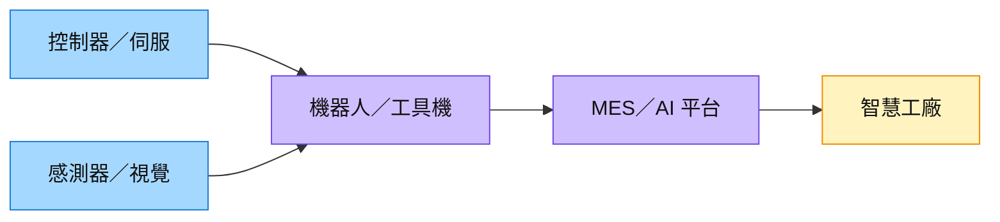

# 供應鏈_工業自動化

## 精密定位延伸至半導體設備

[[4576_大銀微系統（市）]] 提供馬達／驅動器與微奈米定位平台，連接運動控制零組件和設備整合端。統一 2026-10-07 以先進封裝、AOI、探針與 CPO 光耦合說明精度、軸數、Z 軸力量控制及翹曲補償升級；這些是應用機會，不等於對台積電、日月光、矽格或光環的具名供貨。

![[報告_統一_大銀微系統精密定位_20261007_p05_stage.png]]

圖說：多軸定位平台整合控制器、驅動器、馬達、編碼器與機構基座，客製調校形成設備製程門檻。（統一，2026-10-07，p.5）

公司原規劃 2026Q2／Q3、2027Q1 各擴產 30%，統一稱 Q2 實際約 22%，模型將後兩次亦採 22%；故供給觀察應使用實際交付、平台驗證與人力／光學編碼器到位，而非直接把公告比例相乘當作現有產能。BB ratio 1.3、交期 2–3 個月是券商查核／中信心。

來源：[[報告_統一_大銀微系統精密定位_20261007]]（統一投顧，2026-10-07）。CPO 能力位置見 [[供應鏈_AI光互聯]]；擴產見 [[時程_2026-2028十月券商催化劑]]。

## 結構
工業自動化由控制器、伺服與感測器形成設備核心，再由機器人、機台與 MES／AI 軟體整合至工廠產線；工具機、半導體與 AI 伺服器液冷設備是新代近期揭露的應用。

```mermaid
flowchart LR
    C[控制器／伺服] --> R[機器人／工具機]
    S[感測器／視覺] --> R
    R --> M[MES／AI 平台]
    M --> F[智慧工廠]
    classDef core fill:#a5d8ff,stroke:#1c7ed6,color:#111;
    classDef process fill:#d0bfff,stroke:#7048e8,color:#111;
    classDef customer fill:#fff3bf,stroke:#f08c00,color:#111;
    class C,S core;
    class R,M process;
    class F customer;
```
圖說：控制、感測與機電設備透過系統整合形成工廠應用；電源模組與功率元件提供設備運作基礎，個別公司關係依下方來源限定。

## 相關公司
- [[7750_新代（市）]]：控制器、伺服、機器人與智慧製造整合。
- [[1504_東元（市）]]：馬達、電力設備與能源工程；MDC 為資料中心延伸應用，POC 尚待驗證。
- [[3707_漢磊（櫃）]]：SiC／GaN 功率製程平台，供工控及電源應用；新增產能與營收口徑待核對。
- [[5309_系統電（櫃）]]：工業 AI 模組、無人載具地面控制與強固電腦；BBU 為另外的資料中心能源業務。
- [[8109_博大（櫃）]]：工業、鐵路、醫療與邊緣設備的利基電源模組；非大型資料中心電源供應器同一市場。

## 來源
- [[活動_華南投顧_東元1504_20261006]]（2026-10-06）、[[活動_華南投顧_漢磊3707_20261007]]、[[活動_華南投顧_系統電5309_20261007]]、[[活動_華南投顧_博大8109_20261007]]（2026-10-07）：華南活動 memo；公司定位轉述，信心中。
- [[7750新代I 20260825 I康和]]（康和證券，2026-08-25）
- [[7750新代｜20260826｜玉山]]（玉山投顧，2026-08-26）

## 2026-08-18 具身智能補充

[[20260821_1041_全球機器人產業前景_具身智能與台灣供應鏈研究]] 將台灣機器人鏈拆為 Edge AI／控制器、電源／驅動、精密傳動、半導體物流與 AI 視覺；其中可直接對應既有公司頁的觀察標的包括 [[2308_台達電（市）]]、[[2395_研華（市）]]、[[2049_上銀（市）]]。報告判斷人形機器人仍處驗證與特定場域導入期，應以客戶驗證、量產、單機成本與營收認列逐級確認，不將展示或合作直接視為訂單。

## 2026-09-17 盟立自動化與機器人更新

- [[2464_盟立（市）]]聚焦先進封裝／高階載板自動化，產品含 OHT、EFEM、Stocker、AMR／AGV；截至 2026 年 8 月累計訂單約 NT$140 億，年底估約 NT$200 億，75%–80% 預計於 2027 年底前完成。
- OHT 2027 年底產能估 2,500–3,000 台、EFEM 3,000 台、Stocker 500–800 台、AMR 800–1,000 台；諧波減速機產能由 2026 年底 30 萬件提升至 2027 年 80 萬件。上述為券商／公司展望，公司頁待使用者確認後再建立。

來源：[[報告_CTBC_盟立_20260917]]（中信投顧，2026-09-17）。

## 相關頁面

- [[4573_高明鐵（櫃）]]
- [[7710_東擎（興）]]
- [[4585_達明（市）]]
- [[6739_竹陞科技（櫃）]]
- [[3447_展達（市）]]
- [[5353_台林（櫃）]]
- [[分析_台林工業網通專案化與越南產能_20260910]]
- [[7631_聚賢研發-創（市）]]
- [[分析_聚賢研發海外二次配工程認列_20260917]]
- [[6667_信紘科（櫃）]]
- [[6870_騰雲（櫃）]]
- [[8045_達運光電（市）]]
- [[分析_信紘科大型廠務統包與海外擴張_20260918]]
- [[分析_達運光電軍工AIoT與1.8G寬頻_20260918]]
- [[時程_2026廠務與資料中心通路催化劑]]
- [[分析_全球機器人具身智能與台灣供應鏈_20260818]]
