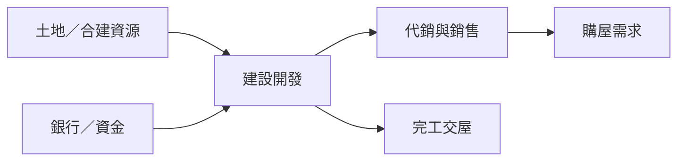

# 供應鏈_房地產開發與代銷

## 供應鏈架構

```mermaid
flowchart LR
    LAND[土地／合建資源] --> DEV[建設開發]
    DEV --> SALES[代銷與銷售]
    SALES --> BUYER[購屋需求]
    FIN[銀行／資金] --> DEV
    DEV --> DELIVERY[完工交屋]
```

## 觀察重點

- [[2348_海悅（市）]] 同時涵蓋代銷與建設，建案交屋節奏可抵銷房市低迷時代銷開案減少。
- 2026–2027 年需追蹤政策、利率、成交量、開案與交屋認列。

## 來源

- [[2348 海悅｜20260826｜台新]]（台新投顧，2026-08-26）
