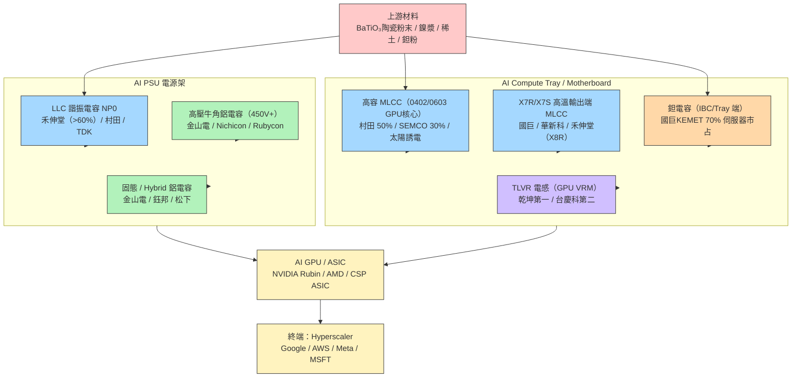

# 供應鏈_被動元件

## 供應鏈主軸

> AI 機架功耗飛升（GB300 ~130 kW → VR ~200 kW+）驅動兩場同步革命：**MLCC 從 DC 侵入 AC 電路**（LLC 諧振），以及電壓從 48 V → 800 V HVDC 推動高壓規格全面升級。VR200 vs GB300 被動元件 BOM dollar content 增幅超過 **3×**（USD 1.5 萬 → USD 3.5–4.5 萬），且因 AI 產品線 ASP 比消費品高 4–7 倍、良率又低，擴產速度慢於需求——結構性緊缺至少延續至 2H27。

## 供應鏈結構圖



## AI 伺服器被動元件用量（世代比較）

| 機架 | MLCC 總量 | MLCC 美元含量 | 高容（47μF+）| 電容總值（被動）| 鉭電容 |
|------|----------|-------------|-----------|----------------|------|
| GB200 | ~30 萬顆 | 基準 | 基準 | USD 1.2-1.5 萬 | ~3,600 顆 |
| GB300 NVL72 | ~44-60 萬顆 | 基準 | 基準 | USD 1.5 萬 | ~5,000 顆 |
| VR200（Vera Rubin）| ~88-100 萬顆（估）| **+182%**（dollar content）| **+210%** | USD 3.5-4.5 萬 | **大幅削減** |

> 資料來源：大摩閉門 2026-06-12（dollar content 口徑）；國票 2026-06-17（unit content 口徑 VR200 vs GB200 +84-120%）。口徑差異主因 VR 高容 ASP 大幅上升。

## 各環節廠商

### LLC 諧振電容 NP0（AI PSU 最高毛利品項）

NP0（C0G）是唯一可在 AC 環境使用的電容材料，LLC 諧振電路是 AI PSU 提升效率至 90-95% 的關鍵拓樸；SiC MOSFET 普及後成主流，MLCC 取代傳統薄膜電容。

| 廠商 | 地位 | 備註 |
|------|------|------|
| [[3026_禾伸堂（市）]] | AI PSU NP0 龍頭，市占 >60% | 台達 / 光寶 / Flex 偉創力第一認證供應商；第二擴產 40 億台幣 3Q26 起 |
| [[6173_信昌電（市）]] | 台廠 NP0 第二 | 楊梅廠擴產，設備 3 個月到位（集團優勢）；六甲廠 3Q27 啟動 |

NP0（未建頁）：村田（NP0 AI PSU 技術強，但重心分散）、TDK（車用 C0G 市占 30-40%；AI PSU 第二供應 2027 年才切入）、三星電機（台達培植中，最快 2027）。

**NP0 規格升級路徑（禾伸堂）**

| 世代 | 代表規格 | 耐壓 | ASP（NT$）| 用量/PSU |
|------|---------|------|----------|---------|
| H100 era | 103（1 nF） | 630V | ~0.1 | 10-20 顆 |
| Blackwell GB | 103/223 | 630V | 0.5-1 | 70-100 顆 |
| Rubin VR | 333（33 nF） | 1,000V | 5.5-8 | 100+ 顆（三相 PSU × 3） |
| Rubin Ultra | 1210 47nF / 1210 33nF 1,250V | 1,250V | 開發中 | 更多 |

> **三相 PSU 需求倍增邏輯**：PSU 從單相改三相（5.5kW → 18.3kW），每相各需一組 LLC 諧振電容 → NP0 用量 **3×**；BBU 未來走 400V-800V 後再加一組 LLC → 整體諧振電容需求 **5-6× vs 傳統**。

### 高容 MLCC（AI 主板 GPU/CPU 核心供電）

用於 GPU/CPU VRM 去耦旁路。最缺貨的三顆關鍵料：

| 規格 | 應用位置 | 主供 | 備註 |
|------|---------|------|------|
| 0201 / 10μF / X6S / 2.5V | GPU/CPU 核心供電 | 村田（幾乎獨供）| 最難做，全球僅 2-3 家能量產 |
| 0402 / 47μF / X6S / 2.5V | VR GPU 附近 | 村田 / SEMCO | 現貨掃貨現象，交期 20-24 週 |
| 0603 / 100μF / X6S / 2.5V | VR GPU 附近 | 村田 / SEMCO / KYOCERA | 台廠幾乎未能量產 |

高容 MLCC 市占（AI 伺服器）：村田 ~50%、三星電機 ~30%、太陽誘電 ~10%。

**全球 MLCC 整體市占（2025 年，Vastpeak）**：Murata **40.8%**、SEMCO **22.5%**、Taiyo Yuden **11.3%**、TDK **6.9%**、Yageo **5.4%**、其他 **13.0%**。AI 高容市場集中度更高（Murata ~70%）。

![[報告_Vastpeak_被動元件產業_20260630_020.png]]
*MLCC 供需缺口走勢圖（2016–2028E）：2027E 供給增幅首次低於需求增幅（缺口轉負），顯示結構性緊缺不是短週期。來源：Vastpeak，2026-06-30。*

| 廠商 | 地位 | 備註 |
|------|------|------|
| [[2327_國巨（市）]] | 台廠最大（中低容外溢）| MLCC 全球第三；AI 主板 X7R/高容外溢受惠；漲價邏輯 2Q26 開始兌現 |

高容（未建頁）：村田（月產 1,400 億顆，高容 >80% 產能，UTR 接近滿載）、三星電機（月產 1,000 億顆，AI 良率 Q4'25 突破 80%，菲律賓廠 2027Q1 出量）、太陽誘電（月產 800 億顆，韓國廠 2027 完成；LTA 策略全轉）、華新科（月產 500 億顆，年增 10-15%）。

### X7R/X7S/X8R 高溫高壓輸出端 MLCC（AI PSU 輸出端）

PSU 輸出端 48V 降壓段使用 1206 4.7μF 100V / 1210 10μF 100V / 0805 2.2μF 100V（Rubin 空間限制），標準應用。

| 廠商 | 地位 | 備註 |
|------|------|------|
| [[3026_禾伸堂（市）]] | X8R 台灣獨供（台達） | 1210 2.2μF 150V X8R；台達要求 50-60% 份額；村田最快 2027 進入 |
| [[6173_信昌電（市）]] | X7R/X7T，GB200/GB300 design-in | Mega Cap（插腳式）：NT$7-9/unit，AI PSU BBU 用量持續增加 |
| [[2327_國巨（市）]] | 高容 + 外溢 | X7R/X6S 高容量外溢訂單接收主力；MLCC AI 佔比 ~14% |

### 高壓牛角鋁電解電容（AI PSU 一次側 Bulk Cap）

AI PSU 電源端（AC/DC，450V+），傳統薄膜電容換 MLCC 之前的 bulk 儲能。隨機架瓦數提升每 PSU 用量從 5 顆（5.5kW）飛升至 15-16 顆（18.3kW）。

| 廠商 | 月產能（2026-底） | 地位 | 備註 |
|------|----------------|------|------|
| [[8042_金山電（市）]] | **200 萬顆** | 非日系第一，且將超越任一日系 | 廣州廠；廣達 AI 泰國廠獨家供應；AWS 最大客戶；設備採購中國製（3 個月交期） |
| Nichicon（日系，未建頁）| 60 萬顆 | 三大日系之一 | AI 保守，因 EV 擴產受傷 |
| Rubycon（日系，未建頁）| 60 萬顆 | 三大日系之二 | 同上 |
| Chemi-Con（日系，未建頁）| 80 萬顆 | 三大日系之三 | 同上 |

> 單顆 ASP：**USD 8-10**（保守）/ USD 10-12（積極）。北美 4 大 CSP 30 GW 資料中心計畫 → 高壓牛角 TAM $63-90 億 USD。

### 固態 / Hybrid 鋁電容（AI 機架低壓端）

二次側 DC/DC + IBC + POL（POL ≤ 35V 固態，35-80V Hybrid）。固態失效模式短路（安全）、Hybrid 開路（更安全、容量更大）。Hybrid 成長最快，POSCAP/高分子電容將被 MLCC 逐步取代（VR200 POSCAP 歸零）。

**VR200 Hybrid/Polymer 電容 BOM（群益，2026-06-24）**

| 位置 | 規格 | 數量 | 主要供應商 |
|------|------|------|---------|
| 主板 | Hybrid 100U 63V M10×10 | 18 顆 | LELON（#1）、TDK、NICHICON、KEMET |
| 主板 | Hybrid 560U 16V M8×10.3 | 31 顆 | NICHICON、LELON、PANASONIC |
| 主板 | Polymer 120U 16V M6.3×7.7 | 6 顆 | NICHICON、LELON、CAPXON |
| PDB | Hybrid 100U 63V M10×10 | 36 顆 | LELON（唯一） |
| LPX | Hybrid 100U 63V M10×10.5 | 3 顆 | LELON（唯一） |
| LPX | Polymer 270U 16V M6.3×7.7 | 2 顆 | NICHICON |
| LPX | Polymer 63V M10×10 | 48 顆 | NICHICON |

**關鍵廠商現況（群益，2026-06-24）**：
- **NVIDIA 轉向 Hybrid** 取代原先 SP-CAP 主配置；主板、PDB、電源端均已導入
- Panasonic 減產 OS-CON（鎖定車用高毛利）→ 轉單 Chemi-Con；Chemi-Con 產能緊繃
- **SP-CAP 供需仍緊**：ASIC 大量導入 → SP-CAP 需求未減；Panasonic 佔市場 8-9 成、滿載；鈺邦 AP-CAP 對標 SP-CAP
- **鈺邦 2026-08 更新**：2Q26 伺服器營收占比約 38%，CAP／Vchip／Hybrid 受高功耗機櫃與 HVDC 規格升級帶動；CAP 月產能規劃由 70M 於 2026-11 提升至 80M、2027-01 提升至 100M，1H27 目標 120M，均屬公司展望／券商整理，良率與拉貨仍待驗證。來源：[[6449 鈺邦｜Takeaway ｜20260825｜凱基]]。

**Panasonic 7月漲價規劃**：

| 品項 | 漲幅 | 對標台廠（受惠） |
|------|------|----------------|
| POS-CAP | 10~40% | KEMET |
| SP-CAP | 20~40% | 鈺邦、KEMET |
| OS-CON | 30% | 鈺邦、[[2472_立隆電（市）]]、[[8042_金山電（市）]] |
| AL-CAP | 8月公布 | [[2472_立隆電（市）]]、[[8042_金山電（市）]] |

| 廠商              | 地位        | 備註                                |
| --------------- | --------- | --------------------------------- |
| [[2472_立隆電（市）]] | Panasonic Hybrid 全球唯一授權（非日系）| VR200 Hybrid 100U 63V 主板#1；PDB/LPX 唯一供應商；OS-CON/AL-CAP Panasonic 漲價直接受惠 |
| [[8042_金山電（市）]] | 台廠泰國廠唯一量產 | 素萬那普廠 80mn/月（2026-07）；AWS 獨供廣達泰國廠 |
| [[6449_鈺邦（市）]] | 台廠固態電容 | 只做 Polymer 固態，無液態；AP-CAP 對標 Panasonic SP-CAP |
| 松下（未建頁）         | 日系 SP-cap | 佔 SP-CAP 市場 8-9 成、滿載；主板 Hybrid 560U 16V 供應商之一 |

### 鉭電容（Tantalum，AI 架構逐步削減）

AI 機架 IBC/Tray 端穩壓，但 NVIDIA 因地緣風險（鉭粉 80%+ 來自剛果/盧安達）主動降低依賴；**VR200 鉭電容大幅削減，CSP 架構仍保留**。

| 廠商 | 地位 | 備註 |
|------|------|------|
| [[2327_國巨（市）]]（旗下 KEMET）| 全球第一（整體 40%、伺服器 70%）| Rubin 每機架鉭電容 >7,000 顆（vs GB300 ~5,000 顆）；KEMET 2H26+1H27 各加 1 條產線；ASP 已漲 >100% |

鉭電容（未建頁）：AVX/Kyocera（20%，不積極擴產）、松下/SANYO（15%，2H27 可能小擴）、Vishay（10%，主攻軍工不擴）。

**鉭粉供應風險**：年初 RMB 4,000/kg → 2026-06 RMB 6,000+/kg（+50%）；中國收緊出口（2026 年計劃縮減 1,000 噸 vs 2025 年 300 噸）。國巨已與巴西礦場簽長期合約。

### TLVR 電感（GPU VRM 核心）

TLVR（Transient Linear Voltage Regulator）放置在每顆 GPU 旁邊（16 顆/GPU），一片主板 30+ 顆；功能是提供 GPU 核心電壓的超快速瞬態響應。

| 廠商 | 地位 | 備註 |
|------|------|------|
| 乾坤科技（未建頁）| TLVR 台灣第一 | Delta 背後支持；份額 >30% |
| [[3357_台慶科（市）]] | TLVR 台灣第二 | Super World Holding 新加坡關係；Rubin 第二代 TLVR（8 腳，NT$15/顆，+50% vs 第一代）|

TLVR（未建頁）：TDK、Eaton、Murata（日系/歐美，前三名才有實質訂單）；HVDC 800V 電感（台達電是核心專利持有者，國際 Flex 小量）。

### 上游材料

| 材料 | 說明 | 主供廠商 |
|------|------|---------|
| BaTiO₃ 陶瓷粉末 | MLCC 電介質核心材料 | 日本玠化學、美國 Ferro、日本化學（寡占）；[[6173_信昌電（市）]] 自製垂直整合 |
| 鎳漿 / 銀漿 | MLCC 內電極材料 | 銀漿已大漲（+50-100%），影響台慶科電感 / 陳舊 NP0 規格成本 |
| 稀土元素 | NP0 / 高溫 MLCC 材料添加劑 | **⚠️ 中國出口管制升級**：Dy（鏑）對日出口維持 **0**；Y（釔）2026 前五個月出口量僅去年全年 **1.13%**；Ho（鈥）列兩用物項逐案審批。主要衝擊日韓廠（Murata/Taiyo/SEMCO），台廠間接受益外溢訂單 |
| 鉭粉 | 鉭電容原料 | 主礦剛果（30%）/ 巴西 / 澳洲；RMB 6,000/kg（+50% YTD 2026）|

## 競爭格局

### MLCC 技術層級分化

| 層級 | 廠商 | 技術指標 | 市場定位 |
|------|------|---------|---------|
| 一類（頂端）| 村田 / 太陽誘電 / 三星電機 | 介質層 1,200-1,600 層；AI 高容 90%+ 份額 | 0402 47μF / 0603 100μF；禾伸堂 NP0 |
| 台灣中階 | 國巨 / 華新科 / 禾伸堂 / 信昌電 | 介質層 800-1,100 層 | 外溢訂單 / NP0 / X7R-X8R |
| 中國 | 風華高科 / 三環集團 | 介質層 700-1,000 層；AI 高容尚在驗證 | 中國 server 廠（聯想/華為），不入 Google/AWS |

> 日系高容轉產 AI 拋下中低容，台廠吃外溢訂單；但台廠高容良率低（國巨 **~30%**，vs 日廠 **~70%**），標準品 ~95%。中低容 Commodity 話語權在台灣（國巨/華新科），高容在日韓。

### 本輪缺料 vs 2017-18 年的差異

| 維度 | 2017-18 | 2026-27（本輪） |
|------|---------|---------------|
| 驅動 | TDK 700 億顆/月產能轉車用 → 全品類短缺 | AI GPU 用量爆炸 + 供給結構升級不及 |
| 缺料範圍 | 全品類（包含低階消費品）| **高階高容為主**；中低階外溢給台廠 |
| 漲價幅度 | 現貨 100 倍 → 後來崩跌 | 結構性 30-50% 第一波，每季 20-30% 滾動 |
| 擴產策略 | 大幅躁進 → 隔年過剩 | 保守（10-15%/年）；不想重蹈覆轍 |
| 供需持續 | 短週期（1.5-2 年）| **AI 結構性需求，至少 2H27；樂觀 2030** |
| 台廠角色 | 接全品類外溢、大幅擴產 | 專注外溢 Commodity + NP0 / Mega Cap 特利基 |

## 漲價週期地圖（2026-2027）

### MLCC 漲價順序

```
1. 現貨市場 / 通路商 先漲（已完成）
   → 高容（1μF+）現貨漲 3-5 倍；部分料號 10 倍

2. 通路商正式函告漲 30-50%（2Q26 進行中）
   → 5月第一輪 +30-50%，6月第二輪再 +20%

3. ODM 端（大廠季度議價）
   → 3Q-4Q 大廠暫停談判；下次議價 12月談 1Q27 價格
   → 消費低容 ODM: +5-100%（3Q26）
   → 中高容 server: +15-30%（4Q26）

4. 第二波調漲（2027）
   → 不在同一年反複調；預計 2027 再一波
```

### 各品類漲價狀況

| 品類 | 漲價狀況（截至 2026-06）| 驅動 |
|------|----------------------|------|
| NP0 LLC 諧振 | 已高位（NT$5.5-8）；市場蓋牌不公開 | 供給寡占（禾伸堂主導）|
| 0402 47μF / 0603 100μF | 現貨掃貨，部分料號 3-10 倍 | VR 備料潮 |
| X7R 標準品 | ODM 漲 10-20%；通路 30-50% | 供給外溢減少 |
| 高壓牛角電容 | 日系漲價醞釀中；金山電受惠 | 功耗提升，用量激增 |
| 鉭電容 | **>100%** 自 2025 底 | 鉭粉漲 + AI 用量增 |
| TLVR 電感 | 第一代 NT$10 → 第二代 NT$15 | 規格升級 |

### 全球 MLCC 月產能 vs 擴產計畫

| 廠商 | 月產能（億顆）| 年擴幅 | 高容擴產 |
|------|------------|-------|---------|
| 村田 | 1,400-1,500 | +10% | 5.6億日圓＋800億日圓（2Q26 宣布）2029-30 出量 |
| 三星電機 | 1,000-1,100 | +15% | 菲律賓廠 6億 → 2027Q1 出量 |
| 國巨（含 KEMET）| ~1,000 | +10-15% | YF3 高雄廠（已滿載）；去瓶頸為主 |
| 太陽誘電 | 800 | +10% | 韓國廠 7億 → 2027 完成 |
| 三環集團（中）| 600 | +17% | 高容 +70億顆/月 |
| 華新科 | 500 | +10-15% | 六甲廠 2027 出量 |
| 風華高科（中）| 450 | 有限 | — |

**設備瓶頸**：升降爐（高端 NP0 必備）交期 **1.0-1.5 年**；堆疊機交期 ~1 年。新建產線 1.5-2 年。轉產（切換）僅需 6 個月（但良率爬坡另計）。

## 觀察重點（投資視角）

1. **VR200 量產放量節奏**（最重要）：2H26 VR 開始放量 → 高容 MLCC 缺口爆發、高壓牛角電容 15-16 顆/PSU 需求（vs 5 顆）、NP0 三相 PSU 需求全面落地。
2. **漲價傳導到 ODM 的速度**：大廠（NVIDIA 等一線 OEM）不允許漲、從 2-3 線客戶 / 通路試水 → 傳導至一線的時間是主要不確定性。
3. **禾伸堂第二擴產 40億 × 3Q26 進廠**：燒結爐 30 台 + 宜蘭廠調整；2027 年產能能否如期 3-6× → 影響 2027E EPS 空間。
4. **台達電 2nd Source 進程（三星/村田）**：最快 2027 才能進來，這段時間禾伸堂仍是唯一真正供應商；一旦 2nd source 到位，禾伸堂市占將正常化至 50-60%（仍是主供）。
5. **金山電牛角電容年底 200 萬顆**：能否如期達成，以及台達電 AI PSU 端驗證通過時程——通過後 Tier 1 電源廠客戶擴充，估值重估。
6. **鉭粉供應鏈**：中國收緊出口政策是否如計畫執行（2026 年縮 1,000 噸）→ 鉭粉 RMB 6,000+/kg 再漲 → 國巨 KEMET 成本轉嫁時程。
7. **HVDC 800V 架構滲透時程**：800V 架構延後（短期）vs 長期方向不變；禾伸堂 1,250V NP0 和信昌電高壓產品受惠時間節點。
8. **中國廠商競爭邊界**：三環集團開始供應比亞迪/蔚來，若打入 Google/AWS，對台廠中低容外溢訂單構成威脅（目前仍需 2 年以上）。

## 相關頁面

- [[8121_越峰（市）]]
- [[009150.KR(semco)]]
- [[2492_華新科（市）]]
- [[供應鏈_記憶體]]
- [[聯友金屬-創（興）]]
- [[2327_國巨（市）]]
- [[3026_禾伸堂（市）]]
- [[6173_信昌電（市）]]
- [[8042_金山電（市）]]
- [[2472_立隆電（市）]]
- [[3357_台慶科（市）]]
- [[2308_台達電（市）]]（PSU 最大終端客戶）
- [[NVDA.US(nvidia)]]
- 技術：[[技術_MLCC]]、[[技術_800VDC供電架構]]
- 對照供應鏈：[[供應鏈_AI伺服器散熱]]、[[供應鏈_AI伺服器PCB]]

## 來源

- [[報告_Vastpeak_被動元件產業_20260630]]（Vastpeak，2026-06-30；2025 市占率、BB/UTR/交期全廠對比、稀土管制 Dy/Y/Ho、高容良率分層、S-D gap 圖）
- [[memo_被動元件_整理]]（多家被動元件公司 memo 彙整，2025-10 至 2026-06-16）
- [[活動_MLCC_專家會議_20260623]]（2026-06-23；漲價順序、禾伸堂設備交期、台廠策略）
- [[活動_被動元件_20260513]]（2026-05-13；LLC 架構詳解、NP0 獨特性、PSU 架構變遷）
- [[活動_大摩閉門_存儲MLCC_20260612]]（大摩閉門，2026-06-12；VR200 MLCC +182%、47μF+ +210%）
- [[活動_被動元件_華南分析師簡報_20260610]]（華南投顧，2026-06-10；國巨/禾伸堂/金山電推薦、競爭格局表）
- [[活動_禾伸堂3026_法說]]（2026-03-24；NP0 AI PSU 市占、擴產計畫）
- [[活動_禾伸堂3026_call_20260507]]（2026-05-07；禾伸堂技術護城河深度）
- [[活動_禾伸堂3026_call_20260512]]（2026-05-12；董事長：40億二期投資）
- [[活動_金山電8042_call_20260430]]（2026-04-30；廠區結構、AWS 客戶）
- [[活動_金山電8042_call_20260512]]（2026-05-12；1Q26 財務、競品月產能比較）
- [[活動_信昌電6173_會後]]（信昌電 NP0 / Mega Cap / 設備優勢）
- [[活動_國巨2327_專家會議_20260521]]（2026-05-21；MLCC 應用下游結構、供需格局）
- [[活動_國巨2327_專家會議_20260527]]（2026-05-27；BB ratio、交期現況）
- [[活動_國巨2327_專家鉭電_20260624]]（2026-06-24；VR 鉭電容 7,000 顆、鉭粉漲價）
- [[活動_台慶科3357_call]]（2026-05-05；TLVR 細節、ASP、第二代規格）
- [[活動_太陽誘電6976JP_call_20260505]]（太陽誘電視角；0402 47μF TAM 1.5bn USD；800V NP0 TAM 60mn USD）
- [[活動_TDK_call_20260601]]（TDK：PSU 薄膜電感、COG 車用市占、AI 策略）
- [[20260626_0803_20260624__群益被動元件講座_定錨(給客戶版)]]（群益，2026-06-24；VR200 Hybrid/Polymer cap BOM、MLCC 產能利用率、需求預測、國巨漲價規格、Panasonic 7月漲價規劃）
