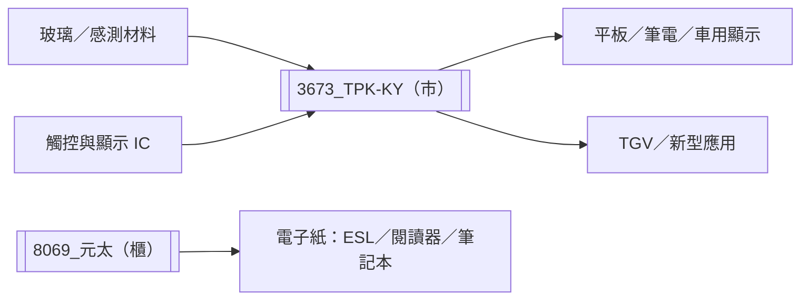

# 供應鏈_觸控顯示

## 供應鏈架構

## 觀察重點

- [[3673_TPK-KY（市）]] 的價值在於觸控設計、貼合與量產整合，產品尺寸與終端應用組合影響毛利。
- 泰國廠試運轉、TGV 商品化與車用客戶導入是後續驗證節點。
- [[8069_元太（櫃）]] 位於電子紙顯示整合環節；2026 年 8 月營收月增 20%，但近端催化劑與 ESL／閱讀器需求仍待驗證。

## 來源

- [[3673 TPK-KY｜20260826｜華南]]（華南投顧，2026-08-26）
- [[報告_MorganStanley_元太_20260908]]（摩根士丹利，2026-09-08）
