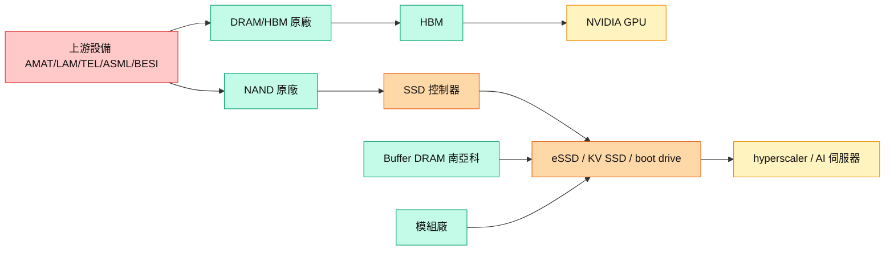

# 供應鏈_記憶體

## 供應鏈主軸
這頁整理 2026 記憶體超級循環的 DRAM／HBM／NAND 供應鏈，涵蓋原廠、SSD 控制器、模組廠、利基 NAND、buffer DRAM 與上游設備。摩根士丹利 [[260702_ms_nand-industry]]（2026-07-02）指 AI 使 NAND 供給緊俏延續至 2027（2027 sufficiency -9%），戰術上偏好 DRAM 勝 NAND（LTA 條件較佳、HBM4E 產能擠壓）；大和 [[大和 韓國記憶體產業電話會議摘要]]（2026-07-02）強調 capex 增加 ≠ 產能大幅增加，並看好 NAND（inference + KV Cache）。

## 結構圖

圖說：記憶體循環由上游設備 → DRAM/HBM 與 NAND 原廠 → HBM 接 GPU、NAND 接控制器/模組成 eSSD/boot drive → hyperscaler；buffer DRAM（南亞科）為 SSD 必要環節。

## AI 記憶體階層演進

![[20260521_0807_統一證to群益投信_記憶體技術概論與大廠現況分析_260520_015.png]]
*圖（統一證，2026-05-20）：傳統記憶體階層（Cache/DRAM/HDD）→ AI 時代演進為 Near memory（SRAM/HBM） + Main memory（HBM） + Expansion memory（AI SSD） + Local SSD data cache + Networked data lakes；短期 latency 方案：CXL=optane；Cache(SRAM)CIM；HBF 定位於 HBM 與 SSD 之間（SanDisk × SK Hynix 戰略合作）。*

## 市場與需求
| 指標 | 2025 / 2026e / 2027e 資料點 | 投資含義 |
|------|------------------------------|----------|
| 全球 NAND sufficiency | 2%／-15%／-9%（負值＝短缺） | 2026–27 持續短缺，支撐 ASP |
| AI 占 NAND 需求 | 18%／32%／41% | AI 結構性拉動，非景氣循環 |
| AI NAND 需求（EB） | 205／400／609 | 三年約 3x |
| 3Q26 漲價 | TLC eSSD +30% QoQ；server DRAM +20%；DDR3/4 +30–40% | 伺服器級強、消費級近天花板 |
| HBM $/Gb 周期 | 2026全年 $1.59（強勁多頭）→ 2027全年 $2.12（高檔盤整）→ 2028全年 $1.34（供給過剩去庫存）| 統一證估 2028 為 HBM 空頭修正期 |
| NAND 終端漲幅 | 1TB TLC PCIe SSD：2025-11 $80.8 → 2027-01 $305.3（+2.8x）| 大容量高階品漲幅最陡 |
| NAND 下半年漲幅 | 2026 下半年合計 +40%（延遲反映）；每季 +20% | NAND 滯後反映漲價 |
| DRAM 每季漲幅 | 每季 ~+15% | 供應率 Fulfill rate 僅滿足 ~70% 需求 |
| DDR4 supply/demand gap | 2H26: 19–20%（5/28 MS）；2027–28: 18–20% | Micron 台灣設備移轉 + HX Wuxi DDR4→DDR5 轉換 |
| DDR4 3Q26 漲價 | ~20%（5/28 MS 估計） | SiCap/SLC NAND 為南亞科/華邦電再評價觸媒 |
| DRAM→HBM trade ratio | 約 3:1（HBM4E 更高） | HBM 排擠標準 DRAM 供給 |

## DDR4 供需圖（舊式記憶體）

![[20260528 MS_記憶體產業_002.png]]
*圖（MS，2026-05-28）：DDR4 季度供需（1Q23–3Q28e）——2H26 undersupply ratio 達 -19~20%，2027-28 維持 -18~20%，反映 Micron 台灣產線設備移轉（→美國）+ SK Hynix Wuxi DDR4/LPDDR4 轉 DDR5 後端雙重供給壓縮。*

![[20260528 MS_記憶體產業_004.png]]
*圖（MS，2026-05-28）：DDR4 8Gb 1Gx8 2666Mbps 即期價格飆至 US$27.25，合約價 US$13.00（Jan 2026 資料點）——spot/contract 背離反映短缺正在反映到現貨但合約價格跟進緩慢，漲價動能仍在。*

## 各環節廠商
| 環節 | 主要用途 | 觀察廠商 | 技術拉動 |
|------|----------|----------|----------|
| DRAM / HBM 原廠 | 標準型 DRAM、HBM | [[005930.KR(samsung)]]、[[000660.KR(sk_hynix)]]、[[MU.US(micron)]] | [[技術_HBM高頻寬記憶體]] |
| NAND 原廠 | eSSD、KV SSD | [[285A.JP(kioxia)]]、[[SNDK.US(sandisk)]]、[[MU.US(micron)]]、[[005930.KR(samsung)]] | [[技術_NAND快閃記憶體]] |
| SSD 控制器 | boot drive、eSSD | SIMO.US(silicon_motion)（慧榮）、[[8299_群聯（櫃）]]（群聯）、[[2379_瑞昱（市）]]（瑞昱）、Fadu（韓） | [[技術_NAND快閃記憶體]] |
| 模組廠 | SSD 模組 | Longsys 江波龍（301308.SZ）、[[8299_群聯（櫃）]] | — |
| 利基 NAND | SLC/MLC | [[2337_旺宏（市）]]（旺宏）、[[2344_華邦電子（市）]]（華邦）、GigaDevice（603986.SS） | — |
| Buffer DRAM | SSD 快取 | [[2408_南亞科技（市）]] | — |
| MLCC / 被動 | 記憶體循環外溢 | [[009150.KR(semco)]]、[[2327_國巨（市）]] | [[供應鏈_被動元件]] |

## 技術 → 需求對照
| 技術 | 主要拉動 | 重點觀察 |
|------|----------|----------|
| [[技術_HBM高頻寬記憶體]] | DRAM 產能、CoWoS、hybrid bonding 設備 | trade ratio 3:1；2027 HBM4E 漲價 |
| [[技術_NAND快閃記憶體]] | eSSD、KV Cache、boot drive、控制器 | TLC eSSD +30% QoQ；Super High IOPS 耗 3x 產能 |

## 競爭格局 / 觀察重點（投資視角）
1. **HBM 市占重排**：大和估 2027 三星回第一（~50%）、美光 ~20%、海力士回落；受惠 HBM4E logic die 製程（N4/N3）領先者。
2. **DRAM 優於 NAND（戰術）**：MS 偏好 DRAM（LTA 條件佳、EUV 限供、HBM4E 擠壓）；NAND 偏好原廠勝模組廠（毛利韌性）。
3. **capex ≠ 擴產**：廠商 capex 多用於製程升級/新技術（HBM hybrid bonding、新 DRAM 架構），嘉惠設備商 AMAT、LAM、TEL、ASML、BESI。
4. **2028 供給變數（YMTC）**：長江存儲 Fab4/5 若全投 NAND、五廠齊發可達全球 24% 市占；加速 greenfield 恐轉過剩。
5. **台廠卡位**：控制器（慧榮 SIMO boot drive 100%、群聯）、利基 SLC/MLC（旺宏、華邦）、buffer DRAM（南亞科）為 AI 儲存受惠環節。
6. **Cisco 入股南亞科**：思科（Cisco）投資 [[2408_南亞科技（市）]]，目的為搶佔 AI 伺服器 DRAM（eSSD buffer DDR4）供應鏈（統一證，2026-05-20）。
6. **LTA 護城河**：原廠與 hyperscaler 簽 3–5 年 LTA，2028 出貨 40–50% 有 LTA 覆蓋，支撐評價與股東回饋。

## 相關技術
- [[技術_HBM高頻寬記憶體]]
- [[技術_NAND快閃記憶體]]

## 來源
- [[260702_ms_nand-industry]] — 摩根士丹利，2026-07-02
- [[大和 韓國記憶體產業電話會議摘要]] — 大和，2026-07-02
- 報告_MS_舊式記憶體升評南亞華邦_20260528 — 摩根士丹利，2026-05-28（DDR4/SiCap/SLC NAND 升評）
- [[20260521_0807_統一證to群益投信_記憶體技術概論與大廠現況分析_260520]] — 統一證券，2026-05-20（HBM $/Gb 2026-28F；NAND/DRAM 漲價幅度；AI記憶體階層圖；DRAM/3D NAND Roadmap；Cisco入股南亞科；AI晶片HBM時間表）

## 相關頁面

- [[5289_宜鼎（櫃）]]
- [[AMZN.US(amazon)]]
- [[ASML.NL(asml)]]
- [[分析_2026-08記憶體_AI需求與液冷ASIC更新]]
- [[1810.HK(xiaomi)]]
- [[CXMT（未）]]
- [[分析_記憶體超級循環2026]]
- [[時程_2026記憶體與AI催化劑]]
- [[5388_中磊（市）]]
- [[分析_2026-08_AI網通與硬體報告更新]]
## 本次 ingest 更新（2026-08-22）

- DIGITIMES 報告整理記憶體漲勢與大廠策略，新增觀察重點為供需緊張、產品組合與資本支出配置；個別價格與產能數字仍應以公司法說及正式財報交叉驗證。
- 中磊報告另指出記憶體供應緊張可能延續至 2027 年，對網通設備毛利與出貨形成約束，屬券商轉述／estimate，信心中。
- 來源：[[記憶體漲勢不停，大廠策略解析 - DIGITIMES]]、[[中磊(5388B_買進)-CTBC260817]]。
