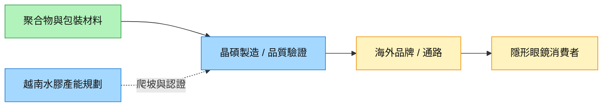
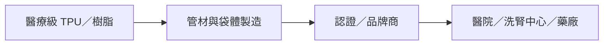

# 供應鏈_醫療器材

## 隱形眼鏡製造與海外代工

[[6491_晶碩（市）]] 位於水膠／矽水膠材料到隱形眼鏡成品製造的環節，下游為日本、歐洲、中國等品牌與通路。本批富邦來源未具名客戶；日本彩片／矽水膠日拋、歐洲高階光學產品及中國透片需求應分開追蹤，避免把通路成長直接當作所有代工廠訂單。

圖說：品牌／通路需求經製造與品質驗證轉為成品出貨，產能規劃仍需設備、良率與訂單配合。

越南水膠月產能規劃 2027 年 1,000 萬片、2028 年 2,000 萬片，為富邦轉述的計畫／中信心；進一步上調擴產是券商 thesis。大溪產能調適、原料／電費與高階產品 mix 共同決定毛利。來源：[[報告_富邦_晶碩營運動能無虞_20261007]]（2026-10-07）；同步 [[時程_2026-2028十月券商催化劑]]。

## 結構
醫療耗材供應鏈由醫療級材料、管材與袋體製造、認證與品牌商，連接至醫院、洗腎中心及藥廠；認證、可靠度與產品組合是進入門檻。

## 相關公司
- [[4107_邦特（櫃）]]：醫療管材、血液迴路與藥用軟袋。

## 來源
- [[4107 邦特｜20260826 ｜福邦]]（福邦投顧，2026-08-26）

## 相關頁面

- [[6782_視陽（市）]]
