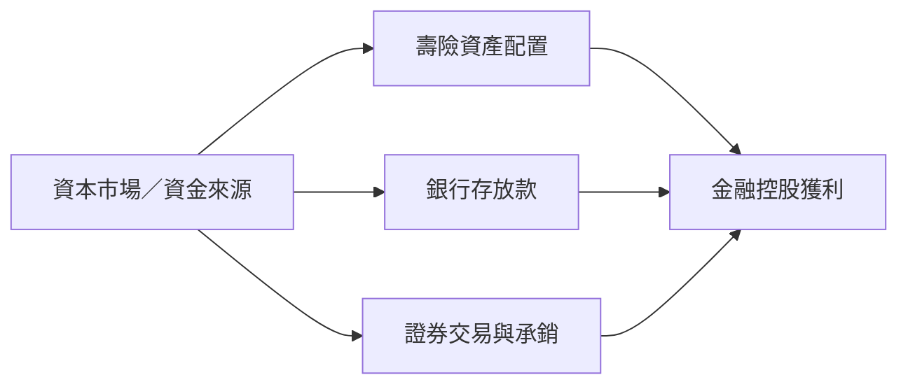

# 供應鏈_金融服務

## 結構
金融控股透過壽險、銀行與證券三大平台取得保費、利差、手續費與資本利得；主要觀察變數為股債市場、匯率避險、利率、信用成本與資本適足率。

## 相關公司
- [[2881_富邦金（市）]]：壽險、銀行與證券綜合平台。
- [[5871_中租-KY（市）]]：企業租賃、分期與消費金融。

## 風險
- 利率、匯率與股市波動會改變投資收益、避險成本與資本比率。
- 信用成本、監管制度與資產負債期限錯配是金融業核心風險。

## 來源
- [[2881 富邦金｜20260826｜元大]]（元大投顧，2026-08-26）

## 相關頁面

- [[2882_國泰金（市）]]
- [[2890_永豐金（市）]]
