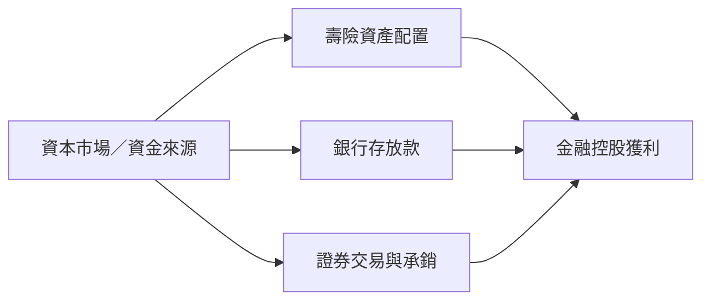
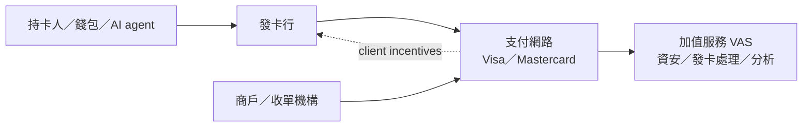

# 供應鏈_金融服務

## 結構
金融控股透過壽險、銀行與證券三大平台取得保費、利差、手續費與資本利得；主要觀察變數為股債市場、匯率避險、利率、信用成本與資本適足率。

```mermaid
flowchart LR
    F[資本市場／資金來源] --> I[壽險資產配置]
    F --> B[銀行存放款]
    F --> S[證券交易與承銷]
    I --> E[金融控股獲利]
    B --> E
    S --> E
```

## 支付網路層

卡片支付網路位於發卡行與商戶之間，向發卡行與收單機構收取交易處理、assessments 與跨境手續費，並以 client incentives（返還與獎勵）與發卡行分潤；近年加值服務（VAS）成為第二條成長曲線。依 BNP（2026-08-07），Visa 的 client incentives 約佔毛營收 27–29%（FQ4 25～FQ3 26）；依 RBC（2026-09-09），Mastercard 的 VASS 約佔近四季營收 42%、Visa 的 VAS 約 30%。

```mermaid
flowchart LR
    C[持卡人／錢包／AI agent] --> I[發卡行]
    I --> N[支付網路<br/>Visa／Mastercard]
    M[商戶／收單機構] --> N
    N --> V[加值服務 VAS<br/>資安／發卡處理／分析]
    N -.client incentives.-> I
```

## 相關公司
- [[2881_富邦金（市）]]：壽險、銀行與證券綜合平台。
- [[5871_中租-KY（市）]]：企業租賃、分期與消費金融。
- [[MA.US(mastercard)]]：卡片支付網路與 VASS，近四季營收約 $35.1B。
- [[V.US(visa)]]：卡片支付網路與 VAS，近四季營收約 $44.5B。

## 風險
- 利率、匯率與股市波動會改變投資收益、避險成本與資本比率。
- 信用成本、監管制度與資產負債期限錯配是金融業核心風險。

## 來源
- [[2881 富邦金｜20260826｜元大]]（元大投顧，2026-08-26）
- [[報告_BNP_MastercardVisa_20260807]]（BNP Paribas，2026-08-07）
- [[報告_RBC_VisaMastercard加值服務_20260909]]（RBC，2026-09-09）

## 相關頁面

- [[分析_Visa_vs_Mastercard_加值服務比較]]
- [[分析_Mastercard_2Q26後券商觀點與催化劑]]
- [[時程_2026Q3Q4_支付網路催化劑]]
- [[2882_國泰金（市）]]
- [[2890_永豐金（市）]]
