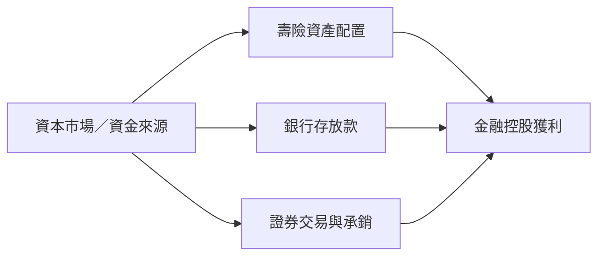
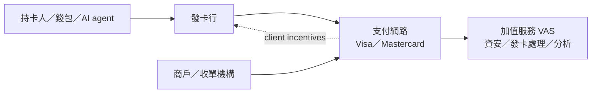
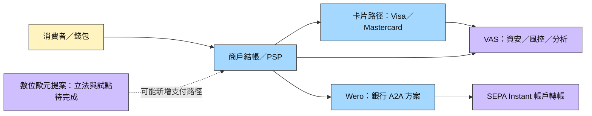

# 供應鏈_金融服務

## 結構
金融控股透過壽險、銀行與證券三大平台取得保費、利差、手續費與資本利得；主要觀察變數為股債市場、匯率避險、利率、信用成本與資本適足率。

```mermaid
flowchart LR
    F[資本市場／資金來源] --> I[壽險資產配置]
    F --> B[銀行存放款]
    F --> S[證券交易與承銷]
    I --> E[金融控股獲利]
    B --> E
    S --> E
```

## 支付網路層

卡片支付網路位於發卡行與商戶之間，向發卡行與收單機構收取交易處理、assessments 與跨境手續費，並以 client incentives（返還與獎勵）與發卡行分潤；近年加值服務（VAS）成為第二條成長曲線。依 BNP（2026-08-07），Visa 的 client incentives 約佔毛營收 27–29%（FQ4 25～FQ3 26）；依 RBC（2026-09-09），Mastercard 的 VASS 約佔近四季營收 42%、Visa 的 VAS 約 30%。

```mermaid
flowchart LR
    C[持卡人／錢包／AI agent] --> I[發卡行]
    I --> N[支付網路<br/>Visa／Mastercard]
    M[商戶／收單機構] --> N
    N --> V[加值服務 VAS<br/>資安／發卡處理／分析]
    N -.client incentives.-> I
```

## 歐洲替代支付與錢包層（2026-10-06 補入歷史資料）

Wero 是銀行推動的商業 A2A 支付方案，底層使用 SEPA Instant；數位歐元則是公共貨幣與基礎設施提案，兩者的發行主體、採用誘因與立法依賴不同。UBS（2026-07-27）估計，扣除信用卡、入境跨境與非交易型 VAS 後，可競爭的全球淨營收池為 Visa 約 7%（不含英國）／12%（含英國），Mastercard 約 12%／16%。這是可受影響範圍，不能直接當成已流失營收；初期較應觀察銀行談判籌碼、費率與商戶導入，之後才是交易量替代。

```mermaid
flowchart LR
    C[消費者／錢包] --> P[商戶結帳／PSP]
    P --> N[卡片路徑：Visa／Mastercard]
    P --> W[Wero：銀行 A2A 方案]
    W --> S[SEPA Instant 帳戶轉帳]
    D[數位歐元提案：立法與試點待完成] -.可能新增支付路徑.-> P
    N --> V[VAS：資安／風控／分析]
    P --> V
    classDef provider fill:#a5d8ff,stroke:#333,color:#111
    classDef process fill:#d0bfff,stroke:#333,color:#111
    classDef customer fill:#fff3bf,stroke:#333,color:#111
    class C customer
    class P,N,W provider
    class S,D,V process
```

![[報告_UBS_Wero與數位歐元_20260727_p8.png]]
*UBS（2026-07-27）對歐洲替代支付的比較；Wero 註冊帳戶與原有 A2A 方案遷移，不能等同新增卡片替代量。*

MS 的 2Q26 受理追蹤顯示 Visa／Mastercard 在樣本商戶接近全面受理；PayPal、Shop Pay、Google Pay 與 BNPL 的受理率是結帳入口覆蓋率，不是交易市占。PSP 併購或錢包成長是否繞過卡網，仍需看資金路徑、跨境、匯款與 payout 的具體場景。未建頁公司與比較詳見 [[分析_FinTech錢包變現併購與立法風險_20261006]]；Wero 的估值、EPS 與反證條件詳見 [[分析_歐洲替代支付對VisaMastercard的風險_20261006]]。

## 相關公司
- [[2881_富邦金（市）]]：壽險、銀行與證券綜合平台。
- [[5871_中租-KY（市）]]：企業租賃、分期與消費金融。
- [[MA.US(mastercard)]]：卡片支付網路與 VASS，近四季營收約 $35.1B。
- [[V.US(visa)]]：卡片支付網路與 VAS，近四季營收約 $44.5B。

## 風險
- 利率、匯率與股市波動會改變投資收益、避險成本與資本比率。
- 信用成本、監管制度與資產負債期限錯配是金融業核心風險。
- Wero 商戶端採用、卡網費率談判與數位歐元立法進展，可能改變支付網路的成長與定價；UBS 時程仍是當時預估。

## 來源
- [[2881 富邦金｜20260826｜元大]]（元大投顧，2026-08-26）
- [[報告_BNP_MastercardVisa_20260807]]（BNP Paribas，2026-08-07）
- [[報告_RBC_VisaMastercard加值服務_20260909]]（RBC，2026-09-09）
- [[報告_UBS_Wero與數位歐元_20260727]]（UBS，2026-07-27）
- [[報告_MorganStanley_2Q26支付受理追蹤_20260710]]（Morgan Stanley，2026-07-10）
- [[報告_DeutscheBank_PayPal收購傳聞_20260717]]（Deutsche Bank，2026-07-17；交易傳聞未確認）

## 相關頁面

- [[8932_智通（櫃）]]
- [[分析_Visa_vs_Mastercard_加值服務比較]]
- [[分析_歐洲替代支付對VisaMastercard的風險_20261006]]
- [[分析_FinTech錢包變現併購與立法風險_20261006]]
- [[分析_Mastercard_2Q26後券商觀點與催化劑]]
- [[時程_2026Q3Q4_支付網路催化劑]]
- [[2882_國泰金（市）]]
- [[2890_永豐金（市）]]
