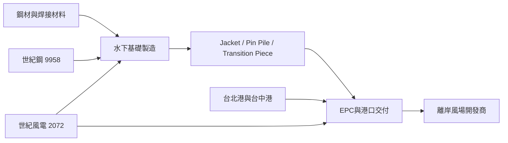

# 供應鏈_離岸風電

## 供應鏈架構

## 研究重點
- 台灣市場受政策、AI 用電與企業再生能源需求支持；法說 memo 估台灣離岸風電裝置容量仍有中長期擴張空間。
- 世紀風電具 Jacket 交付實績、深水重件碼頭與 EPC 整合能力；世紀樺欣合併可提高 Pin Pile 自製率。
- 印尼與亞太市場是海外擴張方向，但需追蹤選商、認證、船期與專案融資。

## 主要公司
| 公司 | 位置 | 來源 |
|---|---|---|
| [[9958_世紀鋼（市）]] | 鋼構與集團母公司 | [[活動_世紀集團法說_20260813]] |
| [[2072_世紀風電（市）]] | 水下基礎製造與 EPC | [[活動_世紀集團法說_20260813]] |

## 來源
- [[活動_世紀集團法說_20260813]]（2026-08-13）
