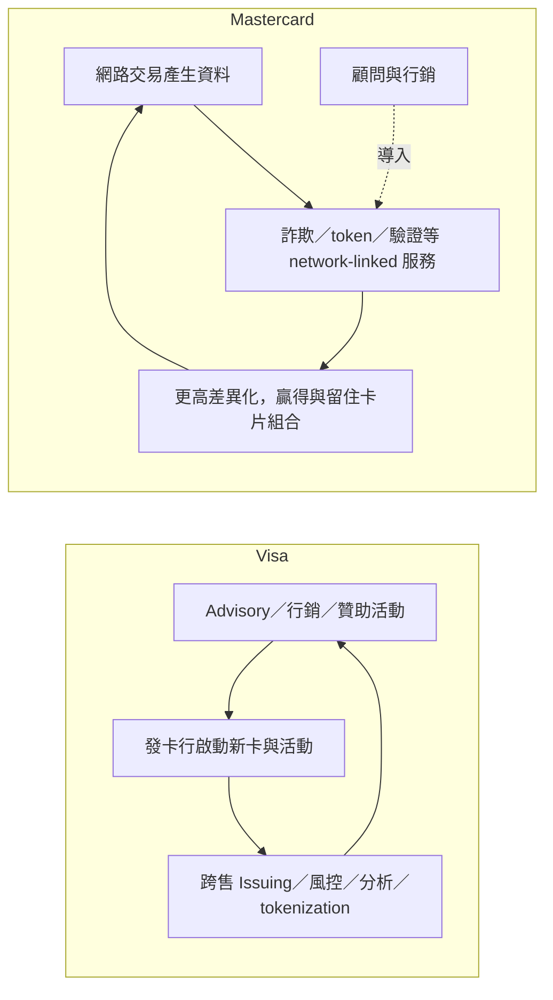

# 分析_Visa_vs_Mastercard_加值服務比較

## 問題背景

加值服務（VAS）已從支付網路的附屬收入變成 Visa 與 Mastercard 長期成長算式的核心：近四季 Visa 的 VAS 約 30% 營收、Mastercard 的 VASS 約 42%（RBC 2026-09-09）。RBC 在 2026-09-09 發布 38 頁 VAS 深度報告，量化 Visa 近 14 季中有 13 季成長快於 Mastercard、平均約 4ppt，並與 BNP（2026-08-07）對 FY27 的相反預期並列。thesis 預告：**Visa 的領先主要來自結構（網路連動占比、基期、贊助資產），而 FY27 因基期墊高，差距可能反轉**。

## 關鍵發現

- [[報告_RBC_VisaMastercard加值服務_20260909]]（2026-09-09）：Visa VAS 近四季約 $13.3B、成長約 30%；Mastercard 約 $14.6B、成長約 23%；Visa 的 TPV（$4,658B）為 Mastercard（$2,882B）約 1.6 倍。
- [[報告_RBC_VisaMastercard加值服務_20260909]]：RBC 歸因三個因素：①Visa 網路連動占比較高（約 65% vs 約 60%）並疊加較大交易基數；②Visa VAS 基期比 Mastercard 小約 16%（2Q26 縮至約 9%）；③Visa 全球一致的贊助資產（奧運、FIFA、F1）造成較大的持卡人啟動事件，形成跨售 flywheel。
- [[報告_BNP_MastercardVisa_20260807]]（2026-08-07）：Visa FY26 VAS 因冬奧與世界盃加速約 4pts 至 28%，FY27 預估降到 21%，約對集團成長造成 2ppt 逆風；MA 因資安 pipeline 可能小幅加速。
- [[報告_BNP_MastercardVisa_20260807]]：MA 的 VAS 近兩年穩定約 18%，已開始修剪組合，並傳出尋求出售帳單支付與 A2A 資產；Visa 的 VAS 則獲得 Wells Fargo 選用 Pismo 等指標客戶的肯定。
- [[報告_Barclays_Mastercard2Q26財報_20260730]]（2026-07-30）：MA VASS 在 2Q26 約 18% organic FXN，2 年疊加加速約 4pts，需求來自安全解決方案、消費者獲取與互動、數位與驗證、商業與市場洞察，以及定價。
- [[報告_BofA_Mastercard_20260730]]（2026-07-30）：MA VASS +20% y/y（+18% CC）；Recorded Future 帶來交叉銷售基礎。

### 2026-10-06 補入：RPO 與歐洲替代支付的口徑

UBS（2026-07-27）指出，Visa 的 RPO 多來自 VIK 形式的 VAS 合約，估計對集團淨營收成長貢獻約 0.5–1ppt、對 VAS 成長約 2–4ppt；這是成長貢獻，不能當成營收占比或現金訂閱收入。這份較早資料補充營收可見度，並不取代 RBC／BNP 對後續季別的預測。來源：[[報告_UBS_支付與FinTech觀察_20260727]]（estimate，信心中）。

UBS 的 Wero 研究從可競爭營收池扣除非交易型 VAS；因此「VAS 隨卡片流量成長」與「部分 VAS 可獨立服務其他支付路徑」需分開。不能用全部 VAS 占比推論卡網不受 A2A 影響。具體範圍、估值情境與反證條件見 [[分析_歐洲替代支付對VisaMastercard的風險_20261006]]。

## 比較表

| 維度 | Visa | Mastercard | 投資含義 |
|---|---|---|---|
| 近四季 VAS 營收 | 約 $13.3B（約 30% 營收） | 約 $14.6B（約 42% 營收） | MA 的營收組成更依賴 VAS，VAS 加速對 MA 影響大 |
| 近四季 VAS 成長 | 約 30% | 約 23% | V 動能較強，但含世界盃等一次性貢獻 |
| FY21–FY25 VAS CAGR | >20% | 約 18% | 差距為結構性而非單季 |
| VAS 佔增量營收 | 約 65%（2Q26） | 約 56%（2Q26） | 兩家都已由 VAS 主導成長 |
| 可服務市場（TAM）／已取得 | $520B／約 2.6% | $490B／約 3.0% | 長期跑道皆長 |
| 網路連動占比 | 約 65% | 約 60% | V 轉換交易量為 VAS 的效率較高 |
| 最大組合 | Issuing Solutions（約 40%）：卡片權益、忠誠度、發卡處理、Pismo | Security Solutions（約 40%）：威脅情報、風控、身分 | 前者與交易量連動，後者與訂閱和網安需求連動 |
| 最小但成長最快 | Advisory & Other（約 15%，FY22–24 約 +35% CAGR） | Consumer Acquisition & Engagement（約 15%） | 皆以顧問／行銷作為跨售入口 |
| 贊助資產 | 奧運、FIFA、F1（兩車隊）等全球一致資產 | 歐冠、法網、美國名人賽、Copa América、F1（McLaren）等區域資產 | V 的啟動事件規模較大 |
| FY27 預期（BNP） | VAS 自 28% 降至約 21% | 可能小幅加速 | 與 RBC 的歷史領先並列，FY27 差距可能縮小 |

![[報告_RBC_VisaMastercard加值服務_20260909_p9.png]]
*RBC（2026-09-09）：公司披露的 VAS 組合。Visa FY24 約 $8.8B：Issuing $3.5B（中雙位數 CAGR）、Acceptance $2.5B（低 20%）、Risk & Security $1.5B（高十幾%）、Advisory & Other $1.3B（約 35%）；Mastercard 約 $11B：Security solutions 占最大，且以 network-linked 與高 recurring 為主，Other solutions（即時支付、帳單、跨境、開放銀行）屬非卡片交易。這張圖是比較兩家「收入錨點」差異的最直接來源。*

## 贊助事件與 VAS 成長差距（RBC Exhibit 8，日曆季、constant currency）

| 日曆季 | Visa 事件 | Mastercard 事件 | Visa VAS | MA VAS | 差距 |
|---|---|---|---:|---:|---:|
| 1Q25 | F1、Super Bowl | Grammy | 22% | 18% | 4ppt |
| 2Q25 | Euroleague、Club World Cup | 法網、美國名人賽、歐冠 | 26% | 22% | 4ppt |
| 3Q25 | F1 | McLaren F1 贊助開始、MLB 明星賽 | 25% | 22% | 3ppt |
| 4Q25 | F1 | F1、LoL 世界賽、紐約馬拉松等 | 28% | 22% | 6ppt |
| 1Q26 | F1、Super Bowl、冬奧 | F1、Grammy | 27% | 18% | 9ppt |
| 2Q26 | F1、Euroleague、世界盃 | F1、法網、美國名人賽、歐冠，開始 Miami CF 贊助 | 34% | 18% | 16ppt |

14 季平均差距約 4ppt；唯一例外為 1Q23（MA 21% 對 V 20%，排除併購後 MA 為 18%）。

*結構圖（RBC 內容自行整理）：Visa 以 Advisory 為 flywheel 啟動點（Lisa Ellis 2025-03：「VAS 三年約 20% 成長，集團利潤率無惡化」）；Mastercard 的 virtuous cycle 以網路資料與 token 驅動（Miebach、Mehra 引述）。*

![[報告_BNP_MastercardVisa_20260807_p6.png]]
*BNP（2026-08-07）：左圖 Visa VAS 的成長含／不含重大體育賽事；右圖兩家資安服務在 VAS 的占比（MA 約 40%、V 約 17%，BNP 認為口徑不完全可比，Visa 實際資安曝險略大）。*

## 兩家 VAS 產品要點

### Visa（四個組合）

| 組合 | 代表產品 | 備註 |
|---|---|---|
| Issuing Solutions | Card Benefits、Loyalty、Digital Enablement SDK、DPS、Pismo | DPS FY23 處理 >$2.5T 授權；Pismo 擴張至 19 個新市場 |
| Acceptance Solutions | Token Management Service、CyberSource、Authorize.net、Intelligent Authorization、VROL、Verifi | 網路中立；Authorize.net 約 $200B 年交易量 |
| Risk & Security Solutions | Visa Advanced Authorization、Risk Manager、Decision Manager、Protect for A2A、Featurespace、CardinalCommerce／Visa Secure、Account Attack Intelligence、BioCatch（待核准） | VAA 最多 400 個資料點評分 |
| Advisory & Other Services | Marketing Services、Consulting、Managed Services、Data Solutions、Tink | 150M 張卡自競爭網路遷入 Visa（10 年、34 國） |

### Mastercard（五個組合）

| 組合 | 代表產品 | 備註 |
|---|---|---|
| Security Solutions | Recorded Future、RiskRecon、Cyber Quant、Cyber Front、Threat Protection、Ethoca、Risk Decisioning、Crypto Secure、A2A 詐欺監控 | 約 40% VASS；Recorded Future 於 2024 年底收購 |
| Consumer Acquisition & Engagement | Marketing、Loyalty、Dynamic Yield（Experience OS）、Commerce Media | 與支付量連動的合約使收入較黏，近四分之三的 2024 年顧問與行銷服務客戶於次年回購 |
| Business & Market Insights | Economics Institute、Test & Learn、SpendingPulse、Credit Analytics、Acquirer Analytics | 3,000+ 顧問 |
| Other Services | MDES、Mastercard One Credential、Identity Check、Agent Pay、Merchant Cloud | token 交易核准率較非 token 高 3–6ppt |
| Other Solutions | Instant Payment Service、Bill Pay、Cross-Border Services（Move、BVNK）、Open Finance | 非卡片交易，BNP 稱 MA 已修剪組合 |

## Insight 結論

| 結論 | 投資含義 | 信心 |
|---|---|---|
| Visa 的 VAS 領先主要來自結構性因素，不只是行銷 | 長期看 Visa 的 VAS 成長溢價仍存在，但 FY27 基期使差距收斂 | 中 |
| Mastercard 的 VAS 品質取決於資安需求而非交易量 | 資安 pipeline 轉化是 MA 估值與 VASS 加速的關鍵 | 中 |
| 贊助事件使 Visa 2Q26 VAS 的 34% 含一次性成分 | 比較 FY27 成長時要排除世界盃與冬奧效應（BNP 估約 4pts） | 中 |

> [!tip] 結論／投資觀點
> Visa 在 VAS 的歷史領先來自網路連動占比、較小基期與全球贊助資產；Mastercard 的 VAS 以資安為主、與交易量較脫鉤。FY26 世界盃墊高基期，使 FY27 兩者差距可能收斂，這是 BNP 偏好 MA 的主要依據。
> 信心水準：中

## 數據彙整

| 項目 | 數值 | 來源 | 日期 |
|---|---|---|---|
| Visa／MA VAS 近四季營收 | $13.3B／$14.6B | RBC | 2026-09-09 |
| Visa／MA 日曆 2Q26 TPV | $4,658B／$2,882B | RBC | 2026-09-09 |
| Visa／MA VAS 近四季年增 | 約 30%／約 23% | RBC | 2026-09-09 |
| Visa VAS l/l 成長：FY26E／FY27E | 28%／21% | BNP | 2026-08-07 |
| 2026 世界盃 FIFA 專案 | 300+ 專案、240+ 客戶、70 市場；約 20% 首用行銷服務 | RBC | 2026-09-09 |
| 巴西銀行 FIFA 活動 | 100 萬參與者、卡片啟用提升 8%、約 $400M 增量支付量 | RBC | 2026-09-09 |
| MA 2Q26 VASS 營收／成長 | $3,826M／約 20% | RBC 模型 | 2026-09-09 |

## 關鍵 Claim

| Claim | 類型 | 來源 | 日期 | 信心 |
|---|---|---|---|---|
| Visa VAS 成長 14 季中 13 季領先 MA，平均約 4ppt | fact（RBC 整理公司資料與估計） | [[報告_RBC_VisaMastercard加值服務_20260909]] | 2026-09-09 | 中 |
| 差距主要來自網路連動占比與基期，贊助為質性加成 | thesis | [[報告_RBC_VisaMastercard加值服務_20260909]] | 2026-09-09 | 中 |
| 重大體育賽事將 Visa FY26 VAS 成長推高約 4pts | estimate | [[報告_BNP_MastercardVisa_20260807]] | 2026-08-07 | 低 |
| Visa FY27 VAS 降至約 21%，約 2ppt 集團逆風 | estimate | [[報告_BNP_MastercardVisa_20260807]] | 2026-08-07 | 中 |
| MA 資安 pipeline 將在未來數季轉化並使 VASS 小幅加速 | thesis | [[報告_BNP_MastercardVisa_20260807]] | 2026-08-07 | 低 |

> [!todo] 待確認事項
> - [ ] Visa FQ4 26 與 FY27 展望是否確認 VAS 的 21% 預期；若 VAS 在世界盃後仍維持 >25%，BNP 論點失效
> - [ ] MA 3Q26 VASS 成長是否從約 18–20% 提升；若維持 18% 且無資安轉化，MA 溢價回補論點需下修
> - [ ] 查證 Visa 與 MA VAS 揭露口徑（網路連動占比為 RBC 估計，Security 占比 BNP 稱不完全可比）
> - [ ] 追蹤 BioCatch 收購核准與 Wells Fargo 遷移到 Pismo 的時程

## 來源引用

- [[報告_RBC_VisaMastercard加值服務_20260909]] — RBC，2026-09-09
- [[報告_BNP_MastercardVisa_20260807]] — BNP Paribas，2026-08-07
- [[報告_Barclays_Mastercard2Q26財報_20260730]] — Barclays，2026-07-30
- [[報告_BofA_Mastercard_20260730]] — BofA，2026-07-30
- [[報告_UBS_支付與FinTech觀察_20260727]] — UBS，2026-07-27
- [[報告_UBS_Wero與數位歐元_20260727]] — UBS，2026-07-27
