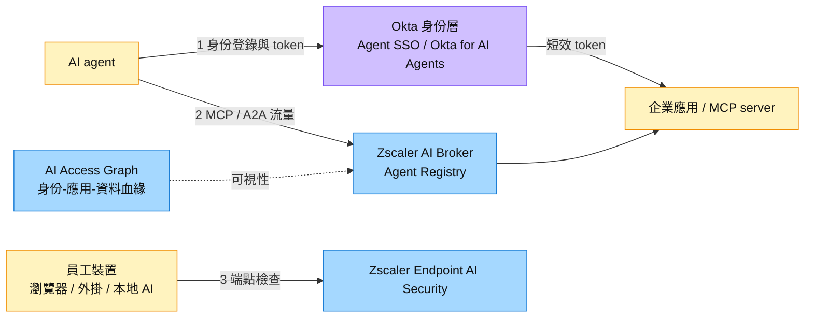

# 分析_Zscaler與Okta_Agent防護分工_20261005

## 問題背景

企業部署 AI agent 後，agent 以暫時身份、子 agent 與 MCP／A2A 呼叫存取資料，傳統為人設計的資安難以看見與控管。Zscaler（Zenith Live，2026-06-09）與 Okta（Agent SSO GA，2026-08-24）各自宣稱掌握 agent 控制平面。本文為比較型分析，根據 2026-10-05 網路搜尋擷取的六篇公開來源（多為公司新聞稿與媒體轉述）。一句 thesis：**Zscaler 管「agent 做了什麼」（流量與裝置），Okta 管「agent 是誰、能拿什麼」（身份與授權），技術上互補，商業上爭同一筆 agent 治理預算。**

## 關鍵發現

- Zscaler 以 AI Broker 代理 MCP／A2A 通訊，內建 Agent Registry；Endpoint AI Security 伸入瀏覽器、擴充與本地 AI 工具；AI Access Graph 來自 $175M 的 Symmetry 收購。來源：[[research_Zscaler_Okta_Agent防護_20261005]]（2026-06-09 新聞稿、SiliconANGLE）。
- Zscaler 未公布這批新產品的定價與 GA 日期（SiliconANGLE，2026-06-09）；Jefferies 轉述 Zero Trust for Agents 仍為 early access（見 [[ZS.US(zscaler)]]）。
- Okta Agent SSO 於 2026-08-24 GA、含於核心 SSO 不另收費；Okta for AI Agents 自 2026-05 起另購。來源：[[research_Zscaler_Okta_Agent防護_20261005]]（Okta 新聞稿，2026-08-24）。
- Cross App Access 已被列為 MCP 的企業授權擴充，25+ 軟體商加入，含 Claude、Cursor、VS Code、Slack、Atlassian、Datadog、Cloudflare。來源：同上（SiliconANGLE，2026-06-23）。
- Futurum（2026-06）指出 A2A 多為雲端內東西向流量，可能不經 SASE 檢查點，且雲端大廠（如 Microsoft Agent 365）可能擁有 agent 盤點；同時列出 Okta、SailPoint、Palo Alto Networks（CyberArk）為競爭者。

圖說：依兩家新聞稿整理的概念圖，兩者在「agent 存取企業資源」路徑上分別處於身份授權點與流量檢查點；非任一公司官方架構圖，本批來源亦無適用的官方示意圖（待補來源圖）。

## 比較表

| 維度 | Zscaler | Okta | 投資含義 |
|---|---|---|---|
| 控制點 | 網路流量（MCP／A2A）、端點、資料血緣 | 身份目錄、授權 token、治理流程 | 互補，不是同一層的替代品 |
| 核心機制 | 即時流量審查、Agent Registry 控管 | 登錄具名身份、短效 token、認證與 kill switch | 兩者都有 agent 登錄，邊界重疊 |
| 發現 shadow agent | AI Protect 掃描 SaaS／網路流量、公有雲 agent、程式碼 | Okta for AI Agents 以瀏覽器、端點、網路偵測 | 發現能力雙方都主張，須實測 |
| 標準 | 專有（Futurum：不同於 vendor-agnostic 的 ACS） | 主推開放 XAA，已進 MCP 擴充 | 開放標準有利 Okta 生態擴張，但也降低鎖定 |
| 商業化 | 無價格與 GA；AI Protect 過去 12 個月 bookings 逾 $100M（BMO，見 [[ZS.US(zscaler)]]） | Agent SSO 免費導流，Okta for AI Agents 另購 | Okta 路徑清楚但營收未揭露；ZS 營收更依賴 Zero Trust Exchange 既有客戶 |
| 主要弱點 | 東西向 A2A 可能繞過檢查；盤點是前提 | 非 XAA agent 需升級版才覆蓋；成長偏低（CY26E 9.8%，見 [[OKTA.US(okta)]]） | 兩者都須證明「治理」能轉成可收費用量 |

## 投資重點 memo

| 重點 | 投資含義 | 相關標的 | 信心 |
|---|---|---|---|
| 流量層與身份層互補 | 若企業同時採購，兩家並非零和；單一廠商要拿下整個控制平面難度高 | [[ZS.US(zscaler)]]、[[OKTA.US(okta)]] | 中 |
| Okta 以免費 Agent SSO 當入口 | 變現取決於升級 Okta for AI Agents 的轉換率，需看後續財報揭露 | [[OKTA.US(okta)]] | 中 |
| Zscaler 新產品尚未可收費 | 敘事先於營收，Jefferies 預期 FY27H2 才較有利；與 [[分析_Zscaler_CRO交接與非席次計價_20261005]] 的計價驗證相連 | [[ZS.US(zscaler)]] | 中 |
| 身份治理廠商與 SASE 重疊 | Agent Registry（ZS）、Universal Directory（Okta）、IGA（SailPoint）、CyberArk（PANW）爭預算 | [[SAIL.US(sailpoint)]]、[[PANW.US(palo alto networks)]] | 低 |
| 雲端大廠擁有盤點入口 | 若 agent 清單由 Microsoft 等雲端控制，兩家都退為執行層 | [[ZS.US(zscaler)]]、[[OKTA.US(okta)]] | 低 |

## Insight 結論

| 結論 | 投資含義 | 信心 |
|---|---|---|
| Agent 安全是多層控制，不是單一產品 | 追蹤客戶是否把流量層與身份層分開採購，而非只看單家敘事 | 中 |
| 免費入口加付費治理是 Okta 的明確路徑 | 看 Okta for AI Agents 的客戶數與 ARR 揭露 | 中 |
| ZS 的差異在即時流量與端點可視性，但商業化落後 | 關注 GA 日期、定價、東西向流量覆蓋 | 中 |

> [!tip] 結論／投資觀點
> Agent 端防護短期是「敘事與產品發表領先、收入揭露落後」：Okta 已有 GA 與清楚變現路徑，Zscaler 擁有流量與端點控制點但尚無價格與 GA。兩者較像互補而非替代，競爭壓力主要來自同層的廠商與雲端大廠。
> 信心水準：中

## 數據彙整

| 項目 | 數值 | 來源 | 日期 |
|---|---|---|---|
| Symmetry Systems 收購金額 | $175M | SiliconANGLE | 2026-06-09（收購 2026-05 宣布） |
| 對 AI agent 套用與員工相同控制的組織比例 | 34% | Okta《AI Agents at Work 2026》 | 2026-08-24 |
| XAA 加入軟體商 | 25+ | SiliconANGLE | 2026-06-23 |
| Zscaler 涵蓋的 GenAI app（prompt 擷取） | 250+ | Zscaler 新聞稿 | 2026-06-09 |
| Agent SSO 所屬產品客戶數 | 20,000+（Okta SSO） | Okta 新聞稿 | 2026-08-24 |

## 關鍵 Claim

| Claim | 類型 | 來源 | 日期 | 信心 |
|---|---|---|---|---|
| Zscaler 為「業界首個完整的 agentic AI 零信任平台」 | rumor（公司行銷主張，Futurum 稱應審慎看待） | [[research_Zscaler_Okta_Agent防護_20261005]] | 2026-06-09 | 低 |
| Zscaler 新品尚無公布定價與 GA 日期 | fact | 同上（SiliconANGLE） | 2026-06-09 | 高 |
| Agent SSO 2026-08-24 GA 且不另收費 | fact | 同上（Okta 新聞稿） | 2026-08-24 | 高 |
| 僅 34% 組織對 agent 套用同等控制 | fact（公司自家調查，樣本與方法未見） | 同上 | 2026-08-24 | 中 |
| 雲端大廠可能成為 agent 盤點主入口 | thesis | 同上（Futurum） | 2026-06 | 低 |
| 兩家為互補而非替代 | thesis | 本文推論 | 2026-10-05 | 中 |

> [!todo] 待確認事項
> - [ ] 查證 ZS 與 OKTA 既有頁「ZS 整合 Okta 作為 access layer」的原始出處
> - [ ] 追蹤 Zscaler AI Broker／Endpoint AI Security 的 GA 與定價；10/6 投資人日是否揭露
> - [ ] 追蹤 Okta 下次財報是否揭露 Okta for AI Agents 的 ARR 或客戶數
> - [ ] 反證：若客戶選擇單一廠商（如 Microsoft 或 PANW）整包 agent 治理，雙廠互補的 thesis 失效
> - [ ] 驗證 ZS 對東西向 A2A 流量的實際覆蓋；若無法覆蓋，AI Broker 價值縮小
> - [ ] ZAgent 範圍：以新聞稿或產品文件確認是客戶 agent 治理還是平台自然語言管理

## 來源引用

- [[research_Zscaler_Okta_Agent防護_20261005]] — Zscaler 新聞稿、SiliconANGLE（2026-06-09、06-23）、Futurum、Okta 新聞稿（2026-08-24）、Auth0 發表（2026-05），2026-10-05 擷取。
- [[ZS.US(zscaler)]]、[[OKTA.US(okta)]] — 既有公司頁（BMO 估值與 AI Protect bookings 等）。

## 相關頁面

- [[分析_資安十強Agent端防護比較_20261005]]
