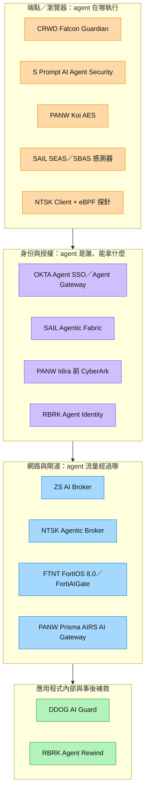

# 分析_資安十強Agent端防護比較_20261005

## 問題背景

2026 年 3 月到 9 月，十家上市資安公司（CRWD、DDOG、FTNT、NTSK、OKTA、PANW、RBRK、SAIL、ZS、S）都推出了「保護 AI agent」的產品，連 Okta 都在 9 月成立跨廠商聯盟。本文延伸 [[分析_Zscaler與Okta_Agent防護分工_20261005]] 的兩家比較，依 2026-10-05 網路搜尋擷取的 32 篇公開來源（多為公司新聞稿與產品文件）整理成十家比較。一句 thesis：**功能正在快速同質化（盤點、MCP 閘道、短效 token、kill switch、紅隊測試），能拉開差距的是「控制點已經裝在客戶那裡」與「誰先把產品轉成 GA 並收費」。**

## 關鍵發現

- **MCP／agent 閘道已成標配**：PANW（Portkey → Prisma AIRS AI Gateway，2026-05 完成）、OKTA（Agent Gateway，目標 GA Q3 CY26）、RBRK（MCP Gateway，2026-08）、NTSK（Agentic Broker，2026-03 GA）、ZS（AI Broker，2026-06 發表、未定價）、FTNT（FortiAIGate）、CRWD（AI Gateway，新聞稿用「Will provide」）。來源：各公司 Raw，2026-03～09。
- **端點感測器是發現 agent 的主戰場**：CRWD 以 Falcon 感測器盤點 Windows／macOS 上的 agent（2026-09-01）；PANW 收購 Koi 做 Agentic Endpoint Security（2026-04-14）；SAIL 推出自有端點與瀏覽器感測器 SEAS／SBAS（2026-08-04）；NTSK 用 Netskope Client 與 eBPF 伺服器探針（2026-06-02）；OKTA 的端點偵測則透過 CrowdStrike Falcon Discover（EA 中，GA Q4 CY26）。來源：[[research_CrowdStrike_Agent防護_20261005]]、[[research_PaloAlto_Agent防護_20261005]]、[[research_SailPoint_Agent防護_20261005]]、[[research_Netskope_Agent防護_20261005]]、[[research_Okta_Zscaler_Agent防護更新_20261005]]。
- **每次工具呼叫發短效 token 成為身份層共識**：OKTA Agent SSO（2026-08-24 GA，免費）以短效 token 取代靜態 API key；RBRK Agent Identity（2026-08）每次 MCP 呼叫都驗證並發單次 token；SAIL Agentic Business Plus 主打 JIT 與零常駐權限。
- **kill switch 被三家同時強調**：OKTA 閘道型 kill switch 會撤銷 agent 已持有的所有 token（GA Q4 CY26）；SAIL Agentic Fabric 有集中式 kill switch（GA）；CRWD 以 Agent Access Controls 封鎖未授權 agent。
- **差異化功能各有一項**：RBRK 的 Agent Rewind（撤銷 agent 已造成的變更、備份 CLAUDE.md 等 agent 設定）；DDOG 的 AI Guard 不需新架構，沿用 dd-trace（Limited Availability）；FTNT 在防火牆特徵碼層辨識 MCP／A2A 方法與參數（FortiOS 8.0）；S 主打斷網與自建環境也能防護。
- **Blueprint Alliance（2026-09-22）**：Okta 發起、12 家創始成員含 AWS、CRWD、Google Cloud、Wiz、Salesforce、ServiceNow、ZS；以 MCP、OCSF、Shared Signals Framework 測試互通。PANW、S、NTSK、FTNT、SAIL、RBRK、DDOG 不在名單。來源：[[research_Okta_Zscaler_Agent防護更新_20261005]]。
- **市場規模口徑**：Fortinet 新聞稿引 Gartner，保護 AI 生態系與 agent 的產品市場 2026 年 $2.8B、2030 年 $16.4B；SentinelOne 新聞稿引 Gartner，AI 資安支出 2024–2029 CAGR 73.9%。兩者定義不同，不可相加。

圖說：依十家公司新聞稿與產品文件整理的控制點分層圖，箭頭表示一次 agent 動作依序可能經過的檢查層，不代表產品間已整合；PANW 與 RBRK 跨多層。非任何公司官方架構圖，本批來源無適用的跨廠商示意圖（待補來源圖）。

## 投資重點 memo

| 重點 | 投資含義 | 相關標的 | 信心 |
|---|---|---|---|
| MCP 閘道快速同質化 | 單靠「有閘道」難以定價；差異要看盤點範圍、既有客戶裝機量與能否不另採購直接啟用 | [[PANW.US(palo alto networks)]]、[[OKTA.US(okta)]]、[[ZS.US(zscaler)]]、[[FTNT.US(fortinet)]] | 中 |
| 端點感測器是發現 agent 的最佳位置 | 已有大量端點裝機的 CRWD 結構上占優；連 Okta 都借道 Falcon Discover，代表身份廠商這段需要合作夥伴 | [[CRWD.US(crowdstrike)]]、[[OKTA.US(okta)]] | 中 |
| PANW 是唯一四層都有收購補齊的廠商 | 平台化敘事最完整，但 Koi、Portkey 整合仍是「will」，且 Futurum 調查顯示買方仍在增加廠商數 | [[PANW.US(palo alto networks)]] | 中 |
| 已 GA 可收費的廠商較少 | NTSK（2026-03 GA）、SAIL（2026-08-04 GA）、OKTA for AI Agents（2026-05 起另購）的商業化路徑最清楚；ZS、CRWD 閘道、DDOG 仍在早期 | [[SAIL.US(sailpoint)]]、[[OKTA.US(okta)]]、[[ZS.US(zscaler)]]、[[DDOG.US(datadog)]] | 中 |
| RBRK 用「撤銷」避開正面競爭 | Agent Rewind 依賴既有備份與時間點還原，較難被複製；但 BMO 認為需要客戶另編新預算 | [[RBRK.US(rubrik)]] | 中 |
| DDOG 走消費制延伸 | AI Guard 掛在既有 APM 追蹤上，若收費可隨 agent 流量自然放大；目前 Limited Availability、未定價 | [[DDOG.US(datadog)]] | 低 |
| Blueprint Alliance 劃出陣營 | OKTA、CRWD、ZS 同盟；PANW 走自有全棧。採購若偏向開放互通，有利同盟成員分工；若偏向單一平台，有利 PANW | [[OKTA.US(okta)]]、[[CRWD.US(crowdstrike)]]、[[ZS.US(zscaler)]]、[[PANW.US(palo alto networks)]] | 低 |

## 比較表

| 公司 | 主要控制點 | 核心產品 | 關鍵機制 | 上市狀態（截至 2026-10-05） | 主要弱點／未知 |
|---|---|---|---|---|---|
| [[CRWD.US(crowdstrike)]] | 端點 | Falcon Guardian（AIDR，延伸 Pangea） | 感測器盤點已核准與影子 agent；prompt→身份→工具呼叫→系統動作完整執行鏈；agent 准入控制；資料直送 Next-Gen SIEM | 2026-09-01 發表；AI Gateway 與託管服務為「will」 | 無定價與 ARR；網路／身份層需靠夥伴 |
| [[PANW.US(palo alto networks)]] | 端點＋閘道＋身份＋網路 | Prisma AIRS 3.0、Koi AES、AIRS AI Gateway（Portkey）、Idira | 盤點雲端／SaaS／端點 agent；agent 本體弱點掃描；紅隊測試；agent registry 與語意路由 | AIRS 3.0 已發表、客戶 300+（3Q FY26）；AI Agent Gateway 當時 limited preview | 整合仍在進行；Futurum 指雲端大廠與買方分散採購風險 |
| SentinelOne（S，未建公司頁） | 端點＋MCP | Prompt AI Agent Security、Prompt AI Red Teaming | 每個 MCP server 的可見性、風險評估與政策；示例攔下 OpenClaw 外傳資料、Claude Cowork 越權 | 2026-03-23 發表；態勢管理與自動修正為 preview；Prompt Security 涵蓋 15,000+ AI 應用 | 規模與盤點來源細節少；Purple AI 屬 AI 防守 |
| [[FTNT.US(fortinet)]] | 網路（防火牆）＋閘道 | FortiOS 8.0 協定偵測、FortiAIGate、Virtue AI | 特徵碼辨識 MCP／A2A，日誌記到方法與參數；閘道雙向掃描 MCP 工具呼叫；Virtue AI 執行前擋惡意工具呼叫 | FortiOS 8.0 已可用；Virtue AI 2026-08-17 收購完成、整合中 | 需 SSL 深度檢查，proxy inline IPS 與 NGFW 政策模式不支援；偏「看得到」 |
| [[DDOG.US(datadog)]] | 應用程式內部 | AI Guard、Agent Console | LLM-as-a-judge 評估 prompt 與工具呼叫是否偏離 agent 目標；盤點未受保護 agent 與資料血緣；monitor→blocking | Limited Availability（官方）；券商 Macquarie 曾寫 GA | 只涵蓋有裝 dd-trace 的自建 agent；資安品牌力仍弱（Evercore 夥伴訪談） |
| Netskope（NTSK，未建公司頁） | 網路（SASE）＋端點／伺服器探針 | Agentic Broker、AI Guardrails、AI Gateway、AI Command Center | 解碼 MCP 流量、MCP server 風險評分、預設封鎖；eBPF 在核心層攔截加密 AI 流量 | 四項產品 2026-03-11 GA；Command Center 2026-06 GA，部分功能 Q3 2026 陸續 GA | 與 ZS 同層競爭；收入揭露見 [[分析_Netskope_2026Q2_AI資安商業化]] |
| [[RBRK.US(rubrik)]] | 事後補救＋身份 | Agent Cloud、Agent Rewind、Agent Identity、SAGE | 撤銷 agent 動作；備份並監控 agent 設定；MCP Gateway 三道檢查後發單次 token | Claude Code／Cowork 版 2026-06-09 GA；Agent Identity 2026-08 發表 | BMO：需新預算；SAGE 語意治理被質疑是行銷包裝（beri.net） |
| [[SAIL.US(sailpoint)]] | 身份治理 | Agentic Fabric（+Entro） | 每個 agent 綁人類擁有者；SEAS／SBAS 感測器；送 LLM 前遮蔽個資；kill switch | 2026-08-04 GA；Entro 預計 FY27 Q3 完成 | 與 OKTA、PANW（Idira）正面重疊；未入 Blueprint Alliance |
| [[OKTA.US(okta)]] | 身份＋執行路徑 | Agent SSO、Okta for AI Agents、Agent Gateway | 短效 token 取代 API key；閘道代理每次工具呼叫；撤銷所有 token 的 kill switch；agent 對 agent 委派稽核 | Agent SSO GA 且免費；Agent Gateway 目標 Q3 CY26、kill switch Q4 CY26 | Okta for AI Agents 營收未揭露；成長率低（CY26E 9.8%） |
| [[ZS.US(zscaler)]] | 網路（SASE）＋端點 | AI Broker、Endpoint AI Security、AI Access Graph | MCP 與 A2A broker＋Agent Registry；資料血緣 | 2026-06-09 發表，無定價與 GA；Zero Trust for Agents 為 early access | 東西向 A2A 可能不經檢查點（Futurum）；Agentic SOC（2026-09-09 GA）屬 AI 防守 |

## Insight 結論

| 結論 | 投資含義 | 信心 |
|---|---|---|
| Agent 防護不是一個新類別，而是每層既有產品各自加 agent 功能 | 追蹤採購時把「新增 SKU 收費」與「既有平台免費加值」分開，後者不代表新營收 | 中 |
| 發現 agent 是所有控制的前提，而端點是最完整的發現點 | 端點裝機量大的 CRWD、S、PANW 有先天優勢；身份與網路廠商需靠合作或自建感測器 | 中 |
| 短期勝負看 GA 與定價，不是發表會 | 下一季財報優先看 NTSK、SAIL、OKTA 是否揭露 agent 產品客戶數或 ARR | 中 |
| 開放聯盟與單一平台兩條路線正在成形 | 若 Blueprint Alliance 互通測試落地，分層採購可持續；若企業偏好整包，PANW 受惠 | 低 |

> [!tip] 結論／投資觀點
> Agent 端防護在 2026 年已從「誰有產品」進入「誰的控制點已經在客戶環境裡、誰先收得到錢」的階段：MCP 閘道與短效 token 會快速同質化，端點裝機（CRWD、PANW、S）、身份目錄（OKTA、SAIL）與既有遙測（DDOG）是較難被取代的位置；RBRK 的撤銷能力是少數非同質化功能。商業化揭露仍普遍落後，任何一家都還沒證明 agent 防護已是重要營收來源。
> 信心水準：中

## 數據彙整

| 項目 | 數值 | 來源 | 日期 |
|---|---|---|---|
| 保護 AI 生態系與 agent 的產品市場 | $2.8B（2026）→ $16.4B（2030） | Gartner，經 [[research_Fortinet_Agent防護_20261005]] 轉述 | 2026-08-17 |
| AI 資安支出 CAGR（2024–2029） | 73.9% | Gartner，經 [[research_SentinelOne_Agent防護_20261005]] 轉述 | 2026-03-23 |
| 財星 500 大平均 agent 數（2028） | 150,000+ | Gartner，經 [[research_Okta_Zscaler_Agent防護更新_20261005]] 轉述 | 2026-09-22 |
| 認為已有合適 agent 治理的組織 | 13% | 同上 | 2026-09-22 |
| 一般企業已部署 agent 數 | 37 個；每月 223 次 AI 資料政策違規；僅 6% 完整看見 AI 管線 | Netskope 自家研究，[[research_Netskope_Agent防護_20261005]] | 2026-06-02 |
| 可存取敏感資料的 AI agent 比例 | 97%；僅 21% 組織高度有把握管理 agent 風險 | SailPoint 自家研究，[[research_SailPoint_Agent防護_20261005]] | 2026-08-04 |
| 財星 500 大企業 PoC 發現的未知 agent | 10,000+ | ZK Research 轉述 SailPoint，[[research_SailPoint_Agent防護_20261005]] | 2026-10-04 |
| 預期 agent 一年內超出防護的主管比例 | 86%；僅 23% 完整看見 agent | Rubrik Zero Labs，[[research_Rubrik_Agent防護_20261005]] | 2026-08 |
| Purple AI 搭售比例 | FY26 Q4 超過 50% 的授權 | [[research_SentinelOne_Agent防護_20261005]] | 2026-03-23 |
| Prisma AIRS 客戶數 | 300+（3Q FY26 季末） | [[PANW.US(palo alto networks)]] 既有財報段落 | 2026-06 |
| 收購金額 | Symmetry $175M（ZS）；Koi、Portkey、Virtue AI、Entro 未揭露或不重大 | 各公司 Raw | 2026 |

## 關鍵 Claim

| Claim | 類型 | 來源 | 日期 | 信心 |
|---|---|---|---|---|
| NTSK Agentic Broker 等四項 AI 安全產品已 GA | fact | [[research_Netskope_Agent防護_20261005]]（公司新聞稿） | 2026-03-11 | 高 |
| SAIL Agentic Fabric 已 GA，含 SEAS／SBAS 感測器與 kill switch | fact | [[research_SailPoint_Agent防護_20261005]]（公司新聞稿） | 2026-08-04 | 高 |
| OKTA Agent Gateway 目標 GA Q3 CY26、kill switch Q4 CY26 | estimate（公司路線圖，附免責聲明） | [[research_Okta_Zscaler_Agent防護更新_20261005]] | 2026-09-22 | 中 |
| DDOG AI Guard 為 Limited Availability，非 GA | fact（公司 Blog；與 Macquarie 寫 GA 衝突，見 [[DDOG.US(datadog)]]） | [[research_Datadog_Agent防護_20261005]] | 2026-06 | 高 |
| CRWD Guardian 的 AI Gateway 尚未上市 | fact（新聞稿用「Will provide」） | [[research_CrowdStrike_Agent防護_20261005]] | 2026-09-01 | 高 |
| ZS agent 產品無定價與 GA | fact | [[research_Zscaler_Okta_Agent防護_20261005]] | 2026-06-09 | 中 |
| RBRK Agent Cloud 於 2026-02-18 GA | fact（僅搜尋摘要標題，原文未擷取） | [[research_Rubrik_Agent防護_20261005]] 的擷取說明 | 2026-02-18 | 低 |
| PANW Koi 收購金額 $231M | rumor（僅搜尋摘要稱出自 10-K，未入 Raw） | 無 Raw | 2026 | 低 |
| 端點是發現 agent 最完整的位置 | thesis | 本文推論，依 CRWD、PANW、SAIL、OKTA 皆布局端點感測 | 2026-10-05 | 中 |
| MCP 閘道將同質化、難以單獨定價 | thesis | 本文推論，七家已有或宣布閘道 | 2026-10-05 | 中 |
| Agent Rewind 較難複製 | thesis | beri.net 評論，[[research_Rubrik_Agent防護_20261005]] | 2026-04-28 | 中 |
| 買方尚未接受單一平台包辦 agent 安全 | thesis（Futurum 調查：43.0% 增加廠商、34.6% 整併） | [[research_PaloAlto_Agent防護_20261005]] | 2026 | 中 |

> [!todo] 待確認事項
> - [ ] 追蹤 OKTA Agent Gateway 是否如期在 Q3 CY26 GA（截至 2026-10-05 未見公告）
> - [ ] 追蹤 NTSK、SAIL、OKTA 下一季是否揭露 agent 產品客戶數、ARR 或定價
> - [ ] 追蹤 DDOG AI Guard 何時 GA 與計價方式；釐清 Macquarie「GA」寫法的來源
> - [ ] 追蹤 CRWD Guardian AI Gateway 與託管服務上市日；ZS 10/6 投資人日是否公布 Zero Trust for Agents 的 GA 與定價
> - [ ] 查證 PANW Koi、Portkey 收購金額（10-K）與 RBRK Agent Cloud 2026-02-18 GA 原文
> - [ ] 反證：若 Microsoft、Google、AWS 的平台內建 agent 控制（如 Agent 365、Model Armor、AgentCore）成為預設，第三方廠商退為補充層，本文「控制點已在客戶環境」的優勢縮小
> - [ ] 反證：若企業把 agent 防護併入既有合約不另收費，十家都難以出現可見的新營收
> - [ ] 評估是否為 SentinelOne、Netskope 建立公司頁

## 來源引用

- [[research_CrowdStrike_Agent防護_20261005]] — Falcon Guardian 新聞稿（2026-09-01）、Channel Insider、Falcon IQ 新聞稿（2026-08-31）、NVIDIA Blog；2026-10-05 擷取。
- [[research_PaloAlto_Agent防護_20261005]] — Prisma AIRS 3.0（2026-03-23）、Koi 收購完成（2026-04-14）、Portkey／AI Gateway Blog（2026-05）、Futurum；2026-10-05 擷取。
- [[research_SentinelOne_Agent防護_20261005]] — RSAC 2026 新聞稿（2026-03-23）、Latio 報告新聞稿（2026-09-15）、SDxCentral；2026-10-05 擷取。
- [[research_Fortinet_Agent防護_20261005]] — Virtue AI 收購（2026-08-17）、FortiOS 8.0 文件、WWT FortiAIGate、FortiSOC（2026-06）；2026-10-05 擷取。
- [[research_Datadog_Agent防護_20261005]] — AI Guard Blog、DASH 2026 keynote roundup（2026-06）、內部評估文；2026-10-05 擷取。
- [[research_Netskope_Agent防護_20261005]] — Netskope One AI Security（2026-03-11）、MCP 安全（2025-12-01）、AI Command Center（2026-06-02）；2026-10-05 擷取。
- [[research_Rubrik_Agent防護_20261005]] — Agent Identity（2026-08）、Agent Cloud for Claude Code（2026-06-09）、SiliconANGLE、beri.net（2026-04-28）、Agent Cloud 首發（2025-10）；2026-10-05 擷取。
- [[research_SailPoint_Agent防護_20261005]] — Agentic Fabric GA（2026-08-04）、發表（2026-05-11）、Entro（2026-06-15）、SiliconANGLE（2026-10-04）；2026-10-05 擷取。
- [[research_Okta_Zscaler_Agent防護更新_20261005]] — Oktane 2026 公告 PDF、SiliconANGLE（2026-09-22、09-28）、Zscaler Agentic SOC（2026-09-09）；2026-10-05 擷取。
- [[research_Zscaler_Okta_Agent防護_20261005]] — Zscaler Zenith Live（2026-06-09）、Okta Agent SSO（2026-08-24）等；2026-10-05 擷取。
- [[分析_Zscaler與Okta_Agent防護分工_20261005]]、[[分析_AI驅動資安支出2026]]、[[分析_Netskope_2026Q2_AI資安商業化]] — 既有分析頁。
