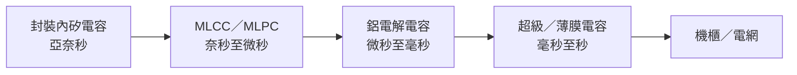

# 分析_電RAM與功率半導體漲價潮

## 核心觀點

國金證券將 AI 供電系統中的電容比作「電 RAM」：從封裝內矽電容、板級 MLCC／MLPC、電源模組的鋁電解電容，到機櫃側超級電容與高壓母線薄膜電容，形成依時間常數分層的能量緩衝網路。這是產業研究觀點，非已確認的單一公司訂單。

## 投資觀察

- 報告認為成本推動與 AI 伺服器需求增加，使電容與功率半導體可能出現擴散式調價；價格、稼動率與實際傳導幅度仍需公司公告驗證。
- 矽電容因貼近晶片、用於瞬態去耦，隨先進封裝與高功耗 AI 晶片升級的重要性提高；詳見 [[技術_矽電容]]。
- 800V／高壓直流架構可增加薄膜電容與功率元件的系統內容價值，但規格滲透與供應商份額不可由本來源推定。

> [!warning] 風險
> - 報告含中國產業觀點與供應鏈名單，未逐一交叉驗證。
> - 漲價、需求與受惠公司均為產業判斷，不能等同個別公司的營收承諾。

## 來源

- [[報告_國金證券_電RAM與功率半導體漲價潮_20260628]]（2026-06-28）
