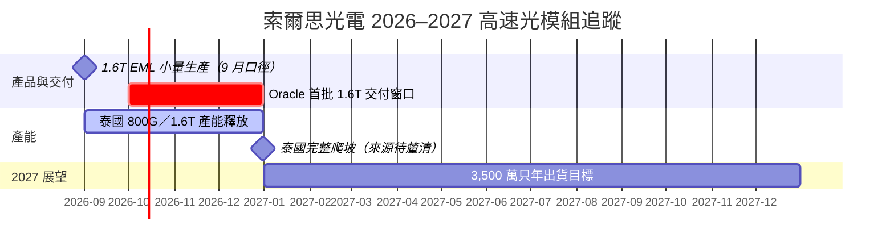

# 時程_2026-2027索爾思光電

## 日期表

| 日期 | 事件 | 相關公司 | 類型 | 重要性 | 備註 |
|---|---|---|---|---|---|
| 2026-07 | 整體光模組出貨約 80 萬只 | [[索爾思光電（未）]] | 出貨 | ⭐⭐ | 專家口徑 |
| 2026-08–09 | 整體光模組出貨各約 100 萬只 | [[索爾思光電（未）]] | 出貨 | ⭐⭐ | 專家口徑 |
| 2026-09 | 1.6T EML 光模組開始生產；首月估 1–2 萬只 | [[索爾思光電（未）]] | 技術下線 | ⭐⭐⭐ | 日期僅至月份；受訂單量限制的說法待驗證 |
| 2026Q4 | 首批 1.6T 訂單預定交付 | [[索爾思光電（未）]]、[[ORCL.US(oracle)]] | 出貨／驗證 | ⭐⭐⭐ | 來源稱 Oracle 訂單，非客戶公告 |
| 2026 年底 | 泰國廠釋放 800G／1.6T 模組產能 | [[索爾思光電（未）]] | 擴產／放量 | ⭐⭐⭐ | 來源稱初步目標 80–100 萬只／月；另有 200 萬只產線年底爬滿說法，待釐清 |
| 2027E | 管理目標為總出貨 3,500 萬只 | [[索爾思光電（未）]] | 放量 | ⭐⭐⭐ | 產能可支撐為專家判斷，不等於訂單已確認 |

## Gantt 時程圖

圖說：月份級資料在 Gantt 中以該月第一日作視覺錨點，不代表來源提供了確切日期。所有客戶交付、擴產與年度目標均為匿名專家說法。[[memo_索爾思光電專家會議_日期不詳]]

> [!warning] 資訊衝突
> 泰國產能同時被描述為年底釋放 80–100 萬只／月與 200 萬只產線年底爬滿；未確認是否是不同產線或不同階段，故未將兩者合併為單一產能數字。

## 來源

- [[memo_索爾思光電專家會議_日期不詳]]（使用者提供；會議日期未提供，2026-09-29 收錄）
