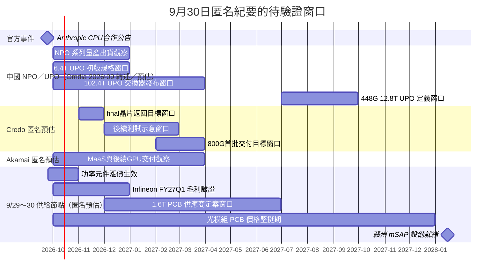

# 時程_2026-2027高速互連與分散式算力

## 日期表

| 日期 | 事件 | 相關公司 | 類型 | 重要性 | 備註 |
|---|---|---|---|---|---|
| 2026-05-21（報告轉述） | OIF 啟動 12.8Tb/s NPO Module 專案 | 產業工作群 | 規格研議 | ⭐⭐ | Omdia 2026-09 p.10，fact（轉述）／中；專案啟動非標準完成 |
| 2026-09（報告月份） | Intel InP-on-SOI、8／16 波長雷射陣列展示 | [[INTC.US(intel)]] | 技術展示 | ⭐⭐ | Omdia p.22，機構轉述／中；未披露量產時程 |
| 2026Q4（預估） | 中國 ICP 3.2T NPO OE／4×25.6T 系列開始量產出貨 | 阿里雲、騰訊等，未建頁 | 放量 | ⭐⭐⭐ | [[報告_Omdia_CIOE展會回顧_202609]] p.15，estimate／中低；不套用到 NVIDIA 或北美專案 |
| 2026Q4（規劃） | 6.4T UPO 初版規格 | 中國 ICP／標準工作群 | 規格升級 | ⭐⭐ | Omdia p.15，estimate／中低；UPO 為 NPO 變體 |
| 2026Q4～2027Q1（規劃） | 102.4T UPO 交換器發布 | 中國 ICP／設備商，未建頁 | 發表會 | ⭐⭐ | Omdia p.15，estimate／中低；Ruijie 展示不等於量產交付 |
| 2027Q3（規劃） | 448G 版本的 12.8T UPO 定義 | 中國 ICP／標準工作群 | 規格升級 | ⭐⭐ | Omdia p.15，estimate／中低；定義窗口非產品放量 |
| 2026-09-24 | Akamai公告擴大CPU基建合作 | [[Anthropic（未）]]；Akamai未建頁 | 合作 | ⭐⭐⭐ | 官方fact；不是B300訂單 |
| 2026-11（預估） | 1.6T Retimer／DSP final版本返回 | [[CRDO.US(credo)]] | 驗證 | ⭐⭐⭐ | 9/30匿名estimate／低信心 |
| 晶片返回後2–3個月（預估） | 晶片與AEC測試，再進工廠排產 | [[CRDO.US(credo)]] | 驗證 | ⭐⭐⭐ | 尚不能寫成量產時間 |
| 2027-02～03（預估） | 第一批800G光模組訂單交付完成 | [[CRDO.US(credo)]] | 放量 | ⭐⭐⭐ | 客戶未具名；另一專案6–10個月不合併 |
| 2026Q4～2027Q1（預估） | MaaS推出、後續B300資源交付 | Akamai，未建頁 | 放量 | ⭐⭐ | MaaS稱年底／年初；B300稱未來兩季，均為低信心且非Anthropic專用 |
| 2026-09底～10（預估） | 功率元件新一輪約10%漲價生效 | Infineon，未建頁 | 價格 | ⭐⭐ | 9/30匿名estimate；毛利改善看FY27Q1（2026-10～12） |
| 2026年底～2027Q2（預估） | 1.6T 光模組 PCB 供應商名單定案窗口 | 紅板科技等，未建頁 | 驗證 | ⭐⭐ | 錯過者2027H2後難進頭部客戶；匿名estimate |
| 2027 全年（預估） | 800V 在 AI 伺服器滲透率升至40%–50% | [[NVDA.US(nvidia)]] | 技術路線 | ⭐⭐ | 與券商10%–20%口徑衝突，見 [[技術_800VDC供電架構]] |
| 2027（Rubin Ultra，預估） | 蓋板可能由純銅升級金剛石銅複合 | [[NVDA.US(nvidia)]] | 技術路線 | ⭐⭐ | 低信心；Lid 路線未收斂，見 [[供應鏈_AI伺服器散熱]] |
| 2027H2 前（預估） | 光模組 PCB 價格堅挺，1.6T 可能續漲 | 光模組 PCB 廠 | 價格 | ⭐⭐ | 匿名estimate；2028Q3起800G與成熟1.6T可能降價 |
| 2028Q1（預估） | 贛州新廠 mSAP 設備就緒，產線由6條增至14條 | 紅板科技，未建頁 | 擴產 | ⭐⭐ | 公司公告項目2027-01開工、建設期48個月，節奏待核對 |
| Feynman 世代（預估） | 相變冷板與 CVD 金剛石熱沉可能導入 | [[NVDA.US(nvidia)]] | 技術路線 | ⭐ | 相變冷板仍在研發驗證，約2–3年 |

## Gantt 時程圖

圖說：季度與月份用起訖區間視覺化，並非新增確切日期；測試窗口只按11月返回與2–3個月流程示意，量產仍取決於版本、驗證與排產。

中國 NPO／UPO 節點是 Omdia 轉述的特定產品系列計畫，圖中的季初／季末只用於顯示窗口，不是承諾的交付日期；[[技術_CPO]] 保留與北美路線的區分。

> [!warning] 時程使用邊界
> Credo官方9/15已發布1.6T光模組，匿名訪談的AEC final版本／交付窗口涉及不同產品及階段，並列而不覆蓋。Akamai沒有既有公司頁，節點保留於本跨公司頁及分析頁；不把其MaaS／B300時程轉寫成Anthropic個股量產承諾。中國公司節點僅在原文與技術／分析頁保留，未新增公司頁。

## 2026Q3 法說季新增節點（LINE 群組 Memo，2026-10-04 收錄）

| 日期 | 事件 | 相關公司 | 類型 | 重要性 | 備註 |
|---|---|---|---|---|---|
| 2026-10 底 | 1.6T 光模組鋁合金外殼全自動線建成，11–12 月量產 | [[8431_匯鑽科（櫃）]] | 擴產 | ⭐⭐ | 公司說法／中 |
| 2026-10 下旬（預定） | 東擎由興櫃轉上市 | [[7710_東擎（興）]] | 上市 | ⭐ | 公司公告／中；以實際掛牌日為準 |
| 2026Q4 | VR200 機櫃量產 | [[3013_晟銘電（市）]] | 放量 | ⭐⭐⭐ | 公司說法／中 |
| 2026Q4 底～2027Q1 | 水冷板鍍鎳金／鍍鎳製程量產 | [[8431_匯鑽科（櫃）]] | 放量 | ⭐⭐ | EVT／DVT 完成、將進 PVT；公司說法／中 |
| 2026Q4（預估） | 玻璃基板送客戶測試 | [[8046_南電（市）]] | 驗證 | ⭐ | 群友筆記／低 |
| 2026 年底～2027 年初 | 第 2 代液冷運算櫃與 ORV3 800G 光纖機櫃移回台灣生產 | [[6933_AMAX-KY（市）]] | 擴產 | ⭐⭐ | 公司說法／中 |
| 2026 年底 | 天虹面板級封裝設備出貨觀察 | [[6937_天虹（市）]] | 驗證 | ⭐⭐ | 元大論壇／中 |
| 2027Q1 | AMD 伺服器 ABF 載板量產 | [[8046_南電（市）]] | 放量 | ⭐⭐ | 群友筆記／低至中 |
| 2027Q1 | FOPLP 檢測機台推出 | [[3563_牧德（市）]] | 新品 | ⭐⭐ | 法說／中 |
| 2027-02～03 | EMIB-T 矽橋載板 ABF 壓膜機出貨 | [[7795_長廣（興）]] | 新品 | ⭐⭐ | 法說／中 |
| 2027 | 先進封裝載具明確量產 | [[3680_家登（櫃）]] | 放量 | ⭐⭐ | 法說／中 |
| 2027 | 1.6T 振盪器擴產主力 | [[3042_晶技（市）]]、[[3221_台嘉碩（櫃）]] | 放量 | ⭐⭐ | 公司說法／中；台嘉碩 625 MHz 送樣 |
| 2027 | ABF 產能年增 30–40% | [[3037_欣興（市）]] | 擴產 | ⭐⭐⭐ | 永豐論壇／中 |
| 2027-01-01 | 牧德產能由 60 億元擴至 100 億元 | [[3563_牧德（市）]] | 擴產 | ⭐⭐ | 法說／中 |
| 2027（預估） | NPO 成為 2027–29 年主架構，CPO 2030 年後放大 | [[4979_華星光（櫃）]]、[[3081_LandMark光電（市）]] | 技術路線 | ⭐⭐⭐ | 公司觀點；與交換器 CPO 先行論點並列，見 [[技術_CPO]] |
| 2027 中 | 台灣銅鑼 DRAM 廠、ID1 投產 | [[MU.US(micron)]] | 擴產 | ⭐⭐⭐ | FY4Q26 法說／中高 |
| 2028H1（FY28 上半） | 高功率 CW laser 貢獻營收 | [[SMTC.US(semtech)]] | 放量 | ⭐⭐ | 法說／中 |
| 4Q28～2029 | 嘉義 AP7 CoPoS 量產 | [[2330_台積電（市）]] | 放量 | ⭐⭐⭐ | 元大論壇講者口徑；日系稱 2028；非公司正式時程 |

其他本批公司節點：[[7711_永擎（市）]]、[[3515_華擎（市）]] 的伺服器板與 AI 系統出貨、[[3587_閎康（櫃）]] 矽光子測試、[[6207_雷科（櫃）]] TGV／修阻機、[[4573_高明鐵（櫃）]] 光通訊對位設備、[[3019_亞光（市）]] 光學鏡頭與 [[3529_力旺（市）]] PUF／OTP 授權，詳見各公司頁時間軸。整體瓶頸整理見 [[分析_2026Q3法說季_AI供應鏈瓶頸與擴產節奏_LINE彙整]]。

> [!warning] 時程使用邊界
> 本段節點來自法說會、論壇與群友筆記，多為管理層或講者口頭說法；群友筆記與轉傳內容信心低，量產仍取決於客戶驗證與設備交期。

## Coherent 專家訪談節點（2026-10-05 收錄）

| 日期 | 事件 | 相關公司 | 類型 | 重要性 | 備註 |
|---|---|---|---|---|---|
| 2026-09 起 | DSP 晶片漲價 12%，2026Q4 反映於模組成本 | [[COHR.US(coherent)]] | 成本 | ⭐⭐⭐ | 專家訪談／低；季度合約轉嫁 |
| 2027 | 6 吋 InP 產能第二次倍增 | [[COHR.US(coherent)]] | 擴產 | ⭐⭐⭐ | 專家訪談／中低 |
| 2027 | OCS 4,400 台，NVIDIA 約 300 台首度導入 | [[COHR.US(coherent)]]、[[NVDA.US(nvidia)]]、[[GOOGL.US(alphabet)]] | 放量／驗證 | ⭐⭐ | 專家訪談／低 |
| 2027H2 | NPO 大量擴產（1.6T 22–23 萬、3.2T 38–40 萬、6.4T 7–8 萬個） | [[COHR.US(coherent)]] | 放量 | ⭐⭐⭐ | 專家訪談／低；現有設計皆需 DSP |
| 2028 | OCS 10,500 台，新增 Meta | [[COHR.US(coherent)]]、[[META.US(meta)]] | 放量／驗證 | ⭐⭐ | 專家訪談／低 |
| 2029 | 512×512 大埠數 OCS（延後） | [[COHR.US(coherent)]] | 技術下線 | ⭐ | 專家訪談／低 |

來源：[[memo_Coherent專家訪談_光模組量價_NPO_OCS_EML與獲利目標_日期不詳]]；判讀見 [[分析_Coherent專家訪談_光模組量價NPO與OCS_20261005]]。

## 來源

- [[memo_Coherent專家訪談_光模組量價_NPO_OCS_EML與獲利目標_日期不詳]] — Coherent 專家訪談整理稿，日期不詳（2026-10-05 收錄）。
- [[報告_Omdia_CIOE展會回顧_202609]] — Omdia／Mingyang Lyu，2026-09（僅揭露月份；pp.10、15、22）。
- [[memo_AceCamp_Credo_800G光模組與1.6TAEC_20260930]] — AceCamp Tech，2026-09-30。
- [[memo_AceCamp_Akamai_CPU算力與MaaS_20260930]] — AceCamp Tech，2026-09-30。
- [Akamai CPU合作公告](https://www.akamai.com/newsroom/press-release/akamai-announces-11-6-billion-multi-year-agreement-with-anthropic-to-support-growing-demand) — 2026-09-24。
- [Credo官方1.6T光模組發布](https://investors.credosemi.com/news-events/news/news-details/2026/Credo-Expands-ZeroFlap-Portfolio-with-224G-Based-1-6T-Optical-Transceivers-Addressing-the-Growing-Demand-for-AI-Network-Infrastructure/default.aspx) — 2026-09-15。
- [[memo_AceCamp_紅板科技光模組PCB與mSAP_20260930]] — AceCamp Tech，2026-09-30。
- [[memo_AceCamp_Infineon_AI電源與800V_20260930]] — AceCamp Tech，2026-09-30。
- [[memo_AceCamp_匿名Rubin散熱TIM2與金剛石_20260929]] — AceCamp Tech，2026-09-29。
- [紅板科技 mSAP 投資項目報導](https://www.nbd.com.cn/articles/2026-07-23/4504954.html) — 2026-07-23；贛州龍南廠區、2027-01 開工與 48 個月建設期。
- 2026Q3 法說季節點：[[活動_匯鑽科8431_元大論壇Memo_20260915]]、[[活動_東擎7710_CallMemo_20260901]]、[[活動_晟銘電3013_CallMemo_20261001]]、[[活動_AMAX-KY6933_CallMemo_20260917]]、[[活動_天虹6937_元大論壇Memo_20260909]]、[[活動_南電8046_群友會議筆記_20261001]]、[[活動_牧德3563_法說Memo_20260930]]、[[活動_長廣7795_法說與SEMICON_Memo_20260811]]、[[活動_家登3680_法說與SEMICON_Memo_20260827]]、[[活動_晶技3042_法說與論壇Memo_20260819]]、[[活動_台嘉碩3221_CallMemo_20260806]]、[[活動_欣興3037_永豐論壇Memo_20260916]]、[[活動_華星光4979_國泰CallMemo_20260828]]、[[活動_Micron_FY4Q26法說_20261001]]、[[活動_Semtech_FY2Q27法說_20260826]]、[[活動_元大投資論壇_設備CPO與CoPoS產業Memo_20260909]]（LINE 群組轉傳，2026-10-04 收錄）。

## 相關頁面

- [[技術_CPO]]
- [[分析_Coherent專家訪談_光模組量價NPO與OCS_20261005]]
- [[INTC.US(intel)]]
- [[分析_Omdia_CIOE2026_NPO部署與InP供給風險]]
- [[分析_20260930專家紀要公司辨識與商業化驗證]]
- [[分析_20260929-30專家紀要受訪公司辨識與供給驗證]]
