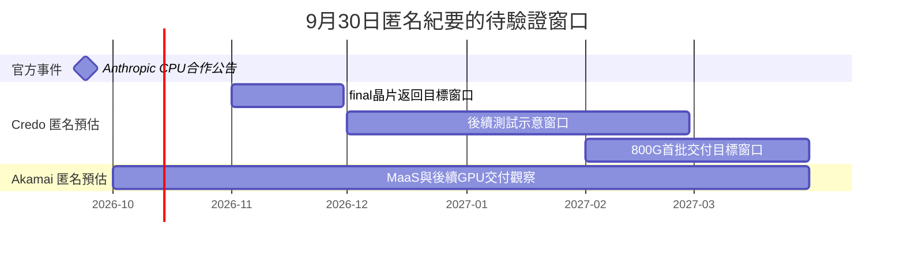

# 時程_2026-2027高速互連與分散式算力

## 日期表

| 日期 | 事件 | 相關公司 | 類型 | 重要性 | 備註 |
|---|---|---|---|---|---|
| 2026-09-24 | Akamai公告擴大CPU基建合作 | [[Anthropic（未）]]；Akamai未建頁 | 合作 | ⭐⭐⭐ | 官方fact；不是B300訂單 |
| 2026-11（預估） | 1.6T Retimer／DSP final版本返回 | [[CRDO.US(credo)]] | 驗證 | ⭐⭐⭐ | 9/30匿名estimate／低信心 |
| 晶片返回後2–3個月（預估） | 晶片與AEC測試，再進工廠排產 | [[CRDO.US(credo)]] | 驗證 | ⭐⭐⭐ | 尚不能寫成量產時間 |
| 2027-02～03（預估） | 第一批800G光模組訂單交付完成 | [[CRDO.US(credo)]] | 放量 | ⭐⭐⭐ | 客戶未具名；另一專案6–10個月不合併 |
| 2026Q4～2027Q1（預估） | MaaS推出、後續B300資源交付 | Akamai，未建頁 | 放量 | ⭐⭐ | MaaS稱年底／年初；B300稱未來兩季，均為低信心且非Anthropic專用 |

## Gantt 時程圖

圖說：季度與月份用起訖區間視覺化，並非新增確切日期；測試窗口只按11月返回與2–3個月流程示意，量產仍取決於版本、驗證與排產。

> [!warning] 時程使用邊界
> Credo官方9/15已發布1.6T光模組，匿名訪談的AEC final版本／交付窗口涉及不同產品及階段，並列而不覆蓋。Akamai沒有既有公司頁，節點保留於本跨公司頁及分析頁；不把其MaaS／B300時程轉寫成Anthropic個股量產承諾。中國公司節點僅在原文與技術／分析頁保留，未新增公司頁。

## 來源

- [[memo_AceCamp_Credo_800G光模組與1.6TAEC_20260930]] — AceCamp Tech，2026-09-30。
- [[memo_AceCamp_Akamai_CPU算力與MaaS_20260930]] — AceCamp Tech，2026-09-30。
- [Akamai CPU合作公告](https://www.akamai.com/newsroom/press-release/akamai-announces-11-6-billion-multi-year-agreement-with-anthropic-to-support-growing-demand) — 2026-09-24。
- [Credo官方1.6T光模組發布](https://investors.credosemi.com/news-events/news/news-details/2026/Credo-Expands-ZeroFlap-Portfolio-with-224G-Based-1-6T-Optical-Transceivers-Addressing-the-Growing-Demand-for-AI-Network-Infrastructure/default.aspx) — 2026-09-15。

## 相關頁面

- [[分析_20260930專家紀要公司辨識與商業化驗證]]
