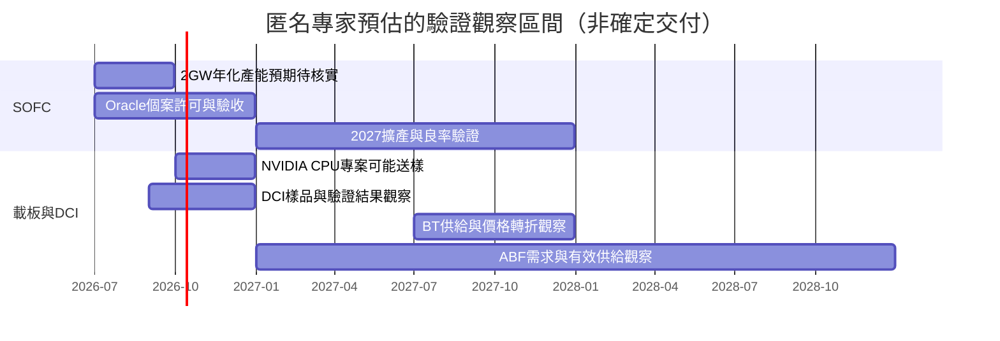

# 時程_2026-2028_SOFC與載板DCI驗證

> [!warning] 匿名訪談預估
> 下表是 2026-08-28～29 當時的預期，2026-10-01 入庫時沒有將已過日期自動視為達成。詳見 [[分析_20260828-29專家紀要公司辨識與供給瓶頸]]；量產、許可、正式訂單及公司指引均須另行確認。

## 日期表

| 日期 | 事件 | 相關公司 | 類型 | 重要性 | 備註與來源 |
|---|---|---|---|---|---|
| 2026Q3 | SOFC 年化名目產能約 2GW（預估，達成未核實） | [[BE.US(bloom_energy)]] | 放量 | ⭐⭐⭐ | 非全年交付；電堆良率仍限制合格產出。[[memo_AceCamp_SOFC隔膜供應商與Bloom交付_20260829_70565484]]、[[memo_AceCamp_SOFC電堆製程與供應鏈_20260829_70566304]] |
| 2026Q3–Q4 | Oracle 案例供氣／營運許可與驗收進度（預估） | [[ORCL.US(oracle)]]、[[BE.US(bloom_energy)]] | 驗證 | ⭐⭐⭐ | 08-29 訪談稱個案許可仍待完成，不能外推所有場址。[[memo_AceCamp_SOFC隔膜供應商與Bloom交付_20260829_70565484]]、[[memo_AceCamp_AI資料中心現場供電_20260829_70565950]] |
| 2026Q4 | 興森可能向 NVIDIA CPU 類專案送樣（預估） | [[NVDA.US(nvidia)]] | 驗證 | ⭐⭐ | 08-28 未正式下單、未稽核，非 GB300 量產資格。[[memo_AceCamp_興森mSAP與客戶驗證_20260828_70566408]] |
| 2026-09 至 2026Q4 | 德科立的 Coherent／Cisco DCI 驗證：原預估 09 月底樣品，最快 11–12 月結果 | [[COHR.US(coherent)]]；Cisco（無既有公司頁） | 驗證 | ⭐⭐ | 僅技術接洽／送樣時程，不是正式量產訂單。[[memo_AceCamp_德科立DCI與物料瓶頸_20260829_70566441]] |
| 2027 | Bloom 更大名目產能與隔膜採購目標（預估） | [[BE.US(bloom_energy)]] | 放量 | ⭐⭐ | 專家轉述約 3–4GW、甚至更高情境，非已確認公司指引；依良率及合格出貨驗證。[[memo_AceCamp_SOFC隔膜供應商與Bloom交付_20260829_70565484]]、[[memo_AceCamp_SOFC電堆製程與供應鏈_20260829_70566304]] |
| 2027H2 | BT 供給增加後可能價格競爭（預估） | 興森／BT 供應鏈 | 放量 | ⭐⭐ | ABF 與 BT 不同週期，BT 價格回落不能直接外推 ABF。[[memo_AceCamp_興森mSAP與客戶驗證_20260828_70566408]] |
| 2027–2028 | ABF 高階需求及新增產能爬坡（預估） | [[NVDA.US(nvidia)]]／載板供應鏈 | 放量 | ⭐⭐ | 匿名訪談仍看緊，須拆客戶、尺寸與良率。[[memo_AceCamp_興森mSAP與客戶驗證_20260828_70566408]] |

## Gantt 時程圖

圖中日期只表示季度觀察區間，不代表確切達成日。

## 驗證方式

- SOFC：分開核對名目產能、合格電堆、製造量、庫存交付及場址啟用。
- 載板：先看到送樣／稽核／正式訂單，才考慮量產；不同產品與 panel 面積不可直接加總。
- DCI：區分客戶目標、技術接觸、樣品、認證與批量交貨；在製品下降須伴隨交付／收入證據。

## 來源

- [[memo_AceCamp_興森mSAP與客戶驗證_20260828_70566408]] — 2026-08-28，匿名訪談。
- [[memo_AceCamp_SOFC隔膜供應商與Bloom交付_20260829_70565484]] — 2026-08-29，匿名訪談。
- [[memo_AceCamp_SOFC電堆製程與供應鏈_20260829_70566304]] — 2026-08-29，匿名訪談。
- [[memo_AceCamp_AI資料中心現場供電_20260829_70565950]] — 2026-08-29，匿名訪談。
- [[memo_AceCamp_德科立DCI與物料瓶頸_20260829_70566441]] — 2026-08-29，匿名訪談。

## 相關頁面

- [[分析_20260828-29專家紀要公司辨識與供給瓶頸]]
