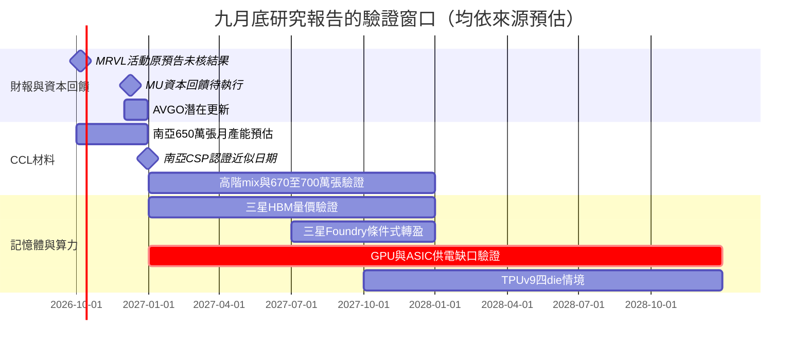

# 時程_2026-2028九月底AI材料與算力驗證

本頁保存 2026-09-28～30 報告的原預估窗口；截至 2026-10-08，日期已過的預告不推定完成。季度、半年及年底日期為觀察區間，圖中的月末／年末只作繪圖定位，均不是精確承諾。

## 日期表

| 日期 | 事件 | 相關公司 | 類型 | 重要性 | 備註 |
|---|---|---|---|---|---|
| 2026-10-06（原預告，已過） | Marvell Analyst Day | [[MRVL.US(marvell)]] | 發表／驗證 | ⭐⭐⭐ | BofA 09-29 預告；本批未收活動結果，需另查新指引 |
| 2026Q4（預估） | 南亞 CCL 月產能約 650 萬張 | [[1303_南亞（市）]] | 擴產 | ⭐⭐⭐ | UBS 09-28，3Q26 約 620 萬；追蹤有效供給、ASP 與良率 |
| 約 2026 年底（預估） | 南亞美國 CSP 高階 CCL 認證及潛在訂單 | [[1303_南亞（市）]] | 驗證 | ⭐⭐⭐ | UBS QRR 以 12-31 為近似催化劑日，客戶未具名，非確定通過 |
| 2026-12-09 起（預估／待執行） | Micron 資本回饋／買回觀察 | [[MU.US(micron)]] | 資本回饋 | ⭐⭐⭐ | BofA 09-29 與既有公司展望並列；實際金額、公告與執行待驗證 |
| 約 2026-12（預估） | Broadcom FQ4 潛在資本回饋更新 | [[AVGO.US(broadcom)]] | 財報／資本回饋 | ⭐⭐ | BofA 09-29 預期可能提高買回，非已宣布 |
| 2027（預估） | 三星 HBM 210 億 Gb、營收約 US$74bn | [[005930.KR(samsung)]] | 放量／定價 | ⭐⭐⭐ | 高盛 09-30；ASP、位元、客戶與良率逐項核對 |
| 2027H2（預估） | 三星 Foundry／System LSI 轉盈窗口 | [[005930.KR(samsung)]] | 營運驗證 | ⭐⭐ | 高盛 09-30，須稼動率逾 90%，非公司保證 |
| 2027 年底（預估） | 南亞 CCL 月產能約 670–700 萬張、M6+ CCL 收入比約 25% | [[1303_南亞（市）]] | 擴產／組合升級 | ⭐⭐⭐ | UBS 09-28；收入占比與張數比不可混用 |
| 2027 年底～2028（情境） | TPUv9 四 die 與高功率機架需求 | [[GOOGL.US(alphabet)]]、[[AVGO.US(broadcom)]] | 規格升級／驗證 | ⭐⭐⭐ | UBS 09-29 模型，與聯發科 2028 EMIB-T 口徑不直接等同；平台與製程待驗證 |
| 2027～2028（預估） | NVIDIA GPU／rack 密度與設施供電驗證 | [[NVDA.US(nvidia)]] | 放量／供電 | ⭐⭐⭐ | UBS GPU 約 1,430／1,830 萬顆、racks 16.8／16.5 萬；2027／28 供電缺口約 20／25–30GW |
| 2027～2028（情境） | AMD Helios／MI500 功率與系統配置 | [[AMD.US(amd)]] | 規格升級／驗證 | ⭐⭐⭐ | UBS Helios 約 235kW、MI500 256 GPU 約 1MW；source 晶片數口徑疑義，非正式規格 |

## Gantt 時程圖

圖說：已知原預告日使用 milestone；擴產、認證、獲利與供電為區間，須以後續公告及實績更新。

## 驗證與失效條件

- 認證送樣、完成驗證、取得訂單與收入認列分開；客戶未具名不得推定供應資格。
- CCL 漲價反轉、M6+ 產品良率不足或 HBM 量價不達標，對應 EPS thesis 應下修。
- 互連排程若未轉施工／送電、BTM 設備及燃料不足，GPU／ASIC 量產不代表可即時部署。
- 新世代功率與 die 數是券商模型，不能寫成官方規格；已過原預告不填「已完成」。

## 來源與相關頁面

- [[報告_BofA_AgenticAI半導體市場_20260929]] — BofA，2026-09-29
- [[報告_UBS_AI算力與資料中心電力供給_20260929]] — UBS，2026-09-29
- [[報告_UBS_南亞CCL漲價與產品升級_20260928]] — UBS，2026-09-28
- [[報告_高盛_三星HBM與獲利預估_20260930]] — 高盛，2026-09-30
- [[分析_AgenticAI需求到供電與材料獲利的驗證_20260929]]
- [[技術_CCL]]、[[技術_AI推論與ASIC平台]]、[[技術_HBM高頻寬記憶體]]
---
