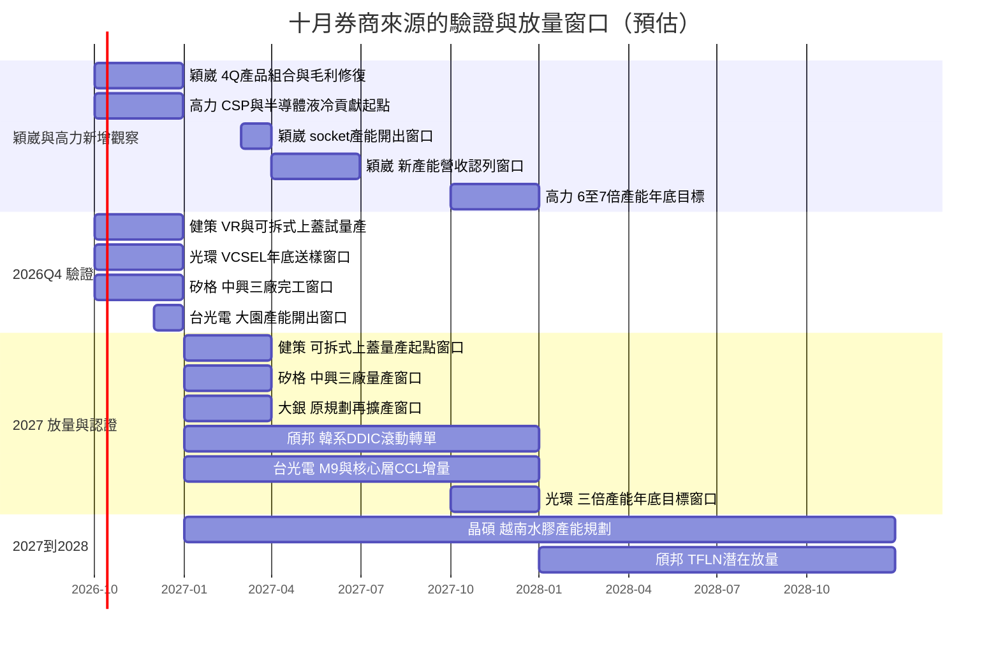

# 時程_2026-2028十月券商催化劑

## 日期表

本頁整理 2026-10-05～07 券商報告，**節點為來源轉述／預估，非統一公司公告時程**。產能、營收及設計導入分開追蹤；各公司頁保留來源內部差異。

| 日期 | 事件 | 相關公司 | 類型 | 重要性 | 來源與信心 |
|---|---|---|---|---|---|
| 2026Q4 | 探針卡交付減少後營收與毛利率分流（預估） | [[6515_穎崴（市）]] | 產品組合 | ⭐⭐⭐ | Citi／Daiwa 10/6 estimate、中；Daiwa 估營收持平至小幅季減、毛利率回升 |
| 2026Q4 起 | CSP CDU 與半導體設備液冷可能新增貢獻（預估） | [[8996_高力（市）]] | 放量 | ⭐⭐⭐ | [[報告_CLSA_SinoPac_高力_20261006]] thesis、中；未提供具名新訂單 |
| 2027-03→2027Q2 | 新增 socket 產能開出，再認列營收（預估） | [[6515_穎崴（市）]] | 擴產／放量 | ⭐⭐⭐ | [[報告_Daiwa_穎崴_20261006]] estimate、中；不等同原春針擴產計畫全數延期 |
| 2027 年底 | 高力產能目標為報告時 6–7 倍（預估） | [[8996_高力（市）]] | 擴產 | ⭐⭐⭐ | [[報告_CLSA_SinoPac_高力_20261006]] estimate、中；產品口徑與絕對產能未列 |
| 2026H2 | 可靠度重新認證後代工回流 | [[3234_光環（櫃）]] | 放量 | ⭐⭐⭐ | 第一金 10/5 轉述／中，客戶未具名 |
| 2026Q4 | VR 機櫃量產／可拆式上蓋擴大試量產（預估） | [[3653_健策（市）]] | 規格升級 | ⭐⭐⭐ | 凱基 10/7／中，不等同 MCL |
| 2026Q4 | 中興三廠完工（預估） | [[6257_矽格（市）]] | 放量 | ⭐⭐⭐ | 宏遠 10/7／中，設備交期影響爬坡 |
| 2026Q4 | 日本與歐洲需求延續（預估） | [[6491_晶碩（市）]] | 放量 | ⭐⭐ | 富邦 10/7／中，大溪新產能調適中 |
| 2026-12 | 大園新增產能預計開出 | [[2383_台光電（市）]] | 放量 | ⭐⭐ | 富邦 10/6／中；原文「30 張」單位未確認 |
| 2026 年底 | 1060nm VCSEL 提供客戶測試（預估） | [[3234_光環（櫃）]] | 驗證 | ⭐⭐ | 第一金 10/5／中，無具名設計導入 |
| 2027Q1 起 | 可拆式上蓋量產（預估） | [[3653_健策（市）]] | 放量 | ⭐⭐⭐ | 凱基 10/7／中；ASP／GPU 數量為模型假設 |
| 2027Q1 | 中興三廠量產（預估） | [[6257_矽格（市）]] | 放量 | ⭐⭐⭐ | 宏遠 10/7／中 |
| 2027Q1 | 原規劃定位平台產能再增 30% | [[4576_大銀微系統（市）]] | 放量 | ⭐⭐⭐ | 統一 10/7 轉述／中；券商模型僅採 22% |
| 2027Q1 起、至年底滾動 | 韓系百餘款 DDIC 委外（預估） | [[6147_頎邦（櫃）]] | 放量 | ⭐⭐⭐ | 凱基 10/7／中；客戶未具名，模型納 20 億元 |
| 2027 | 光通訊測試／切割逐步貢獻（預估） | [[6147_頎邦（櫃）]] | 放量 | ⭐⭐ | 凱基 10/7／中；設備投入不等同已完成驗證 |
| 2027 | M9 比重雙位數、ABF 核心層 CCL 增量（預估） | [[2383_台光電（市）]] | 規格升級／驗證 | ⭐⭐⭐ | 富邦 10/6／中；核心層 CCL 非 ABF 增層膜 |
| 2027 年底 | 產能估為 2026 年底 3 倍 | [[3234_光環（櫃）]] | 放量 | ⭐⭐⭐ | 第一金 10/5 estimate／中 |
| 2027→2028 | 越南水膠月產能規劃 1,000→2,000 萬片 | [[6491_晶碩（市）]] | 放量 | ⭐⭐⭐ | 富邦 10/7 轉述／中；不是已開出產能 |
| 2028 | TFLN 後段潛在有意義放量 | [[6147_頎邦（櫃）]] | 放量 | ⭐⭐ | 凱基 10/7 thesis／中低，未納入獲利模型 |

## Gantt 時程圖

季度／年度以區間呈現，區間端點只是圖表換算，不表示來源確認了確切日期。年底送樣用 Q4 窗口表達。

## 相關頁面

- [[技術_矽光子（SiPh）]]、[[技術_TFLN]]、[[技術_光互連]]、[[技術_CCL]]。
- [[供應鏈_AI光互聯]]、[[供應鏈_工業自動化]]、[[供應鏈_醫療器材]]。

## 來源

- [[報告_Citi_穎崴_20261006]] — Citi，2026-10-06。
- [[報告_Daiwa_穎崴_20261006]] — Daiwa，2026-10-06。
- [[報告_CLSA_SinoPac_高力_20261006]] — SinoPac 研究／CLSA 分發，2026-10-06。
- [[報告_凱基_健策規格升級_20261007]] — 凱基投顧，2026-10-07。
- [[報告_凱基_頎邦光通訊與韓系轉單_20261007]] — 凱基投顧，2026-10-07。
- [[報告_富邦_台光電營運一路走高_20261006]] — 富邦投顧，2026-10-06。
- [[報告_富邦_晶碩營運動能無虞_20261007]] — 富邦投顧，2026-10-07。
- [[報告_第一金_光環光通訊與VCSEL_20261005]] — 第一金投顧，2026-10-05。
- [[報告_宏遠_矽格矽光子測試與擴產_20261007]] — 宏遠投顧，2026-10-07。
- [[報告_統一_大銀微系統精密定位_20261007]] — 統一投顧，2026-10-07。
