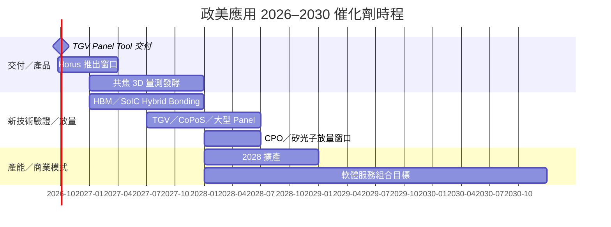

# 時程_2026-2028政美應用催化劑

## 日期表

| 日期 | 事件 | 相關公司 | 類型 | 重要性 | 備註 |
|---|---|---|---|---|---|
| 2026Q4 | TGV Panel Tool 承諾交付 | [[7853_政美應用（興）]] | 驗證／交付 | ⭐⭐⭐ | 客戶關鍵製程規格仍未定，交付後預計隨製程改機 |
| 2026Q4 | 現有產能滿載 | [[7853_政美應用（興）]] | 產能 | ⭐⭐⭐ | 公司／券商轉述；需以出貨、驗收與認列確認 |
| 2027Q1 前 | Horus 高靈敏度檢測設備預計推出 | [[7853_政美應用（興）]] | 技術下線 | ⭐⭐⭐ | Fan-out、CoWoS、矽光子、HBM |
| 2027 | Hybrid Bonding 的 HBM／SoIC 專案開始看到成果 | [[7853_政美應用（興）]] | 驗證／放量 | ⭐⭐⭐ | Tier 1 客戶未具名；公司展望 |
| 2027 | 共焦 3D 量測方案逐步發酵 | [[7853_政美應用（興）]] | 技術下線 | ⭐⭐ | 待客戶驗收與營收貢獻確認 |
| 2027H2–2028H1 | TGV、CoPoS、大型 Panel 設備陸續成為訂單／營收來源 | [[7853_政美應用（興）]] | 放量 | ⭐⭐⭐ | estimate；規格與客戶量產時程可變動 |
| 2028H1 | CPO／矽光子檢測需求預期明顯放量 | [[7853_政美應用（興）]] | 放量 | ⭐⭐⭐ | Waveguide、Lens、Micro Lens、膜厚；客戶提前量產則可能提前交付 |
| 2028 | 擴充產能承接 TGV、CPO、HBM、SoIC | [[7853_政美應用（興）]] | 產能擴張 | ⭐⭐⭐ | 尚未揭露擴產金額、地點與台數 |
| 2030 | 設備、軟體與售後服務營收組合目標 | [[7853_政美應用（興）]] | 商業模式 | ⭐⭐ | 軟體＋服務占比 30%以上／40%以上口徑衝突，待公司確認 |

## Gantt 時程圖

> [!warning] 時程邊界
> 除 TGV Panel Tool 的 4Q26 交付承諾外，多數節點是公司／券商展望；「已驗證部分項目」不等於量產訂單，「滿載」也不等於收入已認列。

## 來源

- [[memo_國泰證期_政美應用CallMemo_20260904]] — 國泰證期研究部，2026-09-04。

## 相關頁面

- [[7853_政美應用（興）]]
- [[分析_政美應用先進封裝檢測與軟體轉型_20260904]]
- [[供應鏈_CPO]]
