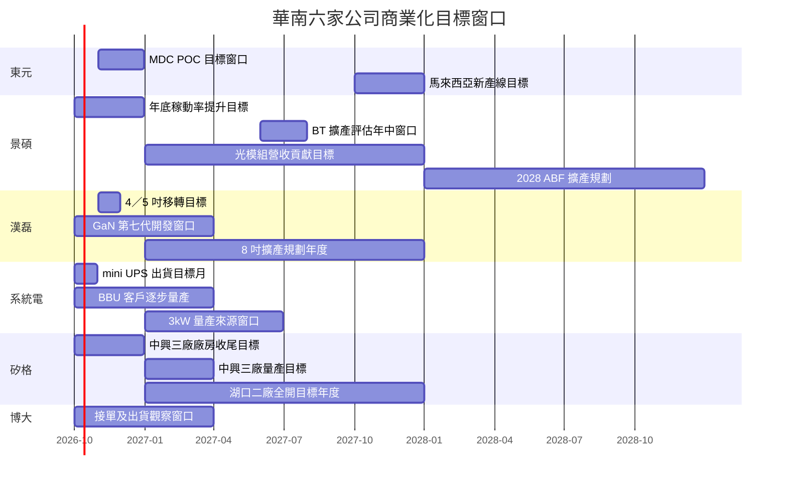

# 時程_2026-2028華南六家公司商業化節點

## 日期表

除已運作項目外均為華南 2026-10-06／07 memo 轉述的目標窗口，並非正式承諾；圖中季度／年度區間只呈現窗口，不能作精確量產日。

| 日期 | 事件 | 相關公司 | 類型 | 重要性 | 備註 |
|---|---|---|---|---|---|
| 2026Q2 後／Q3 | 越南廠運作後陸續出貨／貢獻營收 | [[8109_博大（櫃）]] | 產能開出 | ⭐⭐ | fact／中；兩個時點分別為運作與營收口徑 |
| 2026-10（預估） | mini UPS／BBU 開始出貨 | [[5309_系統電（櫃）]] | 出貨 | ⭐⭐⭐ | 摘要 11kW，正文型號未定；中低信心 |
| 2026-11（預估） | 4／5 吋產線設備與人員移轉完成 | [[3707_漢磊（櫃）]] | 整併 | ⭐⭐ | 2026-08 已停產；estimate／中 |
| 2026-11–12（預估） | 約 2.7MW MDC POC 完成 | [[1504_東元（市）]] | 驗證 | ⭐⭐⭐ | 約對應 2MW 算力單元，之後才推進接單；estimate／中 |
| 2026Q4（預估） | TVS 擴產逐步開出、8 吋 SiC 推進市場 | [[3707_漢磊（櫃）]] | 放量／驗證 | ⭐⭐⭐ | 產品與公司口徑待確認，未有訂單金額 |
| 2026Q4（預估） | 中興三廠廠房收尾 | [[6257_矽格（市）]] | 建置 | ⭐⭐⭐ | 無塵室／機電工序時點與國泰不同，量產目標均 Q1 |
| 2026Q4（預估） | 年底 ABF／BT 稼動率目標 95%／85% | [[3189_景碩（市）]] | 放量 | ⭐⭐⭐ | estimate／中；高層數有效產出仍受材料限制 |
| 2026Q4–2027Q1（預估） | BBU 客戶逐步量產 | [[5309_系統電（櫃）]] | 放量 | ⭐⭐⭐ | 月營收逐步爬坡，非一次跳升；estimate／中 |
| 2026Q4–2027Q1（預估） | 第七代 GaN 開發完成 | [[3707_漢磊（櫃）]] | 驗證 | ⭐⭐⭐ | 開發完成不等於量產；estimate／中 |
| 2026Q4–2027Q1（預估） | 訂單動能延續、鐵路部分訂單跨年度 | [[8109_博大（櫃）]] | 出貨 | ⭐⭐ | 12 月歐美假期與出貨協商仍可能影響認列 |
| 2027Q1／H1（預估） | 3kW 量產 | [[5309_系統電（櫃）]] | 放量 | ⭐⭐⭐ | 正文 Q1、摘要 H1；型號時程需核對 |
| 2027Q1（預估） | 中興三廠投入量產 | [[6257_矽格（市）]] | 放量 | ⭐⭐⭐ | 滿載估 4 億元／月，無滿載時程；不全年化 |
| 2027（預估） | 湖口二廠產能全數開出 | [[6257_矽格（市）]] | 放量 | ⭐⭐⭐ | 80% 視為滿載、估月營收 2–3 億；設備交期是限制 |
| 2027 年中（預估） | BT 擴產重新評估 | [[3189_景碩（市）]] | 擴產評估 | ⭐⭐ | 非已決議投資 |
| 2027（預估） | 光模組載板營收占比估約 5% | [[3189_景碩（市）]] | 放量 | ⭐⭐⭐ | 2026 約 2–3%；驗證轉收入需追蹤 |
| 2027H2（情境） | 高層數 ABF 更緊，可能增加額外議價力 | [[3189_景碩（市）]] | 定價 | ⭐⭐⭐ | thesis／中；有別於成本轉嫁 |
| 2027（規劃） | 8 吋 SiC 1,500→3,000 片／月 | [[3707_漢磊（櫃）]] | 擴產 | ⭐⭐⭐ | 未提供完成月份；estimate／中低 |
| 2027（預估） | 5.5kW 與工業新專案推進 | [[5309_系統電（櫃）]] | 驗證／放量 | ⭐⭐ | 5.5kW 延誤後時程不明，保留摘要年份 |
| 2027（預估） | 資料中心營收占比約 7–8% 以上 | [[1504_東元（市）]] | 放量 | ⭐⭐⭐ | 不把 MDC 尚未接單貢獻重複算入 |
| 2027Q4（預估） | 馬來西亞新增產線開出 | [[1504_東元（市）]] | 擴產 | ⭐⭐ | estimate／中 |
| 2027 年底（預估） | T-Class 高階載板材料短缺可能緩解 | [[3189_景碩（市）]] | 供給 | ⭐⭐⭐ | 供應放量及認證需另驗證 |
| 2028（預估） | 景碩 ABF 65 million units 及 CAPEX 180–200 億元規劃 | [[3189_景碩（市）]] | 擴產 | ⭐⭐ | 原文另有 2028 80 million units，年份與頻率待確認，不繪為第二個確定節點 |

## Gantt 時程圖

## 來源

- [[活動_華南投顧_東元1504_20261006]] — 2026-10-06。
- [[活動_華南投顧_景碩3189_20261007]] — 2026-10-07。
- [[活動_華南投顧_漢磊3707_20261007]] — 2026-10-07。
- [[活動_華南投顧_系統電5309_20261007]] — 2026-10-07。
- [[活動_華南投顧_矽格6257_20261006]] — 2026-10-06。
- [[活動_華南投顧_博大8109_20261007]] — 2026-10-07。

## 相關頁面

- [[分析_華南六家公司成長動能與商業化驗證_20261008]]
