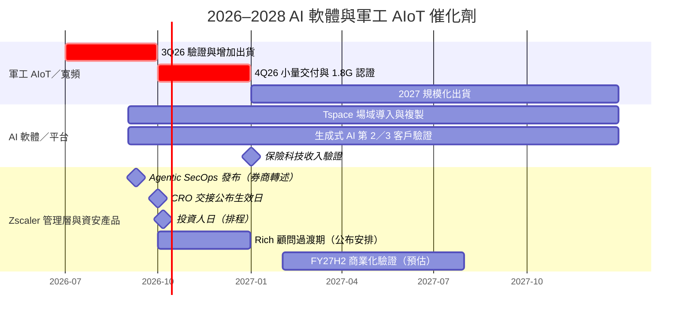

# 時程_2026AI軟體與軍工AIoT催化劑

## 日期表

| 日期 | 事件 | 相關公司 | 類型 | 重要性 | 備註 |
|---|---|---|---|---|---|
| 2026Q3 | 達運軍工 AIoT 驗證專案逐步完成、開始增加出貨 | [[8045_達運光電（市）]] | 驗證／出貨 | ⭐⭐⭐ | 法說轉述；需追蹤驗證完成率 |
| 2026Q4 | 達運軍工 AIoT 小規模交付；1.8G 進入認證／小量試產 | [[8045_達運光電（市）]] | 出貨／驗證 | ⭐⭐⭐ | 客戶正式採購未確認 |
| 2026Q4 前 | 騰雲台北車站場域導入新的數位解決方案 | [[6870_騰雲（櫃）]] | 導入 | ⭐⭐ | 客戶場域，不等同新增訂單 |
| 2026–2027 | 現觀北美、北歐授權擴張；Bell Canada 第二階段部署 | [[6906_現觀科技（市）]] | 放量／海外 | ⭐⭐⭐ | 新客戶與擴充時點待確認 |
| 2027 | 騰雲保險科技開始產生收入；現觀第 2、3 個生成式 AI 客戶較可能貢獻 | [[6870_騰雲（櫃）]]、[[6906_現觀科技（市）]] | 新業務 | ⭐⭐⭐ | 公司展望，非已確認財測 |
| 2027–2028 | 達運五大國防專案若得標，提供基準營收以外上行 | [[8045_達運光電（市）]] | 投標／放量 | ⭐⭐⭐ | 潛在市場約 186 億元，不等同訂單 |
| 2026 年底（預估） | 政府 PQC 標準提出與企業 AI 治理採購驗證 | [[7714_創泓科技（櫃）]] | 規格／驗證 | ⭐⭐ | Call Memo 轉述；詢問度不等於合約 |
| 2026H2–2027 | 毫米波 FWA 實地驗證轉量產進度 | [[7812_稜研科技-創（市）]] | 驗證／放量 | ⭐⭐⭐ | 公司展望；衛星／國防專案週期長 |

## Zscaler 管理層與 AI 安全商業化

| 日期 | 事件 | 相關公司 | 類型 | 重要性 | 備註 |
|---|---|---|---|---|---|
| 2026-09-09（券商轉述） | Agentic SecOps 正式推出；Zero Trust for Agents 為 early access | [[ZS.US(zscaler)]] | 產品發表 | ⭐⭐ | [[報告_Jefferies_Zscaler_CRO交接_20260924]]，fact／中；產品可用不等於收入 |
| 2026-10-01（公布生效日） | Ross Tackett 接任 CRO | [[ZS.US(zscaler)]] | 管理層交接 | ⭐⭐⭐ | [[報告_Barclays_Zscaler_CRO交接_20260924]]；依 9/24 來源安排，未另驗證完成 |
| 2026-10-06（依報告排程） | 紐約投資人日，追蹤 FY27 ARR 指引與長期利益率目標 | [[ZS.US(zscaler)]] | 投資人日／驗證 | ⭐⭐⭐ | [[報告_Barclays_Zscaler_投資人日預覽_20260929]]；25–30% 為券商預期，非已宣布目標 |
| 2026-12-31（公布安排） | Mike Rich 策略顧問任期結束 | [[ZS.US(zscaler)]] | 管理層交接 | ⭐⭐ | [[報告_RBC_Zscaler_CRO交接_20260924]]，fact／中 |
| FY27H2（2027-02～07，預估） | 銷售團隊磨合與 Agentic SecOps／新產品收入驗證 | [[ZS.US(zscaler)]] | 商業化／成長驗證 | ⭐⭐⭐ | [[報告_Jefferies_Zscaler_CRO交接_20260924]]，thesis／中；非已知放量 |

## Gantt 時程圖

## 來源

- [[報告_Barclays_Zscaler_CRO交接_20260924]] — Barclays，2026-09-24。
- [[報告_RBC_Zscaler_CRO交接_20260924]] — RBC Capital Markets，2026-09-24。
- [[報告_Jefferies_Zscaler_CRO交接_20260924]] — Jefferies，2026-09-24。
- [[報告_Barclays_Zscaler_投資人日預覽_20260929]] — Barclays，2026-09-29。

- [[活動_騰雲法說_20260917]] — 富邦投顧，2026-09-17。
- [[活動_現觀科技法說_20260918]] — 國泰證期研究部，2026-09-18。
- [[活動_達運光電法說_20260918]] — 國泰證期研究部，2026-09-18。
- [[memo_國泰證期_創泓科技CallMemo_20260902]] — 國泰證期研究部，2026-09-02。
- [[活動_富邦投顧_稜研科技業績發表會_20260901]] — 富邦投顧，2026-09-01。

## 相關頁面

- [[分析_Zscaler_CRO交接與非席次計價_20261005]]

- [[3447_展達（市）]]
- [[分析_騰雲Tspace實體場域AI商業化_20260917]]
- [[分析_現觀科技電信生成式AI與BoostQuant_20260918]]
- [[分析_達運光電軍工AIoT與1.8G寬頻_20260918]]

