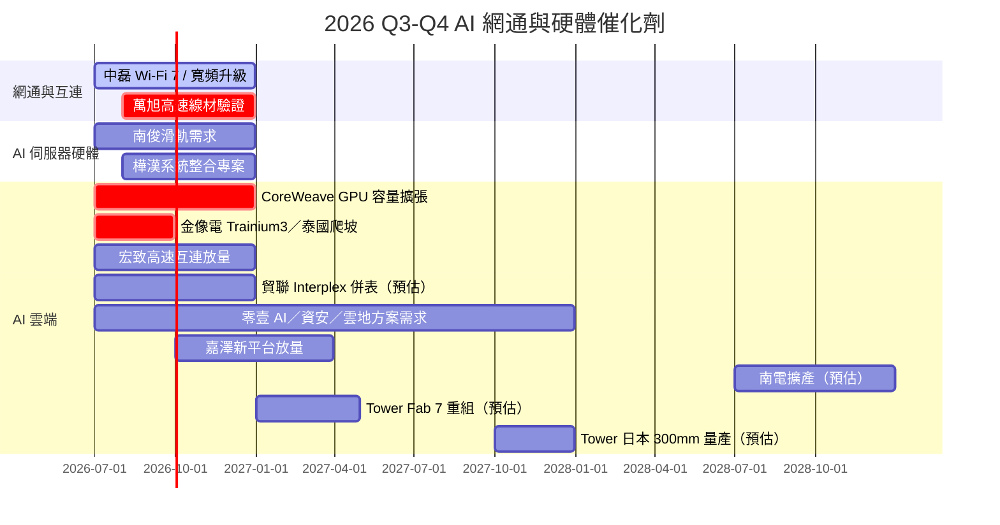

# 時程_2026Q3Q4_AI網通與硬體催化劑

## 日期表
| 日期 | 事件 | 相關公司 | 類型 | 重要性 | 備註 |
|---|---|---|---|---|---|
| 2026H2 | 中磊寬頻升級與 Wi‑Fi 7 持續出貨 | [[5388_中磊（市）]] | 放量 | ⭐⭐⭐ | 記憶體成本轉嫁是關鍵 |
| 2026H2 | 萬旭 AI 伺服器高速線材驗證與放量 | [[6134_萬旭（櫃）]] | 驗證 | ⭐⭐⭐ | 追蹤客戶導入 |
| 2026H2 | 樺漢 AIoT／系統整合專案認列 | [[6414_樺漢（市）]] | 放量 | ⭐⭐ | 專案毛利與現金流 |
| 2026H2 | 南俊國際 AI 伺服器滑軌需求延續 | [[6584_南俊國際（市）]] | 放量 | ⭐⭐⭐ | 產品組合與利用率 |
| 2026H2 | CoreWeave GPU 雲端容量擴張 | [[CRWV.US(coreweave)]] | 放量 | ⭐⭐⭐ | 利用率、資本支出回報 |
| 2027Q1 | 世芯 Trainium3／中磊 DAA 逐步放量 | [[3661_世芯-KY（市）]]、[[5388_中磊（市）]] | 放量 | ⭐⭐⭐ | 兩者來源分別為中信報告估計 |
| 2026Q3 | 金像電 Trainium3 PCB 份額與泰國產能爬坡驗證 | [[2368_金像電（市）]] | 驗證 | ⭐⭐⭐ | [[260811_gs_GCE]]，份額為 Goldman Sachs estimate |
| 2026Q3–Q4 | 宏致 ASIC 高速連接器與高速線出貨 | [[3605_宏致（市）]] | 放量 | ⭐⭐⭐ | [[宏致(3605,Note)-CTBC260724]]，公司展望 |
| 2026H2 | 貿聯 Interplex Datacom 交割與併表 | [[3665_貿聯-KY（市）]] | 併購 | ⭐⭐ | [[貿聯(3665,Note)-CTBC260730]]，時程待確認 |
| 2026Q4–2027Q1 | 嘉澤新 CPU 平台與 QD／SOCAMM 放量 | [[3533_嘉澤（市）]] | 放量 | ⭐⭐⭐ | [[嘉澤(3533,OW_增加持股)-CTBC260814]] |
| 2028H2（預估） | 南電綠地擴產最早開始放量 | [[8046_南電（市）]] | 擴產 | ⭐⭐⭐ | [[260806_citi_nypcb]]，Citi 判斷 |
| 2026Q3 | 台燿泰國高階 CCL 新產能提前爬坡 | [[6274_台燿（市）]] | 放量 | ⭐⭐⭐ | [[260730_gs_TUC]]，公司展望／GS estimate |
| 2026H2–2027 | 聯茂高階 CCL 漲價與產能爬坡 | [[6213_聯茂（市）]] | 規格升級 | ⭐⭐⭐ | [[260808_daiwa_iteq-UG]]，券商 estimate |
| 2027H1–2027Q2 | 長廣日本 ABF 設備產能由 18 台增至 25 台 | [[7795_長廣（興）]] | 擴產 | ⭐⭐ | [[Daiwa-7795 20260805]]，公司展望／Daiwa estimate |
| 2026H2 | 國巨 MLCC 價格調整逐步傳導 | [[2327_國巨（市）]] | 漲價 | ⭐⭐⭐ | [[260810_citi_yageo]]，Citi 解讀 |
| 2026H2–2027 | 零壹 AI／資安／雲地整合方案需求擴大 | [[3029_零壹（市）]] | 放量 | ⭐⭐⭐ | [[零壹科技2026年度 上半年法人說明會 (1)]]，公司展望；市場 CAGR 為 IDC／MIC 預測 |
| 2027-04（預估） | Tower／NTCJ Fab 7 權益重組完成 | [[TSEM.US(tower semiconductor)]] | 重組 | ⭐⭐⭐ | [[報告_開源證券_Tower半導體矽光代工_20260818]]，取決於交易條件 |
| 2027Q4（預估） | Tower 日本 300mm 矽光／矽鍺產線具備量產能力 | [[TSEM.US(tower semiconductor)]] | 量產 | ⭐⭐⭐ | [[報告_開源證券_Tower半導體矽光代工_20260818]]，公司規劃／券商整理 |
| 2026Q4 | 信驊新 OSAT 夥伴與 E-glass 認證進展 | [[5274_信驊（市）]] | 驗證 | ⭐⭐ | [[gs 5274]]，Goldman Sachs estimate |

## Gantt 時程圖

## 來源
- [[中磊(5388B_買進)-CTBC260817]] — 中信投顧，2026-08-17
- [[世芯-KY(3661,B_買進)-CTBC260817]] — 中信投顧，2026-08-17
- [[萬旭(6134,B_買進)-CTBC260820]] — 中信投顧，2026-08-20
- [[Daiwa-6584 20260819]] — Daiwa，2026-08-19
- [[CoreWeave（CRWV US）0818]] — 券商研究，2026-08-18
- [[260811_gs_GCE]] — Goldman Sachs，2026-08-11
- [[宏致(3605,Note)-CTBC260724]] — 中信投顧，2026-07-24
- [[貿聯(3665,Note)-CTBC260730]] — 中信投顧，2026-07-30
- [[嘉澤(3533,OW_增加持股)-CTBC260814]] — 中信投顧，2026-08-14
- [[260806_citi_nypcb]] — Citi Research，2026-08-06
- 2026-08-21：[[3665_貿聯-KY（市）]] 預定公布 2Q26 財報；Morgan Stanley 關注電源互連、AEC 與光互連訂單延續性。
- 2026-08-24：[[TSEM.US(tower semiconductor)]] 矽光／矽鍺擴產、Fab 7 重組與 AI 光互連客戶預訂列為中期觀察節點；數字屬券商 estimate。
- 2026-08-24：[[3029_零壹（市）]] 將 AI 規模化、資安升級與雲端遷移列為 2026H2–2027 方案需求動能；市場 CAGR 為 IDC／MIC 第三方預測，非公司財測。
- 2026-4Q：[[3037_欣興（市）]] mSAP／1.6T 光模組板產能開出，觀察 hyperscaler 直客需求與良率。
## 2026-08-23 新增節點

| 日期 | 事件 | 相關公司 | 類型 | 重要性 | 備註 |
|------|------|---------|------|--------|------|
| 2026Q3 | 高階 M7+/M8+ CCL 第二輪漲價與價格傳導 | [[2383_台光電（市）]]、[[6274_台燿（市）]] | 規格升級 | ⭐⭐⭐ | Goldman Sachs／Daiwa estimate，需追蹤客戶接受度 |
| 2026Q3 | Trainium3 UBB PCB 與 AI PCB 產品 mix 提升 | [[2368_金像電（市）]]、[[4958_臻鼎（市）]] | 放量 | ⭐⭐⭐ | 公司展望／券商 estimate |
| 2026H2 | EMIB-T／高階 ABF 擴產與驗證 | [[3037_欣興（市）]]、[[8046_南電（市）]]、[[7795_長廣（興）]] | 驗證 | ⭐⭐⭐ | 良率、設備交期與實際投產為關鍵 |
| 2026H2 | AI MLCC 長約與漲價傳導 | [[2327_國巨（市）]]、[[009150.KR(semco)]] | 放量 | ⭐⭐ | 需求強度與非 AI 終端復甦仍需觀察 |

## 相關頁面

- [[2228_劍麟（市）]]
