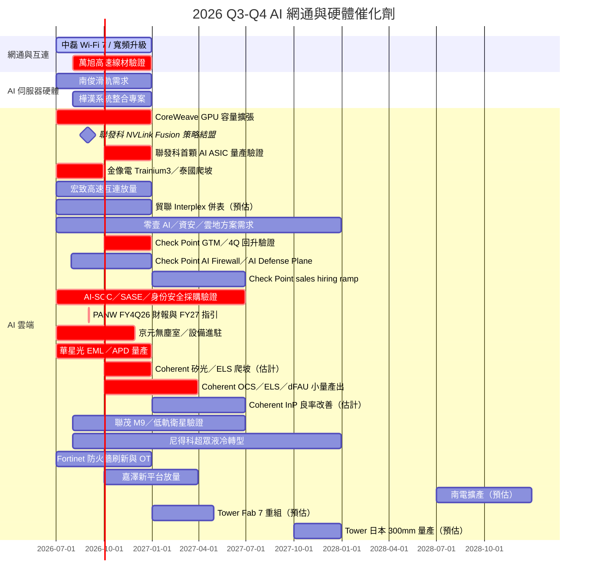
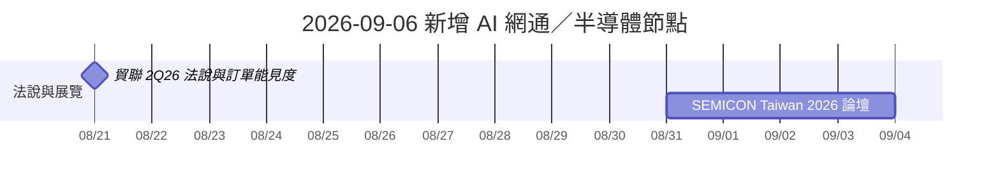

# 時程_2026Q3Q4_AI網通與硬體催化劑

## 2026-09-19 TGV 檢測新增追蹤

| 日期 | 事件 | 相關公司 | 類型 | 重要性 | 備註 |
|---|---|---|---|---|---|
| 2026-04 | SP8000S 非破壞 TSV 光學檢測系統出貨一套 | [[3055_蔚華科（市）]] | 出貨／驗證 | ⭐⭐ | 國泰證期 Call Memo 轉述；客戶、金額、驗收及重複採購未揭露 |
| 2026-09-08 | SP7000G TGV 微裂紋快速掃描系統發表 | [[3055_蔚華科（市）]] | 新產品／量產檢測 | ⭐⭐⭐ | 510 × 515 mm 玻璃基板約 20 分鐘全片掃描，鎖定金屬化／ABF 增層後內部微裂紋；公司規格，非訂單公告 |
| 2026Q4 起 | TGV 檢測設備客戶導入、驗收與重複採購 | [[3055_蔚華科（市）]] | 驗證／商務合作 | ⭐⭐⭐ | 公司僅稱正與國內外客戶進行製程導入與商務合作；已揭露出貨的是 TSV 檢測設備，TGV 出貨與營收貢獻待驗證 |
| 2027 | TGV 製程良率提升、檢查頻率與站點配置定義 | [[3055_蔚華科（市）]] | 製程驗證 | ⭐⭐⭐ | 國泰證期預期需求隨客戶良率管理流程逐步明朗；非訂單或市場規模預估 |
| 2028 前後 | TGV 量產導入，檢測設備數量與篩檢／分析比例明朗 | [[3055_蔚華科（市）]] | 量產／商務化 | ⭐⭐⭐ | 券商轉述三星電機、DNP 等規劃；仍待產品節拍、面板尺寸、缺陷標準與正式採購確認 |

來源：[[research_蔚華科_TGV檢測與SP7000G_20260919]]（蔚華科技／中央社，2026-09-08～09）、[[memo_國泰證期_蔚華科CallMemo_20260910]]（國泰證期研究部，2026-09-10）。

## 2026-09-16 Lumentum IR 新增節點

| 日期 | 事件 | 相關公司 | 類型 | 重要性 | 備註 |
|---|---|---|---|---|---|
| 2027 年初 | OCS contract manufacturer 開始支援產能 | [[LITE.US(lumentum)]] | 擴產／驗證 | ⭐⭐ | [[活動_Lumentum_IR問答_20260916]]；目前限制仍在內部組裝與測試，非零組件短缺 |
| 2027H2 | ELSFP 模組開始出貨、公司估份額逐步達 15%–20% | [[LITE.US(lumentum)]]、[[NVDA.US(nvidia)]] | 出貨／份額驗證 | ⭐⭐⭐ | company estimate；客戶供應商配置決定份額，非已認列收入 |
| FY28 | Non-GAAP EPS $40 outlook | [[LITE.US(lumentum)]] | 財務／驗證 | ⭐⭐⭐ | 最大 OCS 客戶追加訂單驅動；未納入 NPO design win，未拆各業務貢獻 |
| 2028（FY／CY 未明） | 六吋 sulfur-doped InP substrate 準備就緒目標 | [[LITE.US(lumentum)]] | 材料／良率 | ⭐⭐⭐ | 供應商個位數良率為公司轉述，非 Lumentum 自身製程良率 |
| FY29（展望） | OCS dynamic partitioning／resiliency 新用途 | [[LITE.US(lumentum)]] | 架構升級 | ⭐⭐⭐ | 可能使 attach rate 由約 1.5 升至 3–4 ports／XPU；尚未納入 FY28 outlook |

## 本次 ingest 補充

| 日期 | 事件 | 相關公司 | 類型 | 重要性 | 備註 |
|---|---|---|---|---|---|
| 2026-08-18 | Spectrum-X Ethernet Photonics／CPO 量產消息 | [[NVDA.US(nvidia)]] | 技術下線 | ⭐⭐⭐ | [[20260821_1040_華鑫證券20260818_AI算力產業週報：英偉達CPO交換機量產落地，南亞塑膠調漲CCL價格]] 為券商轉述，待公司與客戶部署進一步驗證 |
| 2026-09 | 南亞 CCL／基材價格調整 | [[1303_南亞（市）]] | 規格升級 | ⭐⭐ | 報告引述市場估計漲幅 5%–10%，實際幅度以公司公告與報價為準 |
| 2026-08-31 | NVIDIA 投資聯發科 US$3.5bn 可轉債、Alphabet 參與 US$3.9bn CB，合作擴至 NVLink Fusion／AI factory／AI PC／車用 | [[2454_聯發科（市）]]、[[NVDA.US(nvidia)]]、[[GOOGL.US(alphabet)]] | 策略投資／平台合作 | ⭐⭐⭐ | 投資與合作範圍為 fact；第二／第三 CSP 勝率提升屬 Citi／Morgan Stanley thesis |
| 2026Q4 | 聯發科首個主要 AI accelerator ASIC 目標量產 | [[2454_聯發科（市）]] | 技術下線／放量 | ⭐⭐⭐ | 公司展望；Citi 2026-08-31 轉述，實際量產、良率與營收認列待驗證 |
| 2026Q2–2027 | Semtech CopperEdge 1.6T ACC 已量產出貨；FiberEdge TIA／driver 與 NPO／LPO design win 轉量產 | [[SMTC.US(semtech)]] | 放量／驗證 | ⭐⭐⭐ | [[報告_GoldmanSachs_Semtech_20260827]]；SiGe、InP 與 OSAT 供給仍為主要瓶頸 |

## 日期表
| 2024-03-14（基準） | Broadcom 宣布交付 Bailly 51.2T CPO Ethernet switch | [[AVGO.US(broadcom)]] | CPO／產品交付 | ⭐⭐⭐ | 官方公告；作為 Broadcom CPO 早期商業化基準，與 2027H2 新世代量產預估分開追蹤 |
| 日期 | 事件 | 相關公司 | 類型 | 重要性 | 備註 |
|---|---|---|---|---|---|
| 2026H2 | 中磊寬頻升級與 Wi‑Fi 7 持續出貨 | [[5388_中磊（市）]] | 放量 | ⭐⭐⭐ | 記憶體成本轉嫁是關鍵 |
| 2025-08-26（基準） | NVIDIA 公開 Quantum-X／Spectrum-X CPO 平台與 ELS 架構 | [[NVDA.US(nvidia)]] | 技術路線／驗證 | ⭐⭐⭐ | 官方 Blog；200Gbps PAM4、COUPE、Q3450 115.2Tbps 全雙工為公司說法，作為後續量產驗證基準 |
| 2026H2 | 萬旭 AI 伺服器高速線材驗證與放量 | [[6134_萬旭（櫃）]] | 驗證 | ⭐⭐⭐ | 追蹤客戶導入 |
| 2026H2 | 樺漢 AIoT／系統整合專案認列 | [[6414_樺漢（市）]] | 放量 | ⭐⭐ | 專案毛利與現金流 |
| 2026H2 | 南俊國際 AI 伺服器滑軌需求延續 | [[6584_南俊國際（市）]] | 放量 | ⭐⭐⭐ | 產品組合與利用率 |
| 2026H2 | CoreWeave GPU 雲端容量擴張 | [[CRWV.US(coreweave)]] | 放量 | ⭐⭐⭐ | 利用率、資本支出回報 |
| 2027Q1 | 世芯 Trainium3／中磊 DAA 逐步放量 | [[3661_世芯-KY（市）]]、[[5388_中磊（市）]] | 放量 | ⭐⭐⭐ | 兩者來源分別為中信報告估計 |
| 2026Q3 | 金像電 Trainium3 PCB 份額與泰國產能爬坡驗證 | [[2368_金像電（市）]] | 驗證 | ⭐⭐⭐ | [[260811_gs_GCE]]，份額為 Goldman Sachs estimate |
| 2026Q3–Q4 | 宏致 ASIC 高速連接器與高速線出貨 | [[3605_宏致（市）]] | 放量 | ⭐⭐⭐ | [[宏致(3605,Note)-CTBC260724]]，公司展望 |
| 2026H2 | 貿聯 Interplex Datacom 交割與併表 | [[3665_貿聯-KY（市）]] | 併購 | ⭐⭐ | [[貿聯(3665,Note)-CTBC260730]]，時程待確認 |
| 2026Q4–2027Q1 | 嘉澤新 CPU 平台與 QD／SOCAMM 放量 | [[3533_嘉澤（市）]] | 放量 | ⭐⭐⭐ | [[嘉澤(3533,OW_增加持股)-CTBC260814]] |
| 2028H2（預估） | 南電綠地擴產最早開始放量 | [[8046_南電（市）]] | 擴產 | ⭐⭐⭐ | [[260806_citi_nypcb]]，Citi 判斷 |
| 2026Q3 | 台燿泰國高階 CCL 新產能提前爬坡 | [[6274_台燿（市）]] | 放量 | ⭐⭐⭐ | [[260730_gs_TUC]]，公司展望／GS estimate |
| 2026H2–2027 | 聯茂高階 CCL 漲價與產能爬坡 | [[6213_聯茂（市）]] | 規格升級 | ⭐⭐⭐ | [[260808_daiwa_iteq-UG]]，券商 estimate |
| 2027H1–2027Q2 | 長廣日本 ABF 設備產能由 18 台增至 25 台 | [[7795_長廣（興）]] | 擴產 | ⭐⭐ | [[Daiwa-7795 20260805]]，公司展望／Daiwa estimate |
| 2026H2 | 國巨 MLCC 價格調整逐步傳導 | [[2327_國巨（市）]] | 漲價 | ⭐⭐⭐ | [[260810_citi_yageo]]，Citi 解讀 |
| 2026H2–2027 | 零壹 AI／資安／雲地整合方案需求擴大 | [[3029_零壹（市）]] | 放量 | ⭐⭐⭐ | [[零壹科技2026年度 上半年法人說明會 (1)]]，公司展望；市場 CAGR 為 IDC／MIC 預測 |
| 2026Q3 | Check Point 產品收入低谷、GTM close rate 與大型 appliance deals 觀察 | [[CHKP.US(check point software)]] | 財報／低谷 | ⭐⭐⭐ | [[2026-07-30-CHKP.OQ-JPMorgan-Check Point Software GTM Disruption Persists as Unchanged FY...-123497989]]；3Q 預期仍弱、4Q 回升屬券商／公司指引觀察 |
| 2026Q4 | Check Point 大型 appliance deals、AI Network Firewall 與訂閱 pipeline 驗證 | [[CHKP.US(check point software)]] | 放量／驗證 | ⭐⭐⭐ | [[2026-08-03-CHKP.OQ-Barclays-Check Point Software Technologies Ltd. Takeaways from Our M...-123591707]]；4Q 後置風險與 AI／價格上行選項並列 |
| 2026Q4 | Check Point FY26 指引隱含約 6.5% 營收年增，驗證大型 deal、close rate 與產品回升 | [[CHKP.US(check point software)]] | 財報／驗證 | ⭐⭐⭐ | [[CHKP 260730_2Q26 results JP]]、[[CHKP 260730_2Q26 results Barclays]]；J.P. Morgan／Barclays 均提醒回升斜率偏陡 |
| 2026-07-30 | Check Point 發布 AI Network Firewall，AI Defense Plane 延伸至網路、雲端與 SASE | [[CHKP.US(check point software)]] | 新產品 | ⭐⭐⭐ | [[CHKP_2Q26_Earnings_Presentation]]；需追蹤 AI app／agent 防護是否轉化為 ARR／billings |
| 2027Q1–Q2 | Check Point 新增數百名 salespeople 的生產力開始反映 | [[CHKP.US(check point software)]] | 組織／放量 | ⭐⭐⭐ | [[Check Point Software Technologies Ltd Earnings Call 2026730 DN000000003114523854 (1)]]；2026 指引未納入招募 ramp |
| 2026Q3 | 資安股 2Q26 財報與 AI／SOC／SASE 採購驗證 | [[CRWD.US(crowdstrike)]]、[[PANW.US(palo alto networks)]]、[[ZS.US(zscaler)]]、[[FTNT.US(fortinet)]] | 財報／驗證 | ⭐⭐⭐ | AI 提升董事會關注，但採購仍受 6–12 個月銷售週期與審批影響；來源為 UBS／Evercore／Barclays／Wells Fargo 通路調查 |
| 2026-09-01 | PANW FY4Q26 財報與 FY27 指引 | [[PANW.US(palo alto networks)]] | 財報／驗證 | ⭐⭐⭐ | Barclays／TD 偏正面；UBS／Deutsche Bank 提醒估值與 AI 資安需求落地速度風險 |
| 2026H2–2027 | AI-SOC、身份與資料安全由評估轉為平台擴充 | [[CRWD.US(crowdstrike)]]、[[PANW.US(palo alto networks)]]、[[ZS.US(zscaler)]]、[[OKTA.US(okta)]] | 放量／驗證 | ⭐⭐⭐ | 既有平台與零信任控制點優先於全面自動修補；需追蹤 ARR、加購與新 logo |
| 2026H2 | Fortinet 防火牆刷新週期與 OT 新需求延續 | [[FTNT.US(fortinet)]] | 放量／驗證 | ⭐⭐⭐ | 拉貨前移較 1Q26 降溫，OT 採用為中期抵銷項；SASE／SecOps 仍偏早期 |
| 2027-04（預估） | Tower／NTCJ Fab 7 權益重組完成 | [[TSEM.US(tower semiconductor)]] | 重組 | ⭐⭐⭐ | [[報告_開源證券_Tower半導體矽光代工_20260818]]，取決於交易條件 |
| 2027Q4（預估） | Tower 日本 300mm 矽光／矽鍺產線具備量產能力 | [[TSEM.US(tower semiconductor)]] | 量產 | ⭐⭐⭐ | [[報告_開源證券_Tower半導體矽光代工_20260818]]，公司規劃／券商整理 |
| 2026Q4 | 信驊新 OSAT 夥伴與 E-glass 認證進展 | [[5274_信驊（市）]] | 驗證 | ⭐⭐ | [[gs 5274]]，Goldman Sachs estimate |
| 2026Q3–Q4 | 京元電子新無塵室完工、設備進駐與美國廠選址 | [[2449_京元電子（市）]] | 擴產／驗證 | ⭐⭐⭐ | [[報告_京元電子_2026Q2業務報告_20260820]]、[[活動_京元電子法說_20260828]] |
| 2026H2 | 華星光 EML／APD 量產與 800G DCI 擴產 | [[4979_華星光（櫃）]] | 放量／驗證 | ⭐⭐⭐ | 公司 roadmap；追蹤良率、客戶集中與收入 |
| 2026H2–2027 | 大量高階 CCD／TM4 應用擴至 CPO 與 1.6T 光模組 | [[3167_大量科技（市）]] | 規格升級／驗證 | ⭐⭐⭐ | [[memo_大量聯鈞_2Q26法說_20260818]]；公司展望／使用者轉述，追蹤 400 台月產能與高階占比 |
| 2026Q4 | 大量標準型設備外包 50 台、CPO／1.6T 設備導入驗證 | [[3167_大量科技（市）]] | 產能／驗證 | ⭐⭐ | [[memo_大量聯鈞_2Q26法說_20260818]]；外包與客戶導入尚待確認 |
| 2026H2 | 金像電 AI 伺服器／網通需求與已公告 190 億元資本支出落地 | [[2368_金像電（市）]] | 放量／擴產 | ⭐⭐⭐ | 公司揭露；後續資本支出可能增加 |
| 2026Q4（估計） | Coherent 矽光光模組與 ELS 進入較大批量爬坡 | [[COHR.US(coherent)]] | 放量／驗證 | ⭐⭐⭐ | [[memo_EML_InP_CW_ELS_NPO_CPO專家觀點_日期不詳]]；專家 channel claim，日期不詳 |
| 2026Q4–2027Q1（估計） | Coherent OCS、ELS、dFAU 由純投入轉入小批量產出 | [[COHR.US(coherent)]] | 放量／毛利 | ⭐⭐⭐ | [[memo_Coherent毛利率_1.6T良率_OCS_DFAU專家觀點_日期不詳]]；日期不詳的 channel estimate，追蹤收入、良率與固定成本攤薄 |
| 2027Q2（估計） | Coherent 3→6 吋 InP 轉線後，EML 供給壓力可能逐步緩解 | [[COHR.US(coherent)]] | 擴產／良率 | ⭐⭐⭐ | 需用 MOCVD、應力／溫循良率與有效良品驗證 |
| 2026H2–2027 | 聯茂 M9、低軌衛星與無錫擴產前置驗證 | [[6213_聯茂（市）]] | 規格升級／驗證 | ⭐⭐⭐ | [[活動_聯茂法說_20260828]]；M9／低軌衛星收入待驗證 |
| 2026H2–2027 | 尼得科超眾崑山液冷量產、2027 水冷營收占比 5% 目標 | [[6230_尼得科超眾（市）]] | 放量／驗證 | ⭐⭐ | 公司目標；目前仍處虧損轉型期 |
| 2026Q1–2026-03-19 | Marvell 1.6T DSP 新品送樣與 OFC 2026 展示 | [[MRVL.US(marvell)]] | 新產品／驗證 | ⭐⭐⭐ | Ara T、Ara X、Petra、Aquila M 自 2026Q1 起送樣；OFC 2026 於 3/15–3/19 展示，客戶採用仍待追蹤 |

## 2026-09-18 券商報告新增追蹤

| 日期 | 事件 | 相關公司 | 類型 | 重要性 | 備註 |
|---|---|---|---|---|---|
| 2026-09 | 勤誠 8 月營收與 GPU／ASIC chassis、rack 訂單延續性驗證 | [[8210_勤誠（市）]] | 月營收／驗證 | ⭐⭐ | [[報告_MorganStanley_勤誠_20260908]]；短期供應鏈管理干擾為券商轉述，非公司財測 |
| 2026Q4 | 旺矽 CPO Insertion 3 探針台預計開始出貨 | [[6223_旺矽（櫃）]] | 驗證／出貨 | ⭐⭐⭐ | [[報告_MorganStanley_旺矽_20260908]]；Insertion 2 仍在資格認證，均待客戶量產驗證 |
| 2026Q3–2027 | 欣銓龍潭七層廠逐層擴建、高階 AI ASIC wafer-sort 稼動率驗證 | [[3264_欣銓（櫃）]] | 擴產／放量 | ⭐⭐⭐ | [[報告_Daiwa_欣銓_20260909]]；每季一層與每層營收為 Daiwa estimate |
| 2027Q3 | 奇鋐越南冷板模組、rack／inner manifold 新產能預計投產 | [[3017_奇鋐（市）]] | 擴產／放量 | ⭐⭐⭐ | [[報告_Daiwa_奇鋐_20260909]]；設備預計 2Q27 就緒，液冷滲透率為券商假設 |
| 2027 | 長廣 moulding-film laminator 預期開始貢獻 | [[7795_長廣（興）]] | 新產品／放量 | ⭐⭐ | [[報告_Daiwa_長廣精機_20260909]]；需追蹤客戶認證、ABF 擴產與實際認列 |

## Gantt 時程圖

## 來源
- [[報告_Citi_聯發科_20260831]] — Citi Research，2026-08-31
- [[報告_MorganStanley_聯發科_20260831]] — Morgan Stanley，2026-08-31
- [[260828_daiwa_ Sunonwealth Electric Machine Industry]] — Daiwa，2026-08-28
- [[中磊(5388B_買進)-CTBC260817]] — 中信投顧，2026-08-17
- [[世芯-KY(3661,B_買進)-CTBC260817]] — 中信投顧，2026-08-17
- [[萬旭(6134,B_買進)-CTBC260820]] — 中信投顧，2026-08-20
- [[Daiwa-6584 20260819]] — Daiwa，2026-08-19
- [[CoreWeave（CRWV US）0818]] — 券商研究，2026-08-18
- [[memo_EML_InP_CW_ELS_NPO_CPO專家觀點_日期不詳]] — Coherent 相關專家訪談，日期不詳（2026-08-30 收錄；信心低）
- [[memo_Coherent毛利率_1.6T良率_OCS_DFAU專家觀點_日期不詳]] — Coherent 相關專家訪談，日期不詳（2026-08-30 收錄；信心低）
- [[260811_gs_GCE]] — Goldman Sachs，2026-08-11
- [[宏致(3605,Note)-CTBC260724]] — 中信投顧，2026-07-24
- [[貿聯(3665,Note)-CTBC260730]] — 中信投顧，2026-07-30
- [[嘉澤(3533,OW_增加持股)-CTBC260814]] — 中信投顧，2026-08-14
- [[260806_citi_nypcb]] — Citi Research，2026-08-06
- 2026-08-21：[[3665_貿聯-KY（市）]] 預定公布 2Q26 財報；Morgan Stanley 關注電源互連、AEC 與光互連訂單延續性。
- 2026-08-24：[[TSEM.US(tower semiconductor)]] 矽光／矽鍺擴產、Fab 7 重組與 AI 光互連客戶預訂列為中期觀察節點；數字屬券商 estimate。
- 2026-08-24：[[3029_零壹（市）]] 將 AI 規模化、資安升級與雲端遷移列為 2026H2–2027 方案需求動能；市場 CAGR 為 IDC／MIC 第三方預測，非公司財測。
- 2026-4Q：[[3037_欣興（市）]] mSAP／1.6T 光模組板產能開出，觀察 hyperscaler 直客需求與良率。
- 2026H2–2027：[[2480_敦陽科（市）]] AI 算力、雲端遷移與地端推理整合需求延續；在手訂單約 NT$122 億元，履約轉營收仍需追蹤。
- 2026-09–10／2026Q4：[[6620_漢達（櫃）]] OMCAZIO／HND-039 預計取得 FDA Final Approval 並於 4Q26 在美國上市；商業化策略與授權金仍待確認。
## 2026-08-23 新增節點

## 2026-08-27～28 新增節點

| 日期 | 事件 | 相關公司 | 類型 | 重要性 | 備註 |
|---|---|---|---|---|---|
| 2026H2 | CPO 由 3.2T 世代進入量產驗證，追蹤 COUPE／外部雷射／測試與良率數據 | [[2330_台積電（市）]]、[[LITE.US(lumentum)]]、[[6857.JP(advantest)]] | 驗證 | ⭐⭐⭐ | [[web_SEMICON_Taiwan_2026_矽光子國際論壇_20260831]]；論壇整理與公司／講者說法，尚非出貨承諾 |
| 2027 | 6.4 Tb/s COUPE、400G/lane 材料與光引擎 HVM 驗證 | [[2330_台積電（市）]]、[[2303_聯電（市）]]、[[3711_日月光投控（市）]] | 規格升級／驗證 | ⭐⭐⭐ | [[web_SEMICON_Taiwan_2026_矽光子國際論壇_20260831]]；路線圖／論壇觀點，需追蹤公開良率 |
| 2026Q3–Q4 | Rubin／AI 伺服器出貨與 rack 整合進入放量驗證 | [[NVDA.US(nvidia)]]、[[2317_鴻海（市）]]、[[2382_廣達（市）]]、[[3231_緯創（市）]]、[[2356_英業達（市）]]、[[2324_仁寶（市）]] | 放量 | ⭐⭐⭐ | Citi／GS／MS estimate；電力、HBM、CoWoS 與 rack integration 為同步瓶頸 |
| 2026-10 | 8kW／12kW BBU 可能提前出貨 | [[3211_順達科技（櫃）]] | 放量 | ⭐⭐⭐ | Citi 2026-08-27 供應鏈查核，需實際出貨驗證 |
| 2026-08–12 | AI 伺服器拉動 ODM 營收，但記憶體／CPU／PCB 成本壓抑毛利 | [[2324_仁寶（市）]]、[[2356_英業達（市）]] | 財務 | ⭐⭐ | Goldman Sachs 2026-08-27～28；評等均 Neutral |

| 日期 | 事件 | 相關公司 | 類型 | 重要性 | 備註 |
|------|------|---------|------|--------|------|
| 2026Q3 | 高階 M7+/M8+ CCL 第二輪漲價與價格傳導 | [[2383_台光電（市）]]、[[6274_台燿（市）]] | 規格升級 | ⭐⭐⭐ | Goldman Sachs／Daiwa estimate，需追蹤客戶接受度 |
| 2026Q3 | Trainium3 UBB PCB 與 AI PCB 產品 mix 提升 | [[2368_金像電（市）]]、[[4958_臻鼎（市）]] | 放量 | ⭐⭐⭐ | 公司展望／券商 estimate |
| 2026H2 | EMIB-T／高階 ABF 擴產與驗證 | [[3037_欣興（市）]]、[[8046_南電（市）]]、[[7795_長廣（興）]] | 驗證 | ⭐⭐⭐ | 良率、設備交期與實際投產為關鍵 |
| 2026H2 | AI MLCC 長約與漲價傳導 | [[2327_國巨（市）]]、[[009150.KR(semco)]] | 放量 | ⭐⭐ | 需求強度與非 AI 終端復甦仍需觀察 |
| 2026H2 | 偉詮電伺服器風扇／液冷馬達控制 IC 出貨 | [[2436_偉詮電（市）]] | 放量 | ⭐⭐⭐ | 伺服器架構升級帶動，產品組合仍是毛利關鍵 |
| 2026Q4 | 建準冷板開始貢獻營收、伺服器風扇模組交付 ODM／企業客戶 | [[2421_建準（市）]] | 放量／驗證 | ⭐⭐⭐ | Daiwa 2026-08-28 estimate；CSP 認證與實際出貨待追蹤 |
| 2026H2 | TPK-KY 傳統旺季與泰國廠試運轉 | [[3673_TPK-KY（市）]] | 放量／擴產 | ⭐⭐ | 2027 年初量產目標待驗證 |

| 2026-08-28 | 欣興桃園檢調搜索／原產地標示調查 | [[3037_欣興（市）]] | 風險／事件 | ⭐⭐⭐ | 公司稱目前無重大財務與營運影響；調查範圍、客戶產地要求與責任歸屬待釐清 |
| 2026Q3 | 京元電子 AI GPU 測試時程因 HBM4 重新投片／設計調整延後約一季 | [[2449_京元電子（市）]] | 驗證／延遲 | ⭐⭐⭐ | 中信投顧 2026-08-31 estimate；2026 年營收年增預估下修至 38.9% |
| 2026H2 | 矽力-KY Gen4 12 吋平台營收占比提升 | [[6415_矽力-KY（市）]] | 規格升級 | ⭐⭐⭐ | 4Q26 占比約 20% 為公司展望，需追蹤毛利率改善 |
| 2027 | 矽力-KY SPS／數位控制器進入高階 AI 伺服器貢獻 | [[6415_矽力-KY（市）]] | 驗證／放量 | ⭐⭐⭐ | 美系大廠驗證接近完成，尚非已確認訂單 |
| 2027 | 萬潤 CPO Insertion 3 光耦合機台出貨 200 台以上 | [[6187_萬潤（市）]] | 設備放量 | ⭐⭐⭐ | 中信投顧 estimate；以驗收與客戶導入驗證 |
| 2026-09 | 國泰金累計獲利與配息預估追蹤 | [[2882_國泰金（市）]] | 財務／股利 | ⭐⭐ | 2026 年 1–7 月獲利年增 59.5%，2026E EPS 8.27 元屬券商 estimate |

## 2026-09-01 新增 Lumentum 節點

| 日期 | 事件 | 相關公司 | 類型 | 重要性 | 備註 |
|---|---|---|---|---|---|
| 2026Q4 | CPO 營收進入較有意義的量產 | [[LITE.US(lumentum)]] | 放量／驗證 | ⭐⭐⭐ | [[活動_Lumentum_Fubon_LITE_IR_20260820]]；公司交流口徑，CPO 營收剛超過 US$10m |
| 2027Q1 | 1.6T 成為光模組營收大宗（最早） | [[LITE.US(lumentum)]] | 放量 | ⭐⭐⭐ | 以光模組營收占比計，需追蹤實際出貨與良率 |
| 2027H2 | NVIDIA ELS 光源開始出貨 | [[LITE.US(lumentum)]]、[[NVDA.US(nvidia)]] | 出貨／驗證 | ⭐⭐⭐ | 雷射晶片份額近 100%、封裝約 20%；尚待實際收入驗證 |
| 2026–2027 | EML／超高功率雷射供需缺口延續 | [[LITE.US(lumentum)]]、[[COHR.US(coherent)]] | 產能／瓶頸 | ⭐⭐⭐ | EML 缺口約 30%；未來 2–4 季未必能彌合 |
| 未來 3–4 個月 | NPO 成果或訂單可能公布 | [[LITE.US(lumentum)]] | 驗證 | ⭐⭐⭐ | 仍在研發階段，非已確認大單 |

## 2026-09-01 新增追蹤

| 日期 | 事件 | 相關公司 | 類型 | 重要性 | 備註 |
|---|---|---|---|---|---|
| 2026-08–09（待查證） | 富世達 QD 新產能與 3Q 營收驗證 | [[6805_富世達（市）]] | 放量／驗證 | ⭐⭐⭐ | 3Q NT$4.7B 為作者推演，非公司 guidance；新增 1.5KK 產能與客戶名單待驗證 |
| 2026-10–12（待查證） | Lumentum UHP／ELS／COS 驗證與量產節奏 | [[LITE.US(lumentum)]]、[[3450_聯鈞（市）]] | 技術下線／驗證 | ⭐⭐⭐ | UHP、COS 封測與 ELSFP 關係為使用者法說轉述，待公司原始資料交叉確認 |
| 2026Q4（待查證） | VR200 PVT、NVL72 TTM 與 L11 出貨 | [[NVDA.US(nvidia)]] | 放量／驗證 | ⭐⭐⭐ | 使用者 Rubin 觀察，待 NVIDIA／供應鏈實際出貨驗證 |
| 2026H2–2027（待查證） | NVL8 QS 遞延與 L10 Group A roadmap 影響 | [[NVDA.US(nvidia)]] | 時程風險／規格升級 | ⭐⭐ | 原始 roadmap 未收錄，暫列低信心觀察 |

相關分析：[[分析_富世達_Lumentum_Rubin_20260901]]。
| 2026-08-21（待查證） | NVIDIA IB Switch manual 轉述一個 CPO 搭配 18 個 ELS、Q3450-LD 型號 | [[NVDA.US(nvidia)]]、[[3450_聯鈞（市）]] | 規格／驗證 | ⭐⭐ | [[memo_光通_CPO_ELS_COS_20260901]]；原始 manual 未收錄，低信心 |
| 2026-08–09（待查證） | ELS-COS 架構觀察：位於 ELSFP 與 ILS 之間、靠近 OE 且在 ASIC 封裝外 | [[3450_聯鈞（市）]]、[[NVDA.US(nvidia)]] | 技術路線／驗證 | ⭐⭐ | [[memo_光通_CPO_ELS_COS_20260901]]；NVL756 採用與聯鈞訂單均未確認 |

## 相關頁面

- [[分析_大量與聯鈞_2Q26法說_20260818]]
- [[分析_光通_CPO與ELS-COS_20260901]]

### 2026-08-18 AI CPO／高階 PCB 新增追蹤

| 日期 | 事件 | 相關公司 | 類型 | 重要性 | 備註 |
|---|---|---|---|---|---|
| 2026-08 | NVIDIA Spectrum-X 200G/lane CPO 乙太網路交換器進入全面量產 | [[NVDA.US(nvidia)]] | 技術下線 | ⭐⭐⭐ | [[報告_華鑫證券_AI算力與CPO及CCL_20260818]]；實際出貨與供應商份額待驗證 |
| 2026-09 | 南亞塑膠調漲 CCL／基材價格 | [[1303_南亞（市）]] | 規格升級 | ⭐⭐ | [[報告_華鑫證券_AI算力與CPO及CCL_20260818]] 轉述；漲幅與轉嫁率待公司確認 |
| 2026H2–2027 | Rubin 平台帶動高階 PCB、HDI 與高速高頻材料需求 | [[2368_金像電（市）]]、[[2383_台光電（市）]]、[[6274_台燿（市）]] | 放量 | ⭐⭐⭐ | [[報告_上海證券_高階PCB與硬體架構_20260818]]；非特定訂單承諾 |

### 2026-08-31 法說新增追蹤

| 日期 | 事件 | 相關公司 | 類型 | 重要性 | 備註 |
|---|---|---|---|---|---|
| 2026Q3–Q4 | Rubin 出貨、AI 伺服器供應受限 | [[NVDA.US(nvidia)]] | 放量 | ⭐⭐⭐ | 法說指引；需追蹤實際交付 |
| 2026Q3 | Falcon Flex／AIDR ARR 擴張 | [[CRWD.US(crowdstrike)]] | 業務 | ⭐⭐⭐ | FY27Q2 法說管理層指標 |
| 2026Q3–Q4 | Agentforce ARR 與 Slackbot 使用量 | [[CRM.US(salesforce)]] | 業務 | ⭐⭐ | 新產品與回購展望 |
| 2026H2–2027 | SiC 由試單轉商業出貨 | [[8121_越峰（市）]] | 量產 | ⭐⭐ | 以公司簡報 2027 時程為準 |

- [[分析_20260825-28_半導體設備材料與AI應用法說]]
- [[分析_20260826_AI軟體與晶片平台法說]]
- [[分析_20260828-31_欣興矽力京元與設備金融更新]]
- [[2228_劍麟（市）]]

### 2026-09-04 SEMICON 參展新增節點

| 日期 | 事件 | 相關公司 | 類型 | 重要性 | 備註 |
|---|---|---|---|---|---|
| 2027（論壇觀點） | TSMC COUPE 的 GC／EC、CPO／NPO／可插拔光收發器路線持續驗證 | [[2330_台積電（市）]]、[[3711_日月光投控（市）]] | 技術驗證 | ⭐⭐⭐ | [[SEMICON參展評析-260904]]；供應占比與時程為論壇／券商整理，非公司財測 |
| 2026H2–2027 | CPO coupling loss、Fiber／Alignment 與測試良率改善 | [[3711_日月光投控（市）]]、[[6223_旺矽（櫃）]]、[[7769_鴻勁精密（市）]] | 瓶頸／驗證 | ⭐⭐⭐ | [[SEMICON參展評析-260904]]；0.3 dB 目標與設備導入仍待實際量產確認 |

### 2026-08-24 NPO／Rubin Ultra 研究筆記

| 日期 | 事件 | 相關公司 | 類型 | 重要性 | 備註 |
|---|---|---|---|---|---|
| 2026H2–2027（待查證） | Rubin Ultra NVL576 scale-up 可能由 NPO 內置雷射先行，CPO 並行 | [[NVDA.US(nvidia)]]、[[COHR.US(coherent)]]、[[LITE.US(lumentum)]] | 技術路線／驗證 | ⭐⭐⭐ | [[研究_半導體AI供應鏈_20260824]]；研究模型，非正式規格 |
| 2026H2–2027（待查證） | CPO I2／I3／I4 測試設備 pull-in 可能延後至 2H27 或 4Q27 | [[2360_致茂（市）]] | 瓶頸／驗證 | ⭐⭐ | [[研究_半導體AI供應鏈_20260824]]；受 COUPE 良率改善進度影響的低信心觀察 |

## 2026-09-06 ingest 新增節點

| 日期 | 事件 | 相關公司 | 類型 | 重要性 | 備註 |
|---|---|---|---|---|---|
| 2026-08-21 | 貿聯 2Q26 法說：AI 基礎設施訂單能見度至 2027H2，並討論 2028 專案；光互連與電源／資料連接內容深化 | [[3665_貿聯-KY（市）]] | 財務／業務 | ⭐⭐⭐ | [[活動_貿聯-KY_2026Q2法說_20260821]]；管理層 outlook，非已認列訂單 |
| 2026-08-31–09-04 | SEMICON Taiwan 2026：Silicon Photonics、Heterogeneous Integration、Advanced Testing 等論壇 | [[2330_台積電（市）]]、[[3711_日月光投控（市）]] | 展覽／技術驗證 | ⭐⭐ | [[活動_SEMICON_Taiwan_2026_議程_20260831]]；議程為 2026-06-15 tentative 版本 |

來源：[[活動_貿聯-KY_2026Q2法說_20260821]]、[[活動_SEMICON_Taiwan_2026_議程_20260831]]。

## 2026-09-08／09-03 AI 平台與散熱更新

| 日期 | 事件 | 相關公司 | 類型 | 重要性 | 備註 |
|---|---|---|---|---|---|
| 2026-09 | BYD Electronics VR200 冷板開始出貨 | [[00285.HK(byd_electronic)]]、[[NVDA.US(nvidia)]] | 放量／驗證 | ⭐⭐⭐ | GF Securities 2026-08-28；經由 Lead Wealth，屬券商轉述，待實際出貨確認 |
| 2026Q4 | VR200 NVL72 冷板與 QD 內容值提升 | [[3017_奇鋐（市）]]、[[6805_富世達（市）]]、[[3533_嘉澤（市）]] | 放量 | ⭐⭐⭐ | GFHK 2026-09-08 estimate；冷板約 US$34,200／rack、QD 約 US$10,760／rack |
| 2026Q4–2027 | Tomahawk Ultra 導入 AI scale-up | [[AVGO.US(broadcom)]] | 技術下線／放量 | ⭐⭐⭐ | 富邦 2026-09-03；Tomahawk 7 200Tbps 已 tape-out，attach rate 未揭露 |
| 2026Q4–2027 | NVIDIA Vera Rubin 營收與資料中心部署加速 | [[NVDA.US(nvidia)]]、[[DELL.US(dell)]]、[[2317_鴻海（市）]]、[[SMCI.US(supermicro)]] | 放量 | ⭐⭐⭐ | GFHK 2026-08-27／09-02；受記憶體、電力、機房與供應鏈同步限制 |

公司頁：[[00285.HK(byd_electronic)]]。

## 2026-09-18 本批 ingest 新增節點

| 日期 | 事件 | 相關公司 | 類型 | 重要性 | 備註 |
|---|---|---|---|---|---|
| 2026Q3–Q4 | NVIDIA FY28 供給受限成長、Vera Rubin／AI factory 需求延續 | [[NVDA.US(nvidia)]] | 放量／瓶頸 | ⭐⭐⭐ | 大和、J.P. Morgan 與富邦摘要；70% 成長為 management／券商口徑，先進晶圓與記憶體為主要限制 |
| 2026Q3 | 京元電子 AI GPU 測試時程延後約一季 | [[2449_京元電子（市）]] | 驗證／延遲 | ⭐⭐⭐ | [[京元電子(2449,B_買進)-CTBC260831]]；HBM4 重新投片與設計調整，屬券商 estimate |
| 2027H2 | 世界先進 VSMC P1 與 interposer 產能擴充 | [[5347_世界先進（市）]] | 擴產／放量 | ⭐⭐⭐ | [[世界先進(5347,Note)-CTBC260827]]；月產能與營收翻倍為公司／券商展望 |
| 2027-07 | 信昌電楊梅二廠、六甲粉末廠預計投產 | [[6173_信昌電（市）]] | 擴產／驗證 | ⭐⭐⭐ | [[信昌電(6173,Note)-CTBC260911]]；產能增幅與漲價效益需以實際投產驗證 |
| 2026H2–2027 | Rubin Ultra／NVL576 M10、PTFE 與 glass-less 材料認證 | [[NVDA.US(nvidia)]]、[[2383_台光電（市）]]、[[6274_台燿（市）]] | 規格升級／驗證 | ⭐⭐⭐ | [[JPM_PCB__CCL_and_Substra_2026-09-01_5431668(1)]]；Df ≤0.0004 與可製造性是主要門檻 |
| 2026-09-02 | SEMICON Taiwan 2026 展會聚焦先進封裝、測試、矽光子與智慧製造 | [[6510_精測（市）]]、[[6515_穎崴（市）]]、[[2360_致茂（市）]] | 展覽／技術驗證 | ⭐⭐ | [[事件分析_Semicon 2026_083126]]；展會觀察不等同訂單或量產承諾 |

## 2026-09-14–18 本批券商來源補充

| 日期 | 事件 | 相關公司 | 類型 | 重要性 | 備註 |
|---|---|---|---|---|---|
| 2026-09 | 金居東南亞 RG advanced RTF 銅箔子公司核准，預計 2H28 投產 | [[8358_金居（市）]] | 擴產／認證 | ⭐⭐ | [[報告_MorganStanley_金居_20260914]]；月產能逾 500 噸為券商／公司展望 |
| 2026-09 | Rubin 小量出貨、4Q26 放量，ASIC 液冷與冷板供需仍緊 | [[3017_奇鋐（市）]]、[[3324_雙鴻（市）]] | 放量／驗證 | ⭐⭐⭐ | [[報告_Citi_AI伺服器散熱_20260917]]；VR 冷板最早 1Q27 認證 |
| 2026-09 | 南亞 M10 初步驗證窗口落在 1Q27 | [[1303_南亞（市）]] | 材料認證 | ⭐⭐⭐ | [[報告_CTBC_南亞_20260918]]；目前為送樣，非量產承諾 |
| 2026-09 | 光焱 NightJar-H HVM／客戶驗證預計於年底前，CPO 商用化觀察 2027–2028 | [[7728_光焱（櫃）]] | 測試／驗證 | ⭐⭐⭐ | [[報告_CTBC_光焱_20260918]]；公司頁已建立 |
| 3Q26–4Q27 | 欣銓龍潭廠分層開出，2027 年營收占比估 19.6% | [[3264_欣銓（櫃）]] | 擴產／放量 | ⭐⭐⭐ | [[報告_CTBC_欣銓_20260918]]；設備交期約 6–8 個月 |
| 2026H2–2027 | 晶心科 Meta MTIA 多代專案與 80 系列伺服器路線驗證 royalty | [[6533_晶心科（市）]] | ASIC／驗證 | ⭐⭐⭐ | [[報告_CTBC_晶心科_20260918]]；公司頁已建立 |
| 2026–2027 | 盟立先進封裝自動化訂單與諧波減速機擴產 | [[2464_盟立（市）]] | 訂單／擴產 | ⭐⭐ | [[報告_CTBC_盟立_20260917]]；公司頁已建立 |

## 2026-09-17 CPO／CCL 觀察更新

| 日期 | 事件 | 相關公司 | 類型 | 重要性 | 備註 |
|---|---|---|---|---|---|
| 2026–2028 | CPO 導入對高階 CCL 的廣泛需求破壞仍有限 | [[2383_台光電（市）]]、[[6274_台燿（市）]] | 技術路線／供需 | ⭐⭐⭐ | Morgan Stanley 認為成本、良率、可靠度、維修性與散熱仍是 scale-up 導入障礙；非公司訂單指引 |

## 2026-09-17 AI 散熱架構驗證

| 日期 | 事件 | 相關公司 | 類型 | 重要性 | 備註 |
|---|---|---|---|---|---|
| 2026-10–11（最快） | Rubin Ultra 的兩片式與 Removable Lid 方案持續驗證，可能確認最終結構 | [[3653_健策（市）]]、[[3017_奇鋐（市）]]、[[3324_雙鴻（市）]] | 驗證／規格升級 | ⭐⭐⭐ | 中信投顧供應鏈調查；非客戶已確認規格，須追蹤量產與良率 |
| 2026H2–2027 | VPD 搭配雙面水冷板的高功耗平台評估擴大 | [[3017_奇鋐（市）]]、[[3324_雙鴻（市）]] | 驗證／規格升級 | ⭐⭐⭐ | 4kW+ 熱負載、6kW 演進與 1.5–2 倍 ASP 均為供應鏈調查，不是出貨承諾 |

來源：[[報告_CTBC_AI散熱架構與材料_20260917]]（中信投顧，2026-09-17）。

來源：[[報告_MorganStanley_CCL與CPO_20260917]]（Morgan Stanley，2026-09-17）。
| 2026–2027 | CSP capex、GPU 利用率與 onsite power 成為 AI 擴產驗證指標 | [[NVDA.US(nvidia)]]、[[GOOGL.US(alphabet)]]、[[GEV.US(ge_vernova)]] | 需求／供電 | ⭐⭐⭐ | [[報告_永豐_AI產業趨勢對談_20260916]]；訪談與券商估計需交叉驗證 |
