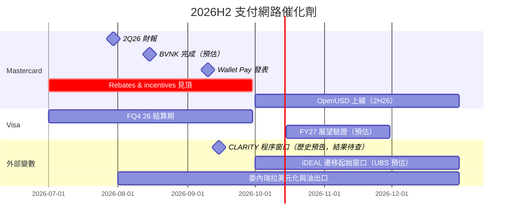

# 時程_2026Q3Q4_支付網路催化劑

## 日期表

| 日期 | 事件 | 相關公司 | 類型 | 重要性 | 備註 |
|---|---|---|---|---|---|
| 2026-07-30 | Mastercard 2Q26 財報：VASS +20%、跨境優於預期、FY26 指引偏高端 | [[MA.US(mastercard)]] | 業績 | ⭐⭐⭐ | [[報告_Barclays_Mastercard2Q26財報_20260730]]、[[報告_BofA_Mastercard_20260730]] |
| 2026-08（預估） | Mastercard 完成收購 BVNK（約 $1.8B；年化穩定幣處理量約 $30B） | [[MA.US(mastercard)]] | 併購 | ⭐⭐ | BMO 稱 2026 年 8 月完成；BofA／Barclays 7 月底稱預期 3Q 完成，單一來源，信心中 |
| 2026-09（約 09-09～10） | Mastercard 發表 Wallet Pay（新興市場錢包平台） | [[MA.US(mastercard)]] | 發表會 | ⭐⭐ | [[報告_TD_MastercardWalletPay_20260910]]：不改變近期財務 |
| 2026-09-15（Evercore 8 月預告） | CLARITY 程序投票窗口 | [[MA.US(mastercard)]]、[[V.US(visa)]] | 立法 | ⭐⭐ | [[報告_EvercoreISI_CLARITY程序投票_20260810]] 稱需 60 票；9 月社群截圖聲稱未推進，缺官方紀錄，不能視為最終立法結果 |
| 2026-10 起（UBS 預估） | iDEAL 逐步遷移至 Wero 基礎設施 | [[MA.US(mastercard)]]、[[V.US(visa)]] | 支付替代 | ⭐⭐⭐ | [[報告_UBS_Wero與數位歐元_20260727]]；既有 A2A 遷移不是等量新增卡片流失，完成日期未定 |
| 2026Q3 | MA rebates & incentives 成長預期見頂（BNP 估約 21%），4Q26 起趨緩 | [[MA.US(mastercard)]] | 業績 | ⭐⭐⭐ | [[報告_BNP_MastercardVisa_20260807]]；estimate |
| 2026Q3（日期未揭露） | Mastercard 3Q26 財報（BofA 估 EPS $5.15、BMO 估 $5.22、RBC 估 $5.23） | [[MA.US(mastercard)]] | 業績 | ⭐⭐⭐ | 驗證跨境價差、VASS 與 incentives |
| FQ4 26（2026-09 止；財報日未揭露） | Visa FQ4 26 財報與 FY27 展望（BNP 估 FQ4 淨營收 $12.17B、EPS $3.48） | [[V.US(visa)]] | 業績 | ⭐⭐⭐ | BNP 認為 FY27 成長超過 12% 有挑戰 |
| 2026H2 | OpenUSD 上線；穩定幣結算與 Agent Pay 擴散 | [[MA.US(mastercard)]] | 新產品 | ⭐⭐ | 管理層於 2Q26 電話會議（BofA） |
| 2026H2 | 委內瑞拉美元化立法與原油出口續增（BMO 估 2027 年產量 1.5–2mm bpd） | [[MA.US(mastercard)]] | 外部變數 | ⭐⭐ | [[報告_BMO_Mastercard委內瑞拉_20260825]] |
| 待核准 | Visa 收購 BioCatch | [[V.US(visa)]] | 併購 | ⭐⭐ | [[報告_RBC_VisaMastercard加值服務_20260909]] |
| 2027 | MA 淨營收成長 13–14% vs V 約 12%（BNP 估計） | [[MA.US(mastercard)]]、[[V.US(visa)]] | 預測 | ⭐⭐⭐ | VAS：V 自 28% 降至 21%，MA 可能小幅加速 |
| 2027H2／2029（條件式預估） | 數位歐元約 12 個月試點／潛在推出 | [[MA.US(mastercard)]]、[[V.US(visa)]] | 立法／試點 | ⭐⭐ | [[報告_UBS_EMEAFinTech觀察_20260731]]；以立法與執行為前提，不是已確定商用日 |

## Gantt 時程圖

## 來源

- [[報告_Barclays_Mastercard2Q26財報_20260730]] — 2026-07-30
- [[報告_BofA_Mastercard_20260730]] — 2026-07-30
- [[報告_BNP_MastercardVisa_20260807]] — 2026-08-07
- [[報告_BMO_Mastercard委內瑞拉_20260825]] — 2026-08-25
- [[報告_RBC_VisaMastercard加值服務_20260909]] — 2026-09-09
- [[報告_TD_MastercardWalletPay_20260910]] — 2026-09-10
- [[報告_UBS_Wero與數位歐元_20260727]] — 2026-07-27
- [[報告_UBS_EMEAFinTech觀察_20260731]] — 2026-07-31
- [[報告_EvercoreISI_CLARITY程序投票_20260810]] — 2026-08-10
- [[memo_MimiVsJames_CLARITY立法風險_20260916]] — 日期取自原檔名；非官方立法紀錄

## 相關頁面

- [[供應鏈_金融服務]]
- [[分析_Mastercard_2Q26後券商觀點與催化劑]]
- [[分析_Visa_vs_Mastercard_加值服務比較]]
- [[分析_歐洲替代支付對VisaMastercard的風險_20261006]]
- [[分析_FinTech錢包變現併購與立法風險_20261006]]
