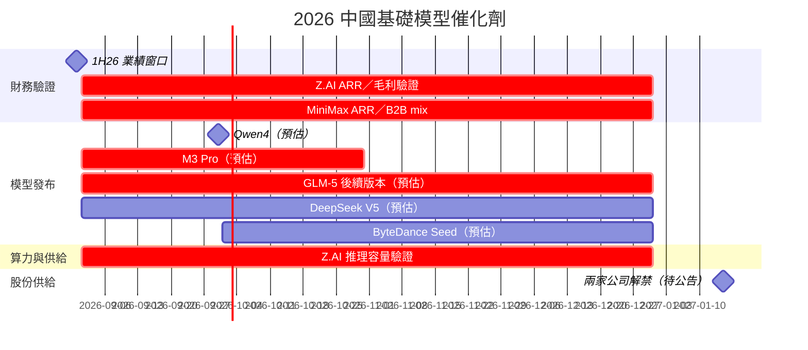

# 時程_2026中國基礎模型催化劑

## 日期表

| 日期 | 事件 | 相關公司 | 類型 | 重要性 | 備註 |
|---|---|---|---|---|---|
| 2026-08 下旬 | 1H26 業績公布窗口 | [[2513.HK(z.ai)]]、[[0100.HK(minimax)]] | 財務 | ⭐⭐⭐ | BofA 預估 Z.AI 收入 RMB782m、MiniMax US$80m；須以公告核對 |
| 2026-09 | Qwen4 預計發布 | — | 技術下線 | ⭐⭐ | BofA 模型日曆 estimate；命名與日期待官方確認 |
| 2026-09–10 | M3 Pro 預計發布 | [[0100.HK(minimax)]] | 技術下線 | ⭐⭐⭐ | Daiwa／BofA 稱約 3tn 參數；能力、延遲、價格待實測 |
| 2026-09–10 | Tencent HY4 預計發布 | — | 技術下線 | ⭐⭐ | BofA estimate |
| 2026H2 | GLM-5 後續版本發布／驗證 | [[2513.HK(z.ai)]] | 技術下線 | ⭐⭐⭐ | 報告出現 GLM-5.3／5.5 不同命名口徑，以公司公告為準 |
| 2026H2 | DeepSeek V5 預計發布 | — | 技術下線 | ⭐⭐⭐ | BofA estimate；將影響 API 價格與 token 份額 |
| 2026Q4 | ByteDance Seed 新模型預計發布 | — | 技術下線 | ⭐⭐ | BofA estimate |
| 2026 年底 | Z.AI ARR 與 API 毛利驗證 | [[2513.HK(z.ai)]] | 財務／驗證 | ⭐⭐⭐ | BofA 引述市場預期 US$2.5–3bn ARR；run-rate 非收入 |
| 2026 年底 | MiniMax ARR 與 B2B mix 驗證 | [[0100.HK(minimax)]] | 財務／驗證 | ⭐⭐⭐ | BofA 引述市場預期 US$1–1.5bn ARR |
| 2026H2 | Z.AI 推理容量／本土晶片叢集 | [[2513.HK(z.ai)]] | 產能／驗證 | ⭐⭐⭐ | 1GW 與約 50,000 顆加速器為規劃／公司口徑，待部署資料 |
| 2027-01 | Z.AI、MiniMax H 股解禁 | [[2513.HK(z.ai)]]、[[0100.HK(minimax)]] | 風險／事件 | ⭐⭐⭐ | Z.AI 報告口徑約 40% 或 74% H 股、MiniMax 約 90%；待交易所公告 |

## Gantt 時程圖

## 來源

- [[報告_BofA_智譜與MiniMax_1H26業績前瞻_20260824]] — BofA，2026-08-24
- [[報告_Daiwa_中國基礎模型產業啟動覆蓋_20260811]] — Daiwa，2026-08-11
- [[報告_Daiwa_MiniMax啟動覆蓋_20260811]] — Daiwa，2026-08-11
- [[報告_JPM_GLM5.3與DeepSeek重新定價_20260816]] — J.P. Morgan，2026-08-16

## 相關頁面

- [[0100.HK(minimax)]]
- [[2513.HK(z.ai)]]
- [[分析_中國基礎模型_Token經濟與算力瓶頸_20260905]]
