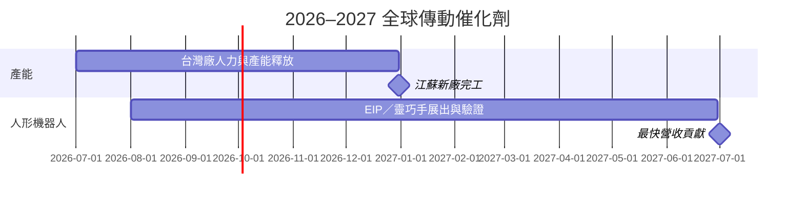

# 時程_2026工業自動化與人形機器人

## 日期表

| 日期 | 事件 | 相關公司 | 類型 | 重要性 | 備註 |
|---|---|---|---|---|---|
| 2026Q3–Q4 | 台灣廠移工培訓完成、產能逐步釋放 | [[4540_全球傳動（市）]] | 放量 | ⭐⭐⭐ | 緩解樹林廠缺工瓶頸 |
| 2026-08 | EIP 致動器與靈巧手原型展出 | [[4540_全球傳動（市）]] | 展覽 | ⭐⭐ | 人形機器人驗證年 |
| 2026年底 | 江蘇新廠完工 | [[4540_全球傳動（市）]] | 擴產 | ⭐⭐⭐ | 2027 年開始量產 |
| 2027H2 | 人形機器人業務最快開始貢獻營收 | [[4540_全球傳動（市）]] | 放量 | ⭐⭐⭐ | 取決於客戶 Design-in 與驗證 |
| 2026-07-29 | JMTBA 6 月訂單年增 53%、海外訂單年增 56% | [[1590_亞德客-KY（市）]]、[[2049_上銀（市）]] | 產業指標 | ⭐⭐⭐ | [[MS-Automation 20260729]]；自動化循環復甦訊號 |
| 2026-08-03 | 中國 7 月製造業 PMI 降至 49.2 | [[1590_亞德客-KY（市）]]、[[2049_上銀（市）]] | 產業指標 | ⭐⭐ | [[260803_ms_automation]]；短期情緒偏逆風，政策寬鬆仍是觀察點 |
| 2026-08-12 | JMTBA 7 月訂單年增 50%、月減 5% | [[1590_亞德客-KY（市）]]、[[2049_上銀（市）]] | 產業指標 | ⭐⭐⭐ | [[ms_Automation – Read-across from Preliminary JMTBA July 2026 Orders_20260812]]；海外需求仍強、季節性分化 |
| 2026H2 | 新代 AI 伺服器液冷設備方案與中國工具機需求放量 | [[7750_新代（市）]] | 放量 | ⭐⭐⭐ | 玉山／康和 estimate；高階控制器滲透率與中國景氣為關鍵 |
| 2026Q4–2027Q1 | 新代蘇州二廠啟用 | [[7750_新代（市）]] | 擴產 | ⭐⭐⭐ | 券商整理，產能約為蘇州一廠 2 倍，時程待驗證 |
| 2027Q2 | 新代馬來西亞廠投產 | [[7750_新代（市）]] | 擴產 | ⭐⭐⭐ | 支援印度、土耳其與美國市場 |

## Gantt 時程圖

## 來源

- [[活動_全球傳動法說_20260814]] — 統一投顧法說會 memo，2026-08-14
- [[MS-Automation 20260729]] — 摩根士丹利，2026-07-29
- [[260803_ms_automation]] — 摩根士丹利，2026-08-03
- [[ms_Automation – Read-across from Preliminary JMTBA July 2026 Orders_20260812]] — 摩根士丹利，2026-08-12

## 2026-08 批次新增

來源補充：[[國金證券20260823-電腦產業研究：Optimus可望迎量產加速時刻]]、[[國金證券20260823-機器人產業研究：特斯拉柏林工廠啟動機器人測試，世界機器人大會成功]]（國金證券，2026-08-23）。

| 日期 | 事件 | 相關公司 | 類型 | 重要性 | 備註 |
|---|---|---|---|---|---|
| 2026-08-12 | 亞德客 2Q26 財報與 4Q26 新品節奏 | [[1590_亞德客-KY（市）]] | 放量 | ⭐⭐⭐ | 2026 年營收成長目標上修至人民幣 +20% 以上；公司展望 |
| 2026H2 | 中砂鑽石碟產能提升至 70k/月 | [[1560_中砂（市）]] | 擴產 | ⭐⭐⭐ | 公司指引／券商整理 |
| 2026H2 | 亞翔新加坡半導體廠務專案認列 | [[6139_亞翔（市）]] | 放量 | ⭐⭐⭐ | 美光、VSMC 專案進度待驗證 |
| 2026Q4 | 萬潤 CPO 業務預估開始貢獻 | [[6187_萬潤（市）]] | 放量 | ⭐⭐⭐ | 券商 estimate，非公司指引 |
| 2026-08-07 | 宇樹科技 IPO 發行與機器人製造／模型研發募資 | [[688836.SH(unitree robotics)]] | 上市 | ⭐⭐ | 群益報告；估值與上市後價格屬 estimate |
| 2026-08-19 | 宇樹科技於科創板上市 | [[688836.SH(unitree robotics)]] | 上市 | ⭐⭐ | 國金整理其 2025 年人形機器人營收／銷量；後續仍須追蹤估值與商業化 |
| 2026H2 | Fremont 首代 Optimus 產線啟動初始生產（預估） | Tesla／Optimus | 技術下線 | ⭐⭐⭐ | 初期以 Academy 訓練與資料採集為主，非等同對外量產；[[國金證券20260823-電腦產業研究：Optimus可望迎量產加速時刻]] |
| 2027 夏季左右 | 德州第二座 Optimus 工廠可能投產（預估） | Tesla／Optimus | 擴產 | ⭐⭐ | 依 Tesla 電話會與國金整理，仍有時程與爬坡風險 |
