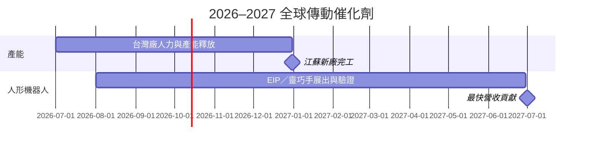

# 時程_2026工業自動化與人形機器人

## 2026-09-24 永豐新增觀察

| 日期 | 事件 | 相關公司 | 類型 | 重要性 | 備註 |
|---|---|---|---|---|---|
| 2026H2–2028（情境） | 搬運、分揀、上下料等結構化任務擴大試點 | [[688836.SH(unitree robotics)]]／產業 | 驗證 | ⭐⭐⭐ | 永豐產業情境；追蹤有效工時、停機、維護與客戶復購，非公司量產承諾 |
| 2027 年底（最快、預估） | Optimus 對外銷售窗口 | Tesla／Optimus | 商業化驗證 | ⭐⭐ | Fremont 及德州產能布局不等同對外交付；來源轉述，信心中低 |
| 2028 前（目標）／2030 前（目標） | 現代美國機器人年產能約 3 萬台／Atlas 零件組裝能力 | Boston Dynamics／現代 | 擴產／技術驗證 | ⭐⭐ | 永豐轉述；約 2.5 萬台導入計畫不等於已出貨 |

來源：[[報告_永豐_人形機器人產業_20260924]]（永豐投顧，2026-09-24）。技術與統計邊界見 [[技術_人形機器人]]。

## 本次 ingest 補充

| 日期 | 事件 | 相關公司 | 類型 | 重要性 | 備註 |
|---|---|---|---|---|---|
| 2026-08-18 | 具身智能研究：由合作／展示走向驗證、量產與營收追蹤 | [[2308_台達電（市）]]、[[2395_研華（市）]]、[[2049_上銀（市）]] | 驗證 | ⭐⭐ | [[20260821_1041_全球機器人產業前景_具身智能與台灣供應鏈研究]]；報告明確提醒合作不等於訂單、送樣不等於量產 |
| 2026H2–2027（匿名訪談） | Harmonic Drive Systems 半導體設備需求能否抵銷機器人中國區價格競爭 | [[6324.JP(harmonic_drive_systems)]] | 接單／產品組合驗證 | ⭐⭐ | [[memo_AceCamp_HarmonicDrive減速機_20260820]]；交期、客戶與營收占比均為渠道說法，非公司指引。 |

## 日期表
| 2026 年底（目標） | 台林蘆竹廠 B 棟完成 | [[5353_台林（櫃）]] | 擴產 | ⭐⭐ | [[memo_國泰證期_台林CallMemo_20260910]]；新增服務專案的實際利用率未揭露 |
| 2026H2 | 展達遞延 AIoT 高毛利訂單認列 | [[3447_展達（市）]] | 放量 | ⭐⭐ | [[memo_國泰證期_展達CallMemo_20260910]]；訂單與毛利改善待驗證 |
| 2027Q4（預估） | 台林越南首座工廠完工 | [[5353_台林（櫃）]] | 建廠 | ⭐⭐⭐ | [[memo_國泰證期_台林CallMemo_20260910]]；公司展望 |
| 2028Q1（預估） | 台林越南首座工廠投產 | [[5353_台林（櫃）]] | 放量／服務 | ⭐⭐⭐ | 同上；在地化服務與訂單待驗證 |

| 日期 | 事件 | 相關公司 | 類型 | 重要性 | 備註 |
|---|---|---|---|---|---|
| 2026Q3–Q4 | 台灣廠移工培訓完成、產能逐步釋放 | [[4540_全球傳動（市）]] | 放量 | ⭐⭐⭐ | 緩解樹林廠缺工瓶頸 |
| 2026-08 | EIP 致動器與靈巧手原型展出 | [[4540_全球傳動（市）]] | 展覽 | ⭐⭐ | 人形機器人驗證年 |
| 2026年底 | 江蘇新廠完工 | [[4540_全球傳動（市）]] | 擴產 | ⭐⭐⭐ | 2027 年開始量產 |
| 2027H2 | 人形機器人業務最快開始貢獻營收 | [[4540_全球傳動（市）]] | 放量 | ⭐⭐⭐ | 取決於客戶 Design-in 與驗證 |
| 2026-07-29 | JMTBA 6 月訂單年增 53%、海外訂單年增 56% | [[1590_亞德客-KY（市）]]、[[2049_上銀（市）]] | 產業指標 | ⭐⭐⭐ | [[MS-Automation 20260729]]；自動化循環復甦訊號 |
| 2026-08-03 | 中國 7 月製造業 PMI 降至 49.2 | [[1590_亞德客-KY（市）]]、[[2049_上銀（市）]] | 產業指標 | ⭐⭐ | [[260803_ms_automation]]；短期情緒偏逆風，政策寬鬆仍是觀察點 |
| 2026-08-12 | JMTBA 7 月訂單年增 50%、月減 5% | [[1590_亞德客-KY（市）]]、[[2049_上銀（市）]] | 產業指標 | ⭐⭐⭐ | [[ms_Automation – Read-across from Preliminary JMTBA July 2026 Orders_20260812]]；海外需求仍強、季節性分化 |
| 2026H2 | 新代 AI 伺服器液冷設備方案與中國工具機需求放量 | [[7750_新代（市）]] | 放量 | ⭐⭐⭐ | 玉山／康和 estimate；高階控制器滲透率與中國景氣為關鍵 |
| 2026Q4–2027Q1 | 新代蘇州二廠啟用 | [[7750_新代（市）]] | 擴產 | ⭐⭐⭐ | 券商整理，產能約為蘇州一廠 2 倍，時程待驗證 |
| 2027Q2 | 新代馬來西亞廠投產 | [[7750_新代（市）]] | 擴產 | ⭐⭐⭐ | 支援印度、土耳其與美國市場 |

## Gantt 時程圖

```mermaid
gantt
    title 2026–2027 全球傳動催化劑
    dateFormat YYYY-MM-DD
    section 產能
    台灣廠人力與產能釋放 :2026-07-01, 2026-12-31
    江蘇新廠完工 :milestone, 2026-12-31, 0d
    section 人形機器人
    EIP／靈巧手展出與驗證 :2026-08-01, 2027-06-30
    最快營收貢獻 :milestone, 2027-07-01, 0d
```

## 來源

- [[活動_全球傳動法說_20260814]] — 統一投顧法說會 memo，2026-08-14
- [[MS-Automation 20260729]] — 摩根士丹利，2026-07-29
- [[260803_ms_automation]] — 摩根士丹利，2026-08-03
- [[ms_Automation – Read-across from Preliminary JMTBA July 2026 Orders_20260812]] — 摩根士丹利，2026-08-12

## 2026-08 批次新增

來源補充：[[國金證券20260823-電腦產業研究：Optimus可望迎量產加速時刻]]、[[國金證券20260823-機器人產業研究：特斯拉柏林工廠啟動機器人測試，世界機器人大會成功]]（國金證券，2026-08-23）。

| 日期 | 事件 | 相關公司 | 類型 | 重要性 | 備註 |
|---|---|---|---|---|---|
| 2026-08-12 | 亞德客 2Q26 財報與 4Q26 新品節奏 | [[1590_亞德客-KY（市）]] | 放量 | ⭐⭐⭐ | 2026 年營收成長目標上修至人民幣 +20% 以上；公司展望 |
| 2026H2 | 中砂鑽石碟產能提升至 70k/月 | [[1560_中砂（市）]] | 擴產 | ⭐⭐⭐ | 公司指引／券商整理 |
| 2026H2 | 亞翔新加坡半導體廠務專案認列 | [[6139_亞翔（市）]] | 放量 | ⭐⭐⭐ | 美光、VSMC 專案進度待驗證 |
| 2026Q4 | 萬潤 CPO 業務預估開始貢獻 | [[6187_萬潤（市）]] | 放量 | ⭐⭐⭐ | 券商 estimate，非公司指引 |
| 2026-08-07 | 宇樹科技 IPO 發行與機器人製造／模型研發募資 | [[688836.SH(unitree robotics)]] | 上市 | ⭐⭐ | 群益報告；估值與上市後價格屬 estimate |
| 2026-08-19 | 宇樹科技於科創板上市 | [[688836.SH(unitree robotics)]] | 上市 | ⭐⭐ | 國金整理其 2025 年人形機器人營收／銷量；後續仍須追蹤估值與商業化 |
| 2026H2 | Fremont 首代 Optimus 產線啟動初始生產（預估） | Tesla／Optimus | 技術下線 | ⭐⭐⭐ | 初期以 Academy 訓練與資料採集為主，非等同對外量產；[[國金證券20260823-電腦產業研究：Optimus可望迎量產加速時刻]] |
| 2027 夏季左右 | 德州第二座 Optimus 工廠可能投產（預估） | Tesla／Optimus | 擴產 | ⭐⭐ | 依 Tesla 電話會與國金整理，仍有時程與爬坡風險 |
| 2026H2 | 新代中國高階控制器與 AI 液冷設備方案放量 | [[7750_新代（市）]] | 放量 | ⭐⭐⭐ | 華南投顧 estimate；中國市占率與毛利率為驗證指標 |
| 2027Q2 | 新代蘇州二廠、馬來西亞廠擴產效益浮現 | [[7750_新代（市）]] | 擴產 | ⭐⭐⭐ | 產能約為現有 2.6 倍，時程待驗證 |

| 2026-08-30 | JMTBA 7 月總訂單年增 50%、海外訂單年增 51% | [[1590_亞德客-KY（市）]]、[[2049_上銀（市）]] | 產業指標 | ⭐⭐⭐ | 月減 5%，但海外年增延續；摩根士丹利維持兩家公司 Overweight |

| 2026H2–2027 | 具身智能由展示／送樣進入客戶驗證與小量出貨觀察期 | [[2308_台達電（市）]]、[[2395_研華（市）]]、[[2049_上銀（市）]] | 驗證 | ⭐⭐⭐ | [[報告_獨立研究_全球機器人與台灣供應鏈_20260818]]；合作不等於訂單，需追蹤營收與量產 |

| 2026Q4–2027Q2 | 上銀滾珠螺桿、部分線性滑軌訂單能見度延伸；交期與調價效益待驗證 | [[2049_上銀（市）]] | 接單／驗證 | ⭐⭐⭐ | 統一投顧 2026-09-23 轉述；預估與實際訂單、交期可能不同 |

來源：[[報告_統一_上銀新聞評析_20260923]]（統一投顧，2026-09-23）。
