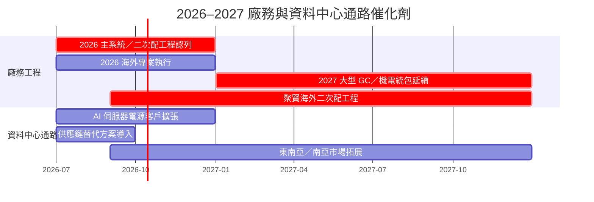

# 時程_2026廠務與資料中心通路催化劑

## 日期表

| 日期 | 事件 | 相關公司 | 類型 | 重要性 | 備註 |
|---|---|---|---|---|---|
| 2026H2 | 信紘科主系統／二次配與大型統包依工程進度認列 | [[6667_信紘科（櫃）]] | 工程／財務 | ⭐⭐⭐ | 在手訂單約 230 億元、能見度至 2028 |
| 2026H2 | 信紘科海外營收目標約占 10% | [[6667_信紘科（櫃）]] | 海外擴張 | ⭐⭐ | 取決於美國／日本專案與客戶建廠 |
| 2026H2 | 光菱 AI 伺服器電源與資料中心客戶擴張 | [[8032_光菱（櫃）]] | 放量／產品組合 | ⭐⭐⭐ | 資料中心占營收 27%，毛利改善仍待驗證 |
| 2026H2 | 供應鏈缺口以替代方案逐步改善 | [[8032_光菱（櫃）]] | 供應鏈 | ⭐⭐ | 電腦／通訊記憶體周邊仍受供應排期限制 |
| 2027 | 信紘科營收目標站穩 100 億元、海外占比有望翻倍 | [[6667_信紘科（櫃）]] | 財務／海外 | ⭐⭐⭐ | 公司展望，非無條件財測 |
| 2026–2027 | 光菱拓展東北亞、東南亞與南亞市場 | [[8032_光菱（櫃）]] | 海外擴張 | ⭐⭐ | 分散地緣與貿易政策風險 |
| 2026H2 | 聚賢研發營收可能低於 1H26 | [[7631_聚賢研發-創（市）]] | 工程／財務 | ⭐⭐⭐ | 海外案件認列主要落於 2027；須追蹤施工與合約資產 |
| 2026-09–2027-12 | 聚賢研發美國／新加坡多系統二次配工程施工 | [[7631_聚賢研發-創（市）]] | 海外工程 | ⭐⭐⭐ | 客戶未具名，認列與毛利取決於工程進度 |
| 2027Q2（預估） | 聚賢研發美國 P3 二次配可能發包 | [[7631_聚賢研發-創（市）]] | 接單／驗證 | ⭐⭐ | 管理層展望，非既有訂單 |

## Gantt 時程圖

## 來源

- [[活動_信紘科法說_20260918]] — 國泰證期研究部，2026-09-18。
- [[活動_光菱法說_20260921]] — 國泰證期研究部，2026-09-21。
- [[活動_聚賢研發法說_20260917]] — 富邦投顧，2026-09-17。

## 相關頁面

- [[分析_信紘科大型廠務統包與海外擴張_20260918]]
- [[分析_光菱資料中心電源與電子通路升級_20260921]]
- [[供應鏈_工業自動化]]
- [[供應鏈_AI伺服器PCB]]
- [[分析_聚賢研發海外二次配工程認列_20260917]]
