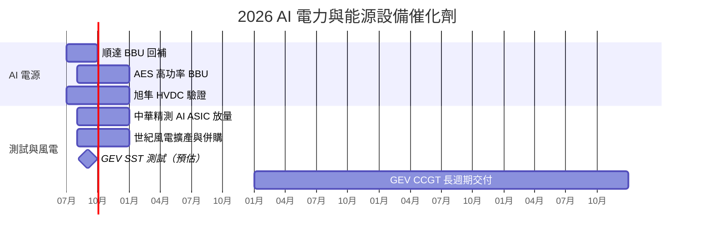
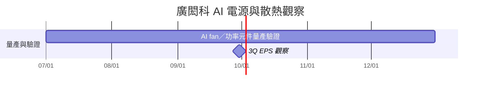

# 時程_2026能源與AI電力設備

| 時間 | 事件 | 公司 | 類型 | 重要性 | 來源 |
|---|---|---|---|---|---|
| 2026Q3 | 順達 BBU 延後出貨回補、毛利率修復 | [[3211_順達科技（櫃）]] | 放量 | ⭐⭐⭐ | [[報告_Citi_順達3211_2Q26_20260719]] |
| 2026H2 | AES 高功率 BBU mix 提升 | [[6781_AES-KY（市）]] | 規格升級 | ⭐⭐⭐ | [[報告_Citi_AES-KY6781_2Q26_20260806]] |
| 2026H2 | 旭隼 HVDC 客戶專案推進 | [[6409_旭隼（市）]] | 驗證 | ⭐⭐⭐ | [[報告_Daiwa_旭隼6409_2Q26_20260810]] |
| 2026Q3–Q4 | 中華精測 AI ASIC 與高階測試板放量 | [[6510_中華精測（櫃）]] | 量產 | ⭐⭐⭐ | [[報告_Citi_中華精測6510_2Q26_20260729]] |
| 2026年底 | 世紀風電擎天塔、五期廠投產 | [[2072_世紀風電（市）]] | 擴產 | ⭐⭐⭐ | [[活動_世紀集團法說_20260813]] |
| 2026-12-31 | 世紀樺欣股份轉換基準日暫定 | [[2072_世紀風電（市）]] | 併購 | ⭐⭐⭐ | [[活動_世紀集團法說_20260813]] |
| 2026H2 | 順達 8kW／12kW BBU 出貨、CSP 新客戶開始出貨 | [[3211_順達科技（櫃）]] | 規格升級 | ⭐⭐⭐ | [[260729_citi_dynapack]]、[[260805_citi_dynapack]] |
| 2026-09 | GEV SST 測試窗口（預估） | [[GEV.US(ge_vernova)]] | 驗證 | ⭐⭐ | [[Sinopac_電力設備]] |
| 2028–2030 | 北美 CCGT 供需缺口與燃氣輪機長週期交付 | [[GEV.US(ge_vernova)]] | 產能 | ⭐⭐⭐ | [[Sinopac_電力設備]] |
| 2026-12 | Musashi 超級電容新廠設備進駐（參訪筆記，待查證） | Musashi | 擴產／驗證 | ⭐⭐ | [[活動_Musashi_京都論壇_20260825]]；設備進駐由 10 月延至 12 月 |
| 2027 | Musashi 超級電容擴產與 CBU／TPU 導入觀察（參訪筆記，待查證） | Musashi、[[NVDA.US(nvidia)]] | 放量／驗證 | ⭐⭐ | [[活動_Musashi_京都論壇_20260825]]；需求與客戶採用尚未由正式文件確認 |
| 2027 | Panasonic BBU／CBU 與資料中心能源業務放量觀察（參訪筆記，待查證） | Panasonic | 放量 | ⭐⭐ | [[活動_Panasonic_京都論壇_20260825]]；財務目標為論壇轉述 |
| 2026-09-11 | Bloom Energy 2Q26 超預期並上修 2026 SOFC 出貨指引至 1.14–1.25GW | [[BE.US(bloom_energy)]] | 放量／財報 | ⭐⭐⭐ | [[報告_中信投顧_BloomEnergy_20260911]]；融資與專案轉實際出貨仍待驗證 |

## 來源
- 本批 2026-07-19 至 2026-08-23 券商報告與公司法說 memo。
- [[Sinopac_電力設備]]（永豐投顧，2026-08-23）
- 2026-3Q：[[2308_台達電（市）]] ±400V 解決方案預計開始生產；800V HVDC 導入較漸進，Daiwa 估較高滲透率可能延至 2027 年。

## 2026-09-06 廣閎科新增節點

| 日期 | 事件 | 相關公司 | 類型 | 重要性 | 備註 |
|---|---|---|---|---|---|
| 2026H2 | 12V／48V AI chassis fan、5G cooling 與功率元件持續量產／驗證 | [[6693_廣閎科（櫃）]] | 放量／驗證 | ⭐⭐ | [[活動_廣閎科_2026Q2法說_20260821]]；公司說法，實際出貨待追蹤 |
| 2026Q3 | 管理層預期 EPS 優於前季 | [[6693_廣閎科（櫃）]] | 財務 | ⭐⭐ | AI 生成逐字稿整理，低信心，不視為正式財測 |

來源：[[活動_廣閎科_2026Q2法說_20260821]]。

## 2026-09-15 UBS 高峰會新增節點

| 日期 | 事件 | 相關公司 | 類型 | 重要性 | 備註 |
|---|---|---|---|---|---|
| 2027 | 台達電 HVDC 生產與出貨由小量逐步放大 | [[2308_台達電（市）]] | 放量／規格升級 | ⭐⭐⭐ | 三家 hyperscaler 評估 400V，其中兩家先導入 NVIDIA 機櫃；管理層／券商展望 |
| 2026 年底 | 旭隼 800VDC power shelf 送樣 | [[6409_旭隼（市）]] | 驗證 | ⭐⭐⭐ | UBS／管理層時程，後續 2027H1 pilot、2027H2 量產 |
| 2027H2 | 旭隼 HVDC 產品進入量產 | [[6409_旭隼（市）]] | 量產 | ⭐⭐⭐ | 新增第三名 HVDC 客戶；實際出貨與營收貢獻待驗證 |

來源：[[報告_UBS_台達電_20260915]]、[[報告_UBS_旭隼_20260915]]（UBS，2026-09-15）。
