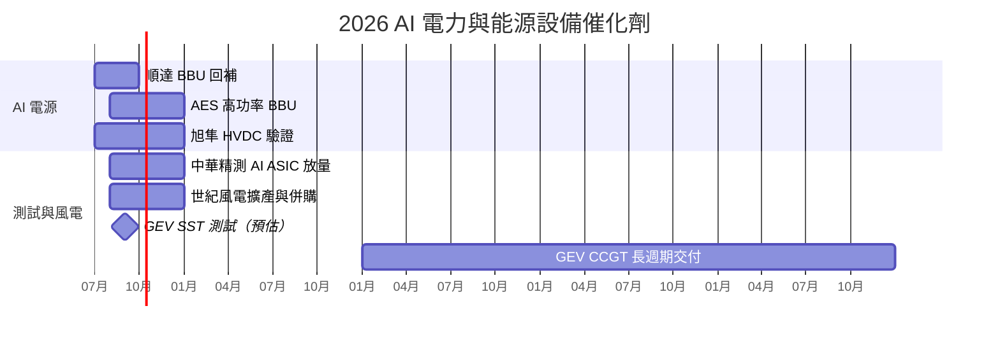
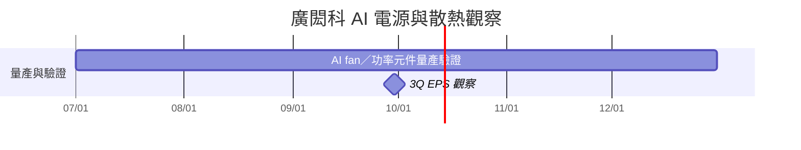
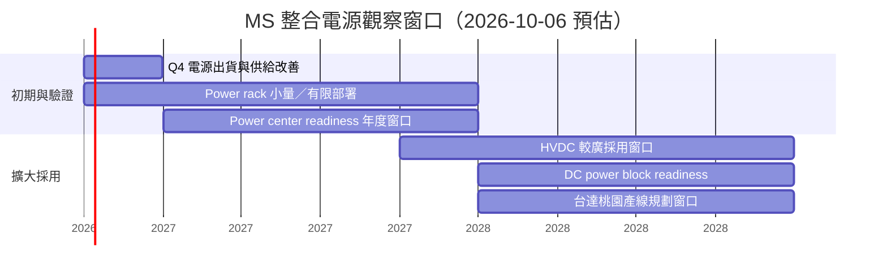

# 時程_2026能源與AI電力設備

| 時間 | 事件 | 公司 | 類型 | 重要性 | 來源 |
|---|---|---|---|---|---|
| 2026Q3 | 順達 BBU 延後出貨回補、毛利率修復 | [[3211_順達科技（櫃）]] | 放量 | ⭐⭐⭐ | [[報告_Citi_順達3211_2Q26_20260719]] |
| 2026H2 | AES 高功率 BBU mix 提升 | [[6781_AES-KY（市）]] | 規格升級 | ⭐⭐⭐ | [[報告_Citi_AES-KY6781_2Q26_20260806]] |
| 2026H2 | 旭隼 HVDC 客戶專案推進 | [[6409_旭隼（市）]] | 驗證 | ⭐⭐⭐ | [[報告_Daiwa_旭隼6409_2Q26_20260810]] |
| 2026Q3–Q4 | 中華精測 AI ASIC 與高階測試板放量 | [[6510_中華精測（櫃）]] | 量產 | ⭐⭐⭐ | [[報告_Citi_中華精測6510_2Q26_20260729]] |
| 2026年底 | 世紀風電擎天塔、五期廠投產 | [[2072_世紀風電（市）]] | 擴產 | ⭐⭐⭐ | [[活動_世紀集團法說_20260813]] |
| 2026-12-31 | 世紀樺欣股份轉換基準日暫定 | [[2072_世紀風電（市）]] | 併購 | ⭐⭐⭐ | [[活動_世紀集團法說_20260813]] |
| 2026H2 | 順達 8kW／12kW BBU 出貨、CSP 新客戶開始出貨 | [[3211_順達科技（櫃）]] | 規格升級 | ⭐⭐⭐ | [[260729_citi_dynapack]]、[[260805_citi_dynapack]] |
| 2026-09 | GEV SST 測試窗口（預估） | [[GEV.US(ge_vernova)]] | 驗證 | ⭐⭐ | [[Sinopac_電力設備]] |
| 2028–2030 | 北美 CCGT 供需缺口與燃氣輪機長週期交付 | [[GEV.US(ge_vernova)]] | 產能 | ⭐⭐⭐ | [[Sinopac_電力設備]] |
| 2026-12 | Musashi 超級電容新廠設備進駐（參訪筆記，待查證） | Musashi | 擴產／驗證 | ⭐⭐ | [[活動_Musashi_京都論壇_20260825]]；設備進駐由 10 月延至 12 月 |
| 2027 | Musashi 超級電容擴產與 CBU／TPU 導入觀察（參訪筆記，待查證） | Musashi、[[NVDA.US(nvidia)]] | 放量／驗證 | ⭐⭐ | [[活動_Musashi_京都論壇_20260825]]；需求與客戶採用尚未由正式文件確認 |
| 2027 | Panasonic BBU／CBU 與資料中心能源業務放量觀察（參訪筆記，待查證） | Panasonic | 放量 | ⭐⭐ | [[活動_Panasonic_京都論壇_20260825]]；財務目標為論壇轉述 |
| 2026-09-11 | Bloom Energy 2Q26 超預期並上修 2026 SOFC 出貨指引至 1.14–1.25GW | [[BE.US(bloom_energy)]] | 放量／財報 | ⭐⭐⭐ | [[報告_中信投顧_BloomEnergy_20260911]]；融資與專案轉實際出貨仍待驗證 |

```mermaid
gantt
    title 2026 AI 電力與能源設備催化劑
    dateFormat YYYY-MM-DD
    axisFormat %m月
    section AI 電源
    順達 BBU 回補 :2026-07-01, 2026-09-30
    AES 高功率 BBU :2026-08-01, 2026-12-31
    旭隼 HVDC 驗證 :2026-07-01, 2026-12-31
    section 測試與風電
    中華精測 AI ASIC 放量 :2026-08-01, 2026-12-31
    世紀風電擴產與併購 :2026-08-01, 2026-12-31
    GEV SST 測試（預估） :milestone, 2026-09-01, 0d
    GEV CCGT 長週期交付 :2028-01-01, 2030-12-31
```

## 來源
- 本批 2026-07-19 至 2026-08-23 券商報告與公司法說 memo。
- [[Sinopac_電力設備]]（永豐投顧，2026-08-23）
- 2026-3Q：[[2308_台達電（市）]] ±400V 解決方案預計開始生產；800V HVDC 導入較漸進，Daiwa 估較高滲透率可能延至 2027 年。

## 2026-09-06 廣閎科新增節點

| 日期 | 事件 | 相關公司 | 類型 | 重要性 | 備註 |
|---|---|---|---|---|---|
| 2026H2 | 12V／48V AI chassis fan、5G cooling 與功率元件持續量產／驗證 | [[6693_廣閎科（櫃）]] | 放量／驗證 | ⭐⭐ | [[活動_廣閎科_2026Q2法說_20260821]]；公司說法，實際出貨待追蹤 |
| 2026Q3 | 管理層預期 EPS 優於前季 | [[6693_廣閎科（櫃）]] | 財務 | ⭐⭐ | AI 生成逐字稿整理，低信心，不視為正式財測 |

```mermaid
gantt
    title 廣閎科 AI 電源與散熱觀察
    dateFormat  YYYY-MM-DD
    axisFormat  %m/%d
    section 量產與驗證
    AI fan／功率元件量產驗證 :2026-07-01, 2026-12-31
    3Q EPS 觀察 :milestone, 2026-09-30, 0d
```

來源：[[活動_廣閎科_2026Q2法說_20260821]]。

## 2026-09-15 UBS 高峰會新增節點

| 日期 | 事件 | 相關公司 | 類型 | 重要性 | 備註 |
|---|---|---|---|---|---|
| 2027 | 台達電 HVDC 生產與出貨由小量逐步放大 | [[2308_台達電（市）]] | 放量／規格升級 | ⭐⭐⭐ | 三家 hyperscaler 評估 400V，其中兩家先導入 NVIDIA 機櫃；管理層／券商展望 |
| 2026 年底 | 旭隼 800VDC power shelf 送樣 | [[6409_旭隼（市）]] | 驗證 | ⭐⭐⭐ | UBS／管理層時程，後續 2027H1 pilot、2027H2 量產 |
| 2027H2 | 旭隼 HVDC 產品進入量產 | [[6409_旭隼（市）]] | 量產 | ⭐⭐⭐ | 新增第三名 HVDC 客戶；實際出貨與營收貢獻待驗證 |

來源：[[報告_UBS_台達電_20260915]]、[[報告_UBS_旭隼_20260915]]（UBS，2026-09-15）。

## 相關頁面

- [[技術_800VDC供電架構]]
- [[技術_BBU與CBU機櫃儲能]]
- [[分析_AI資料中心供電與電熱整合]]
- [[2301_光寶科（市）]]
- [[7788_松川精密（市）]]
- [[2481_強茂（市）]]

## MS 2026-10-06：整合電源 2026–2030 觀察窗口

| 日期／窗口 | 事件 | 相關公司 | 類型 | 重要性 | 備註 |
|------------|------|----------|------|--------|------|
| 2026Q4 | 台達供給改善、營收模型 QoQ +15%；光寶雲端拉動 +16.2% | [[2308_台達電（市）]]、[[2301_光寶科（市）]] | 放量 | ⭐⭐⭐ | MS p60／86；estimate／中 |
| 2026Q4末–2027 | HVDC power rack 初期小量，Rubin NVL72 仍可用 in-rack shelf | [[2308_台達電（市）]]、[[2301_光寶科（市）]] | 驗證／放量 | ⭐⭐⭐ | MS p8／14；非全面改用 800V |
| 2026年底起 | 光寶少數 CSP 份額增加，HVDC 客戶驗證追蹤 | [[2301_光寶科（市）]] | 驗證 | ⭐⭐⭐ | MS p14，未具名；estimate／中 |
| 2027 | power center 約 1.6–2MW 設備就緒 | [[2308_台達電（市）]]、[[2301_光寶科（市）]] | 規格升級 | ⭐⭐ | NVIDIA roadmap 經 MS 引用；readiness 不等於公司訂單 |
| 2027年底–2028 | MS 估 800／±400VDC 較廣採用 | [[2308_台達電（市）]]、[[2301_光寶科（市）]] | 放量 | ⭐⭐⭐ | p8；不同券商採用率分母不合併 |
| 2028 | 台達桃園新增量產線預計就緒 | [[2308_台達電（市）]] | 擴產 | ⭐⭐ | p64／71 管理層規劃轉述，未確認投產日 |
| 2028 | 設施級 4.8MW DC power block 設備就緒 | [[2308_台達電（市）]] | 規格升級 | ⭐⭐ | p42–44；產業路線非台達已取得訂單 |
| 2030起（待確認） | MS 估 SST 廣泛採用不早於此；現有小量與試點分開 | [[2308_台達電（市）]] | 技術導入 | ⭐⭐ | p49；與舊 memo 2028 放量並列，estimate／中 |

```mermaid
gantt
    title MS 整合電源觀察窗口（2026-10-06 預估）
    dateFormat YYYY-MM-DD
    axisFormat %Y
    section 初期與驗證
    Q4 電源出貨與供給改善 :2026-10-01, 2026-12-31
    Power rack 小量／有限部署 :2026-10-01, 2027-12-31
    Power center readiness 年度窗口 :2027-01-01, 2027-12-31
    section 擴大採用
    HVDC 較廣採用窗口 :2027-10-01, 2028-12-31
    DC power block readiness :2028-01-01, 2028-12-31
    台達桃園產線規劃窗口 :2028-01-01, 2028-12-31
```

圖說：Gantt 以季度／年度窗口視覺化來源估計；「年底」以末季示意，不代表確切出貨日。SST 只有「不早於 2030」下限，未畫成確定起訖或里程碑；SOFC 未有新量產日期，不另造時點。

> [!warning] 時程與口徑保留
> MS 的 2027–2028 HVDC 較廣採用、SST 廣泛採用不早於 2030，與 GEV 2026 測試／舊台達 memo 2028 SST 大規模是不同來源與成熟階段。readiness、產品推出、試點與客戶廣泛導入須分層追蹤，皆待後續訂單與營收確認。

來源：[[報告_MorganStanley_整合電源方案_20261006]] — Morgan Stanley，2026-10-06；p8、14、41–49、60、64、71、86。
