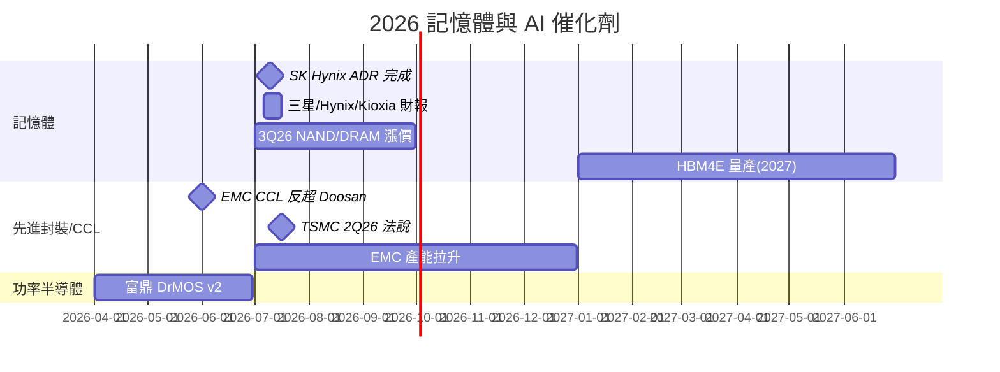

# 時程_2026記憶體與AI催化劑

## 日期表
| 日期 | 事件 | 相關公司 | 類型 | 重要性 | 備註 |
|------|------|---------|------|--------|------|
| 2026-06 | NVIDIA CCL 價值龍頭由 EMC 反超 Doosan | [[2383_台光電（市）]]、[[000150.KR(doosan)]] | 路線轉向 | ⭐⭐⭐ | Rubin/VR NVL72 放量 |
| 2026-07-10 | SK 海力士 ADR 新股發行完成（2.5%） | [[000660.KR(sk_hynix)]] | 事件 | ⭐⭐ | 被動資金流入，多已 priced in |
| 2026-07（上旬） | 三星／海力士／鎧俠 preliminary 財報 | [[005930.KR(samsung)]]、[[000660.KR(sk_hynix)]]、[[285A.JP(kioxia)]] | 事件 | ⭐⭐ | 獲利可達上修後預估 |
| 2026-Q3 | Vera Rubin NVL72 量產（MP）+ 800V Power Rack 出貨 | [[NVDA.US(nvidia)]]、[[2317_鴻海（市）]] | 放量 | ⭐⭐⭐ | Computex 2026 確認（MS 6/7）；Groq 3 LPX 亦 3Q26 量產 |
| 2026-07-16 | TSMC 2Q26 法說會 | [[2330_台積電（市）]] | 事件 | ⭐⭐⭐ | CoWoS/capex/GM 指引 |
| 2026Q2 | 富鼎 DrMOS 第二版推出 | [[8261_富鼎（市）]] | 規格升級 | ⭐⭐ | 配合平台夥伴改版 |
| 2026Q3 | 三星提前啟動庫藏股買進並註銷 | [[005930.KR(samsung)]] | 事件 | ⭐⭐ | 股東回饋加大 |
| 2026Q3 | NAND/DRAM 漲價（TLC eSSD +30%、server DRAM +20% QoQ） | [[MU.US(micron)]]、[[285A.JP(kioxia)]] | 規格升級 | ⭐⭐⭐ | 伺服器級強、消費級近天花板 |
| 2026H2 | EMC CCL 產能拉升至 ~1.5m sheets/月 | [[2383_台光電（市）]] | 放量 | ⭐⭐⭐ | 2028 產能倍增規劃 |
| 2027 | HBM4E 量產、漲價（約前代 2x） | [[005930.KR(samsung)]]、[[000660.KR(sk_hynix)]] | 規格升級 | ⭐⭐⭐ | logic die 製程 N4/N3 差異 |
| 2028 | YMTC Fab4/5 擴產（供給變數） | — | 放量 | ⭐⭐ | 加速 greenfield 恐轉過剩 |

## Gantt 時程圖

## 相關頁面

- [[009150.KR(semco)]]
- [[SNDK.US(sandisk)]]
- [[供應鏈_記憶體]]
