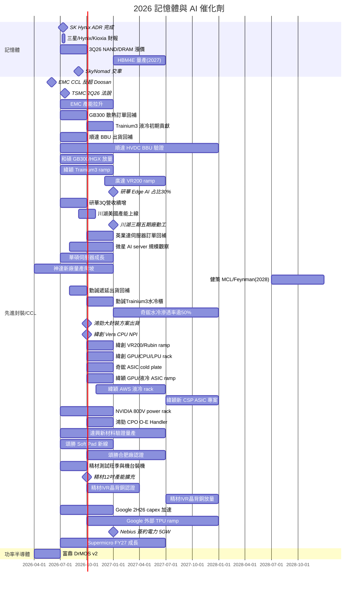

# 時程_2026記憶體與AI催化劑

## 日期表
| 日期 | 事件 | 相關公司 | 類型 | 重要性 | 備註 |
|------|------|---------|------|--------|------|
| 2026-06 | NVIDIA CCL 價值龍頭由 EMC 反超 Doosan | [[2383_台光電（市）]]、[[000150.KR(doosan)]] | 路線轉向 | ⭐⭐⭐ | Rubin/VR NVL72 放量 |
| 2026-07-10 | SK 海力士 ADR 新股發行完成（2.5%） | [[000660.KR(sk_hynix)]] | 事件 | ⭐⭐ | 被動資金流入，多已 priced in |
| 2026-07（上旬） | 三星／海力士／鎧俠 preliminary 財報 | [[005930.KR(samsung)]]、[[000660.KR(sk_hynix)]]、[[285A.JP(kioxia)]] | 事件 | ⭐⭐ | 獲利可達上修後預估 |
| 2026-Q3 | Vera Rubin NVL72 量產（MP）+ 800V Power Rack 出貨 | [[NVDA.US(nvidia)]]、[[2317_鴻海（市）]] | 放量 | ⭐⭐⭐ | Computex 2026 確認（MS 6/7）；Groq 3 LPX 亦 3Q26 量產 |
| 2026-07-16 | TSMC 2Q26 法說會 | [[2330_台積電（市）]] | 事件 | ⭐⭐⭐ | CoWoS/capex/GM 指引 |
| 2026Q2 | 富鼎 DrMOS 第二版推出 | [[8261_富鼎（市）]] | 規格升級 | ⭐⭐ | 配合平台夥伴改版 |
| 2026Q3 | 三星提前啟動庫藏股買進並註銷 | [[005930.KR(samsung)]] | 事件 | ⭐⭐ | 股東回饋加大 |
| 2026Q3 | NAND/DRAM 漲價（TLC eSSD +30%、server DRAM +20% QoQ） | [[MU.US(micron)]]、[[285A.JP(kioxia)]] | 規格升級 | ⭐⭐⭐ | 伺服器級強、消費級近天花板 |
| 2026H2 | EMC CCL 產能拉升至 ~1.5m sheets/月 | [[2383_台光電（市）]] | 放量 | ⭐⭐⭐ | 2028 產能倍增規劃 |
| 2027 | HBM4E 量產、漲價（約前代 2x） | [[005930.KR(samsung)]]、[[000660.KR(sk_hynix)]] | 規格升級 | ⭐⭐⭐ | logic die 製程 N4/N3 差異 |
| 2028 | YMTC Fab4/5 擴產（供給變數） | — | 放量 | ⭐⭐ | 加速 greenfield 恐轉過剩 |
| 2027H1 | 景碩 ABF 月產能達 5,000 萬顆；評估 BT 去瓶頸／擴產 | [[3189_景碩（市）]] | 放量 | ⭐⭐⭐ | AI CPU／GPU／ASIC 與光模組需求 |
| 2027 年底 | T/E-glass 缺料可能開始實質緩解 | [[3189_景碩（市）]] | 材料瓶頸 | ⭐⭐⭐ | 景碩估缺料影響營收 10–15%；仍依賴日東紡擴產 |
| 2028 | 景碩 ABF 月產能目標 6,500 萬顆，部分設備由客戶出資 | [[3189_景碩（市）]] | 放量 | ⭐⭐⭐ | 舊模型 5,150 萬顆，口徑待公司公告確認 |
| 2029 | 景碩 ABF 月產能目標 8,000 萬顆；新土地／新廠準備 | [[3189_景碩（市）]] | 放量 | ⭐⭐⭐ | 既有廠房接近滿載 |
| 2026Q3 | GB300 延遲訂單回補 | [[3324_雙鴻（市）]] | 放量 | ⭐⭐⭐ | 7 月營收月增 39%，JPM 估 3Q26 營收季增 18% |
| 2026Q4 | AWS Trainium 3 液冷組件初期貢獻 | [[3324_雙鴻（市）]] | 放量 | ⭐⭐⭐ | 水冷板、inner/rack manifold；estimate |
| 2026Q4 | 310×310 mm PLP ECP 評估機交付 | [[ACMR.US(acm_research)]] | 驗證 | ⭐⭐⭐ | 面板級封裝新客戶驗證 |
| 2026-09 | SkyNomad 電動 SUV 開始交車 | [[1810.HK(xiaomi)]] | 放量 | ⭐⭐⭐ | 小米 2H26 EV 出貨回升驅動 |
| 2026Q3 | 順達延後 BBU 出貨回補 | [[3211_順達科技（櫃）]] | 放量 | ⭐⭐⭐ | 2Q26 EPS miss 主因 mix 與出貨時點；Citi 預期 Q3 毛利率修復 |
| 2026H2 | 順達 8kW／12kW BBU 認證與放量 | [[3211_順達科技（櫃）]] | 規格升級 | ⭐⭐⭐ | 高功率產品提升 BBU content；客戶 qualification 為關鍵 |
| 2026–2027 | 順達 400V／800V HVDC BBU 量產窗口 | [[3211_順達科技（櫃）]] | 技術下線 | ⭐⭐ | 公司稱 2027 最晚；完整 800VDC 系統時程可能更晚 |
| 2026-08-20 | NVIDIA 發布 800VDC 產業對齊與執行白皮書 | [[NVDA.US(nvidia)]] | 規格升級 | ⭐⭐⭐ | Power Rack／Power Center／DC Power Block 三層部署、約 4.8MW power block；屬公司 roadmap，非立即全面量產 |
| 2027 | 南亞 M9／M10 CCL 認證選擇權 | [[1303_南亞（市）]] | 驗證 | ⭐⭐⭐ | 未納入 JPM 基準獲利；通過後可提升 AI-grade mix |
| 2026Q3 | 和碩 GB300／HGX 伺服器營收續增 | [[4938_和碩（市）]] | 放量 | ⭐⭐⭐ | 公司預期全年 server growth 超過原 10x YoY 目標 |
| 2026 年底 | 研華 edge AI 營收占比目標 30% | [[2395_研華（市）]] | 規格升級 | ⭐⭐⭐ | 1H26 為 22.5%；123 個 design wins 逐步轉量產 |
| 2026Q3 | 研華營收預期續高於 2Q26 | [[2395_研華（市）]] | 放量 | ⭐⭐⭐ | 中信 estimate；2Q26 B/B 1.44x、北美 1.92x |
| 2026Q3–Q4 | 緯穎 AWS Trainium 3 server ramp | [[6669_緯穎（市）]] | 放量 | ⭐⭐⭐ | 2026-07 營收 NT$117.7bn；花旗估動能延續 |
| 2026 年底 | 緯穎 AWS 液冷 rack 初始出貨 | [[6669_緯穎（市）]] | 技術下線 | ⭐⭐⭐ | HSBC estimate；2027 年出貨量可望提升 |
| 2026 年底起 | 廣達 VR200 rack 開始放量 | [[2382_廣達（市）]] | 放量 | ⭐⭐⭐ | UBS 2026-07-20 預估；consignment 與 ASP 為獲利率觀察重點 |
| 2026-10 | 鴻勁大封裝 handler solution 開始出貨 | [[7769_鴻勁精密（市）]] | 技術下線 | ⭐⭐⭐ | mega tray >120×150mm；ASP 高 20–25% |
| 2027H1–H2 | 鴻勁大封裝 solution 滲透率 20–30% → >50% | [[7769_鴻勁精密（市）]] | 規格升級 | ⭐⭐⭐ | 高盛／管理層 estimate |
| 2026-09～10 | 川湖美國產能上線 | [[2059_川湖（市）]] | 放量 | ⭐⭐⭐ | MS estimate；支援北美客戶與在地化需求 |
| 2026 年底 | 川湖三期、五期廠動工 | [[2059_川湖（市）]] | 放量 | ⭐⭐⭐ | 合計投資約 NT$100 億，完工後產能較現有規模倍增 |
| 2027H2 | 川湖高雄新廠投產 | [[2059_川湖（市）]] | 放量 | ⭐⭐⭐ | 另有鄰近土地可供長期綠地擴產 |
| 2026Q4 | 英業達延後伺服器訂單回補 | [[2356_英業達（市）]] | 放量 | ⭐⭐⭐ | 記憶體、CPU、PCB 供應為主要變數 |
| 2026H2 | 微星 AI server 規模化觀察 | [[2377_微星（市）]] | 放量 | ⭐⭐ | thesis；Citi 尚未給出明確放量指引 |
| 2026Q3 | 華碩伺服器營收季增 10–15% | [[2357_華碩（市）]] | 放量 | ⭐⭐⭐ | 公司 outlook；2026 全年伺服器營收年增指引上修至 150% |
| 2026Q2–Q4 | 神達美國三廠與台灣一廠量產爬坡 | [[3706_神達投控（市）]] | 放量 | ⭐⭐⭐ | 高盛估 Q3／Q4 營收季增 10%／32%；良率與毛利為觀察點 |
| 2028H2 | 健策 MCL 可能於 Feynman 世代導入 | [[3653_健策（市）]] | 技術下線 | ⭐⭐⭐ | 美林 2026-07-28 estimate；較早 Rubin Ultra 假設後移 |
| 2026-08～09 | VR200 散熱零組件開始放量 | [[3017_奇鋐（市）]] | 放量 | ⭐⭐⭐ | 中信估 3Q26 營收季增 21.3% |
| 2026-08～09 | 勤誠遞延出貨回補與記憶體缺料觀察 | [[8210_勤誠（市）]] | 放量／供應瓶頸 | ⭐⭐⭐ | 物流改善但關鍵客戶仍受記憶體短缺影響；Daiwa 2026-08-10 estimate |
| 2026Q3 末 | 勤誠馬來西亞廠開始爬坡 | [[8210_勤誠（市）]] | 放量 | ⭐⭐ | chassis 為主 |
| 2026Q4 | 勤誠 AWS Trainium 3 水冷櫃開始出貨 | [[8210_勤誠（市）]] | 放量 | ⭐⭐⭐ | PDS 與水冷 Chassis 訂單需求強勁 |
| 2026Q4–2027Q1 | Google TPU Sunfish／Zebrafish、Meta ASIC 與 AWS Trainium 4 進入量產／放量觀察 | [[2454_聯發科（市）]]、[[MRVL.US(marvell)]]、[[INTC.US(intel)]] | 驗證／放量 | ⭐⭐⭐ | 廣發香港估計；CoWoS、EMIB-T、NPO 規格與實際出貨仍待交叉驗證 |
| 2026Q4–2027 | 勤誠 AI rack／機櫃客製化與海外產能擴張 | [[8210_勤誠（市）]] | 擴產／放量 | ⭐⭐⭐ | UBS estimate；馬來西亞、越南與美國產能爬坡及 rack-level 毛利為觀察點 |
| 2027 | 奇鋐水冷滲透率突破 50% | [[3017_奇鋐（市）]] | 規格升級 | ⭐⭐⭐ | 中信 estimate；ASIC 應用有望超越 GPU |
| 2026Q3 末 | Vera CPU rack NPI 啟動 | [[3231_緯創（市）]] | 新平台 | ⭐⭐⭐ | UBS 估 2026 年 2–3k units、約 NT$60bn |
| 2026Q4 | 緯創 VR200／Rubin rack 開始放量 | [[3231_緯創（市）]] | 放量 | ⭐⭐⭐ | UBS 估 Q4 VR200 約 1k racks；estimate |
| 2026Q4 | 緯創 GPU／CPU／LPU 新機櫃量產 | [[3231_緯創（市）]] | 放量 | ⭐⭐⭐ | GS 估 4Q26 營收季增 40%，ASP 隨新平台提高 |
| 2026Q4 | 奇鋐 Trainium 3／Google TPU v8 cold plate 放量 | [[3017_奇鋐（市）]] | 放量 | ⭐⭐⭐ | J.P. Morgan estimate；內容價值高於 NVIDIA 系統 |
| 2026Q4 | 緯穎 GPU rack 與液冷 ASIC server 集中放量 | [[6669_緯穎（市）]] | 放量 | ⭐⭐⭐ | 高盛估 4Q26 營收 QoQ +32% |
| 2027H2 | 緯穎新 CSP ASIC AI Server 專案推出 | [[6669_緯穎（市）]] | 新平台 | ⭐⭐⭐ | Daiwa 估 L11 市占 10–15%、7,500 racks；estimate，待訂單驗證 |
| 2026H2 | 致茂電源測試、SLT、metrology 與 CPO 測試需求維持高檔 | [[2360_致茂（市）]] | 放量 | ⭐⭐⭐ | Citi；GDR 最多 1,360 萬股、稀釋約 3% 仍待條件確認 |
| 2026H2 | 中租中國資產品質改善與放款回溫 | [[5871_中租-KY（市）]] | 業績 | ⭐⭐ | Citi；信用成本與放款成長仍是關鍵觀察 |
| 2026H2 | NVIDIA 800V power rack 少量出貨低於 500 台 | [[2308_台達電（市）]]、[[NVDA.US(nvidia)]] | 技術下線 | ⭐⭐ | 富邦 estimate；VR200 HVDC 滲透率估 10% |
| 2027 | Kyber 出貨時程待確認 | [[NVDA.US(nvidia)]]、[[2059_川湖（市）]]、[[3017_奇鋐（市）]]、[[3653_健策（市）]] | 時程風險 | ⭐⭐⭐ | 富邦估 2027 無出貨；NVIDIA 否認延遲，MS 後續 channel check 指延後 |
| 2026-10 起 | 鴻勁 CPO Insertion 4 O/E Handler 月出貨 20–30 台 | [[7769_鴻勁精密（市）]] | 技術下線 | ⭐⭐⭐ | 摩根士丹利法說紀錄；待客戶配置與訂單驗證 |
| 2026Q4 | 旺矽 CPO Insertion 3 prober 預計出貨 | [[6223_旺矽（櫃）]] | 驗證／放量 | ⭐⭐⭐ | Morgan Stanley 2026-08-04；目前無設備遭剔除 |
| 2027 年中 | 旺矽 CPO Insertion 2 預計開始 | [[6223_旺矽（櫃）]] | 驗證／放量 | ⭐⭐⭐ | Morgan Stanley estimate；仍待客戶認證 |
| 2026H2–2027H1 | 達興材料 3–4 項新半導體材料預計通過驗證並量產 | [[5234_達興材料（市）]] | 驗證／放量 | ⭐⭐⭐ | 公司估計；14 項材料驗證中 |
| 2027Q1 | 達興材料高雄橋頭新廠動工 | [[5234_達興材料（市）]] | 擴產 | ⭐⭐ | 22 億元僅含土地與基建；2029 才開始貢獻 |
| 2026Q3–Q4 | 頌勝新 Soft Pad 線試產並轉量產 | [[7768_頌勝科技（市）]] | 技術下線 | ⭐⭐⭐ | 3Q 試產、4Q 目標達舊線品質 |
| 2026Q4 | 頌勝合肥廠送樣與新廠認證 | [[7768_頌勝科技（市）]] | 驗證 | ⭐⭐⭐ | 2027 年起主要營收貢獻 |
| 2027Q2–Q3 | 頌勝中科新廠取得執照並試產 | [[7768_頌勝科技（市）]] | 擴產 | ⭐⭐⭐ | 2H27 起逐步量產；時程曾因缺工延後 |
| 2026H2 | Google capex 較 1H26 約增 50% | [[GOOGL.US(alphabet)]] | 擴產 | ⭐⭐⭐ | 全年指引上調至 US$195–205bn；J.P. Morgan estimate |
| 2026 年底起 | Google 外部 TPU 系統收入加速 | [[GOOGL.US(alphabet)]] | 放量 | ⭐⭐⭐ | 2Q26 已開始交付客戶機房，多數既有協議收入預計 2027 年認列 |
| 2026-07 | GB200／GB300 NVL72 月出貨約 8.0K 櫃 | [[3231_緯創（市）]]、[[6669_緯穎（市）]]、[[2317_鴻海（市）]]、[[2382_廣達（市）]] | 月出貨 | ⭐⭐⭐ | Morgan Stanley 2026-08-07 estimate；緯創約 1.1–1.2K、廣達約 2.2–2.25K、鴻海約 3.6K |
| 2026H2 | Google 伺服器與資料中心資本支出加速 | [[GOOGL.US(alphabet)]]、[[6669_緯穎（市）]] | 擴產 | ⭐⭐⭐ | J.P. Morgan 2026-07-23；2026 全年 Capex 上調至 US$195–205bn，供給不足仍推升第三方容量需求 |
| 2026 年底 | Nebius 簽約電力目標 5GW | [[NBIS.US(nebius)]] | 擴產 | ⭐⭐⭐ | 由 4GW+ 上調；實際營收仍取決於接電與機房施工 |
| FY27 | Supermicro 營收指引 US$65–72bn | [[SMCI.US(supermicro)]] | 放量 | ⭐⭐⭐ | GB300／Blackwell、液冷與 backlog 轉換；公司指引轉述 |
| 2026-07 | 致茂 CPO 測試營收開始認列 | [[2360_致茂（市）]] | 放量 | ⭐⭐⭐ | Citi 2026-08-06；CPO 營收明年可能成長數倍，estimate |
| 2026Q3 | 頎邦 LPO 需求逐步增加 | [[6147_頎邦（櫃）]] | 放量 | ⭐⭐⭐ | Citi 2026-07-30；高毛利產品組合，estimate |
| 2026Q4 | 日月光 ATM 毛利率可能突破 30% | [[3711_日月光投控（市）]] | 獲利提升 | ⭐⭐⭐ | Citi／Morgan Stanley estimate，取決於 LEAP mix 與利用率 |
| 2026Q4 | 日月光 CPO 初期部署 | [[3711_日月光投控（市）]] | 技術下線 | ⭐⭐⭐ | Citi 轉述管理層展望，系統性能、熱效率與良率為量產門檻 |
| 2027Q1 | 日月光全自動面板級封裝產線投產 | [[3711_日月光投控（市）]] | 技術下線 | ⭐⭐⭐ | Citi 轉述管理層展望 |
| 2027 | 頎邦 LPO 更具規模 | [[6147_頎邦（櫃）]] | 放量 | ⭐⭐⭐ | Citi estimate；LPO 毛利高於公司平均 |
| 2027 | 致茂 metrology／FT handler／burn-in system 貢獻增加 | [[2360_致茂（市）]] | 新產品放量 | ⭐⭐⭐ | Citi estimate；需追蹤客戶驗證與拉貨 |
| 2026Q3 | 穎崴新測試座產能擴張與 AI/HPC backlog 消化 | [[6515_穎崴（市）]] | 放量 | ⭐⭐⭐ | Citi/GS；3Q26 營收季增與 2H26 ramp 為 estimate |
| 2026H2 | 穎崴 AI GPU／server CPU／AI ASIC 測試需求加速 | [[6515_穎崴（市）]] | 放量 | ⭐⭐⭐ | GS 估 2H26 營收 HoH +56%，需追蹤利用率與毛利率 |
| 2026Q4 | 京元電子 GPU／TPU／Cloud AI 測試新專案加速 | [[2449_京元電子（市）]] | 放量 | ⭐⭐⭐ | Citi/UBS/美林共同指向；4Q26 為主要催化劑 |
| 2027 | 京元電子 wafer sort 與 AI 測試占比提升 | [[2449_京元電子（市）]] | 結構升級 | ⭐⭐⭐ | Citi/UBS estimate；海外廠折舊與利用率為風險 |
| 2026H2 | 南茂記憶體封裝測試利用率與 ASP 改善 | [[8150_南茂（市）]] | 放量 | ⭐⭐⭐ | UBS 2026-08-11；DDR4／DDR5 與庫存回補，estimate |
| 2027–2028 | 南茂 AI ASIC 邏輯測試資本支出加速 | [[8150_南茂（市）]] | 放量 | ⭐⭐⭐ | UBS estimate；需追蹤客戶訂單與稼動率 |
| 2026Q3 | Amkor Computing 業務與 HDFO CPU 專案放量 | [[AMKR.US(amkor)]] | 放量 | ⭐⭐⭐ | 富邦 2026-07-28；Q3 營收預估季增近 30% |
| 2027H1 | Amkor SiP 產能移轉影響逐步消退 | [[AMKR.US(amkor)]] | 產能調整 | ⭐⭐ | 韓國轉越南後，影響可能延續至 2027H1 |
| 2028 | Amkor Bridge 等新一代封裝開始貢獻 | [[AMKR.US(amkor)]] | 技術下線 | ⭐⭐⭐ | 富邦轉述管理層展望 |
| 2026Q3–Q4 | Advantest CPU／ASIC SoC Tester 需求維持高檔 | [[6857.JP(advantest)]] | 放量 | ⭐⭐⭐ | 中信 2026-07-30；訂單能見度約 18 個月 |
| 2026Q3 | 力成 TSV interconnection 開始試產 | [[6239_力成（市）]] | 驗證／放量 | ⭐⭐⭐ | CTBC 2026-07-29；estimate |
| 2026Q3 | 欣銓湖口新廠與晶圓客戶營收觀察 | [[3264_欣銓（櫃）]] | 放量 | ⭐⭐⭐ | CTBC 2026-07-27；estimate |
| 2026Q3 | 矽格營收與 AI／ASIC 測試需求維持高檔 | [[6257_矽格（市）]] | 放量 | ⭐⭐⭐ | CTBC 2026-07-20；折舊與電費為毛利變數 |
| 2026H2 | 南茂矽光子客戶 8／12 吋金凸塊驗證 | [[8150_南茂（市）]] | 驗證 | ⭐⭐⭐ | CTBC 2026-08-12；2027 年新訂單為 estimate |
| 2026Q3 | 精測 AI／HPC 探針卡與測試板需求延續 | [[6510_精測（市）]] | 放量 | ⭐⭐⭐ | CTBC 2026-07-30；2027E EPS 與 TP 為 estimate |
| 2026Q3 | 精材測試機台裝機完成、旺季稼動率提升 | [[3374_精材（櫃）]] | 放量 | ⭐⭐⭐ | 2Q26 測試服務營收年增 103%；管理層對 3Q26 毛利率轉趨樂觀 |
| 2026Q3 末 | 精材 12 吋產能擴至月產 2,000 片 | [[3374_精材（櫃）]] | 擴產 | ⭐⭐⭐ | 客戶驗證放慢，部分訂單延至 2027H1 |
| 2026Q4–2027Q1 | 精材 12 吋 IVR 晶背銅加工完成認證並適量產 | [[3374_精材（櫃）]] | 驗證／放量 | ⭐⭐⭐ | 配合 HPC companion chip |
| 2027H2 | 精材 12 吋 IVR 晶背銅加工放量 | [[3374_精材（櫃）]] | 放量 | ⭐⭐⭐ | 可能成為 12 吋營收主要貢獻之一 |
| 2026Q3 | 均華 OSAT 設備出機與客戶裝機遞延觀察 | [[6640_均華精密（市）]] | 放量 | ⭐⭐⭐ | CTBC 2026-08-13；設備資本支出為主要變數 |

| 2026Q3 | [[TER.US(teradyne)]] 營收指引 US$1.2–1.3bn | [[TER.US(teradyne)]] | 營運 | ⭐⭐ | 2Q26 高峰後 Compute 訂單時點與 Mobile 需求為變數；公司指引 |
| 2026 年底 | 力成與 Broadcom micro-bump OE 試產目標 | [[6239_力成（市）]]、[[AVGO.US(broadcom)]] | 驗證 | ⭐⭐ | UBS 轉述公司規劃；設備安裝與認證可能延遲 |
| 2027 年中前 | 力成 AMD FOPLP AI 晶片放量目標 | [[6239_力成（市）]]、[[AMD.US(amd)]] | 放量 | ⭐⭐⭐ | 時程已較原先規劃後移，屬公司／券商展望 |
| 2027 | Teradyne Compute 市占率改善觀察 | [[TER.US(teradyne)]] | 放量 | ⭐⭐⭐ | Hyperscaler 相關驗證到量產仍需追蹤 |

## 2026-08-22 化學材料與 AI PCB 補充

| 日期 | 事件 | 相關公司 | 類型 | 重要性 | 備註 |
|---|---|---|---|---|---|
| 2026Q3 | 台化 ARO-3／PTA-6 歲修完成、產銷量回升 | [[1326_台化（市）]] | 營運修復 | ⭐⭐ | CTBC 2026-07-23；公司／券商展望 |
| 2026Q3 | 台塑化煉油與石化產能恢復 | [[6505_台塑化（市）]] | 營運修復 | ⭐⭐ | CTBC 2026-07-17；油價與煉油利差仍為變數 |
| 2026Q3 | AI PCB 高階板廠訂單集中釋放 | [[2368_金像電（市）]]、[[2383_台光電（市）]] | 放量 | ⭐⭐⭐ | 國金證券 2026-06-28；屬產業研究推估 |
| 2026H2–2027 | M9/M10 CCL 高純度球形矽微粉認證與放量 | [[2383_台光電（市）]] | 驗證／放量 | ⭐⭐⭐ | [[技術_矽微粉]]；個別供應商仍待驗證 |

## Gantt 時程圖

## 相關頁面

- [[AEHR.US(aehr)]]
- [[6643_M31（市）]]
- [[TXN.US(texas_instruments)]]
- [[2486_一詮（市）]]
- [[8227_巨有科技（櫃）]]
- [[3711_日月光投控（市）]]
- [[6640_均華精密（市）]]
- [[6805_富世達（市）]]
- [[5269_祥碩（市）]]
- [[5803.JP(fujikura)]]
- [[技術_邊緣AI]]
- [[009150.KR(semco)]]
- [[SNDK.US(sandisk)]]
- [[供應鏈_記憶體]]
- [[6147_頎邦（櫃）]]

## 2026-08 Vertiv 催化劑

| 日期 | 事件 | 相關公司 | 類型 | 重要性 | 備註 |
|------|------|---------|------|--------|------|
| 2026H2 | 北美 organic growth 修復至約 40%（公司 guidance） | [[VRT.US(vertiv)]] | 營運修復 | ⭐⭐⭐ | SmartRun／One Core 供應鏈、產能與 PMO 改善 |
| 2027 | rack／pod 層級 HVDC 設計驗證 | [[VRT.US(vertiv)]]、[[NVDA.US(nvidia)]] | 技術驗證 | ⭐⭐ | 放量由次世代晶片規格主導 |
| 2028+ | data hall 級 800VDC／中伏 UPS／SST | [[VRT.US(vertiv)]] | 規格升級 | ⭐⭐⭐ | 每 MW 基礎設施 content 可能提高 |

- [[報告_大和_Vertiv電話會議摘要_20260810]] — 大和，2026-08-10

- [[活動_景碩法說電話會議_20260730]] — 景碩電話會議 memo，2026-07-30

## 2026-08-19 CTBC／法說更新

| 日期 | 事件 | 相關公司 | 類型 | 重要性 | 備註 |
|---|---|---|---|---|---|
| 2026Q3 | 智原 IP 收入成長、ASIC／MP 營收季節性回落 | [[3035_智原（市）]] | 展望 | ⭐⭐ | CTBC 2026-07-29，公司指引 |
| 2027 | 智原先進製程／封裝專案量產貢獻增加 | [[3035_智原（市）]] | 放量 | ⭐⭐⭐ | CTBC estimate，受設計變更影響 |
| 2026Q3–Q4 | 文曄 AI 資料中心與伺服器出貨認列 | [[3036_文曄（市）]] | 出貨高峰 | ⭐⭐⭐ | 部分拉貨由 3Q26 遞延至 4Q26 |
| 2026Q3 | 穩懋 PD 光通訊產品進一步放量 | [[3105_穩懋（櫃）]] | 放量 | ⭐⭐⭐ | CTBC estimate；客戶需求與產能為關鍵 |
| 2H26–2027 | 華邦電 NOR／SLC NAND／DDR4 供需偏緊 | [[2344_華邦電子（市）]] | 規格升級 | ⭐⭐⭐ | 公司展望，價格與位元出貨需追蹤 |
| 2027–2028 | 聯發科 AI ASIC 與 448G SerDes 進入量產／就緒節點 | [[2454_聯發科（市）]] | 技術下線 | ⭐⭐⭐ | 公司展望，EMIB 與客戶專案為驗證點 |
| 2026H2 | Marvell 800G／1.6T optics、NPO 初始量產 | [[MRVL.US(marvell)]] | 放量 | ⭐⭐⭐ | 廣發香港 estimate／管理層說法 |
| 2026H2–2027 | 聯鈞 COSA／CoS 產能逐步增加、800G 客戶驗證 | [[3450_聯鈞（市）]] | 驗證 | ⭐⭐⭐ | [[活動_聯鈞法說_20260818]]；公司展望 |
| 2026Q3 末前 | NVIDIA 決定 Rubin Ultra 分級 HBM4e／HBM4 SKU | [[NVDA.US(nvidia)]] | 規格升級 | ⭐⭐⭐ | [[報告_MS_AI供應鏈_20260810]]，預估 |
| 2026 年底起 | 仁寶 rack-scale AI 伺服器出貨增加 | [[2324_仁寶（市）]] | 放量 | ⭐⭐⭐ | 毛利組合需觀察 |
| 2026-06 | 致茂 CPO Insertion 3 OE tester 開始 pilot-run 交付 | [[2360_致茂（市）]] | 技術下線 | ⭐⭐⭐ | Aletheia 2026-05-21 estimate；客戶驗證為關鍵 |
| 2026Q3 末 | 致茂 CPO Insertion 4 optical tester 預期交付 | [[2360_致茂（市）]] | 技術下線 | ⭐⭐⭐ | Aletheia 2026-05-21 estimate；對應 NVIDIA 32x OE switch IC |
| 2026H2 | AMD MI450/455、Google Axion 與 Rubin 系列高功耗 SLT 放量 | [[2360_致茂（市）]]、[[AMD.US(amd)]]、[[GOOGL.US(alphabet)]]、[[NVDA.US(nvidia)]] | 放量 | ⭐⭐⭐ | Aletheia 2026-05-21 estimate；需追蹤 site-count、測試時間與認證 |
| 2027–2028 | 致茂 AOI/metrology、CPO、1.6T/3.2T 光模組測試擴大 | [[2360_致茂（市）]] | 新產品放量 | ⭐⭐⭐ | Aletheia 2026-05-21 estimate；CoWoS/CoPoS/WMCM/CoWoP 擴產背景 |
| 2026H2 | 環球晶義大利 8 吋廠復工時間與客戶轉單確認 | [[6488_環球晶（櫃）]] | 供應中斷 | ⭐⭐⭐ | UBS 2026-07-23；復工時間未定，營收影響為 estimate |
| 4Q26 | 聯發科 TPU v8t Zebrafish 預期放量 | [[2454_聯發科（市）]] | 放量 | ⭐⭐⭐ | J.P. Morgan 2026-07-22 estimate；CoWoS／基板供應為瓶頸 |
| 2027 | 世界先進 VSMC P1 逐步量產、月產能目標 2 萬片 | [[5347_世界先進（市）]] | 技術下線 | ⭐⭐⭐ | CTBC 2026-08-05 公司展望；折舊與利用率需驗證 |
| 2026–2027 | 達發光通訊業務放量、25G PON 預期量產 | [[6526_達發（市）]] | 放量 | ⭐⭐⭐ | CTBC 2026-08-05 estimate／公司展望 |
| 2026H2 | Qualcomm 資料中心 ASIC 開始貢獻營收 | [[QCOM.US(qualcomm)]] | 放量 | ⭐⭐⭐ | CTBC 2026-07-30；兩個 ASIC 專案已量產但收入仍待驗證 |
| 2026–2027 | AMD MI455X／MI500 與 Helios rack 推進 | [[AMD.US(amd)]] | 規格升級 | ⭐⭐⭐ | 廣發香港 2026-07-24 estimate；CoWoS builds 與客戶採用為觀察點 |
| 2026Q4 起 | 聯發科首個 AI ASIC 專案量產 | [[2454_聯發科（市）]] | 放量 | ⭐⭐⭐ | 公司展望；GS 2026-07-31 指向 2027 年營收加速，封裝與基板良率待驗證 |
| 2026H2 | 穩懋 PD 光通訊產品放量 | [[3105_穩懋（櫃）]] | 放量 | ⭐⭐⭐ | Goldman Sachs 2026-07-24 estimate；客戶與實際營收待驗證 |
| 2026Q4 | 聯發科 TPU v8t／首個 AI ASIC 放量 | [[2454_聯發科（市）]] | 放量 | ⭐⭐⭐ | Citi／美林／UBS 2026-07-31；公司展望與券商 estimate |
| 2027 | 愛普 IPD／S-SiCap 營收加速 | [[6531_愛普（市）]] | 放量 | ⭐⭐⭐ | 公司展望；銅鑼廠遷廠與客戶拉貨為變數 |
| 2027H1／H2 | 旺宏新增 NOR／3D NAND 產能可用 | [[2337_旺宏（市）]] | 擴產 | ⭐⭐⭐ | 公司展望；分別對應先進 NOR 與 3D NAND 產能 |
| 2027Q1 | 世界先進 VSMC P1 interposer 開始生產 | [[5347_世界先進（市）]] | 技術下線 | ⭐⭐⭐ | Morgan Stanley 2026-08-04 轉述公司展望 |
| 2026Q3 | onsemi 營收指引中位數 US$17 億 | [[ON.US(on_semiconductor)]] | 營運 | ⭐⭐ | 公司指引；AI 資料中心成長仍待實績驗證 |

## 2026-08-22 半導體與儲存補充

| 日期 | 事件 | 相關公司 | 類型 | 重要性 | 備註 |
|------|------|---------|------|--------|------|
| 2026Q3 | 聯電晶圓出貨高個位數季增、稼動率預期突破 90% | [[2303_聯電（市）]] | 放量 | ⭐⭐⭐ | 公司指引；[[報告_MorganStanley_聯電_20260729]]、[[報告_CTBC_聯電_20260730]] |
| 2026–2027 | 聯電新加坡 12i P4 與台南 12A P7／P8 建置矽光子、先進封裝能力 | [[2303_聯電（市）]] | 擴產 | ⭐⭐⭐ | 公司規劃；折舊與客戶量產時點待驗證 |
| 2026Q3–2027Q1 | 創意美國車用 AI 晶片與 Google CPU tape-out 窗口 | [[3443_創意電子（市）]] | 驗證 | ⭐⭐⭐ | Tesla／EMIB-T 身分屬 MS 推測，不列為公司 fact |
| 2026Q4–2027H1 | 群聯 aiDAPTIV+ 預期顯著成長 | [[8299_群聯（櫃）]] | 放量 | ⭐⭐⭐ | 公司展望，現階段營收基期仍小 |
| 2027-01 | 群聯 PCIe Gen 6 控制晶片預計送樣 | [[8299_群聯（櫃）]] | 驗證 | ⭐⭐⭐ | 客戶認證與量產時點待確認 |
| 2026Q3 | 譜瑞-KY 第一款 ASIC-like 專案預計 tape-out | [[4966_譜瑞-KY（櫃）]] | 驗證 | ⭐⭐⭐ | 公司展望；第二款緊接其後 |
| 2027 年底 | 譜瑞-KY 兩款 ASIC-like 專案預計開始貢獻 | [[4966_譜瑞-KY（櫃）]] | 放量 | ⭐⭐⭐ | 時程與客戶採用仍需驗證 |
| 2027 年底–2028 | 穩懋 CW／EML 顯著營收窗口 | [[3105_穩懋（櫃）]] | 放量 | ⭐⭐⭐ | MS 較保守；CTBC 估 2H27 先有部分貢獻 |
| 2026H2 | Rubin 熱設計變更與新機架架構定案觀察 | [[NVDA.US(nvidia)]] | 時程風險 | ⭐⭐⭐ | 富邦估短期 Rubin 產量下修至約 100 萬顆；Oberon／Taycan 方案均未定案 |
| 2026 年底 | Intel EMIB 月產能估 1.0–1.2 萬片 | [[INTC.US(intel)]] | 擴產 | ⭐⭐⭐ | 富邦供應鏈調查；學習曲線與良率待驗證 |
| 2027 年底 | 台積電 CoWoS 月產能估 18 萬片 | [[2330_台積電（市）]] | 擴產 | ⭐⭐⭐ | 富邦估計；定錨／JPM 約 19 萬片，口徑接近 |
| 2027 年底 | Intel EMIB 月產能估 2.4–2.5 萬片 | [[INTC.US(intel)]] | 擴產 | ⭐⭐⭐ | 富邦供應鏈調查；Google TPU 配置仍待驗證 |
| 2026Q3 | Intel 2Q26 財報與 3Q26 財測優於預期、Capex 上修 | 營運／擴產 | ⭐⭐⭐ | [[Intel(INTC,OW_增加持股)-CTBC260724]]；公司指引／券商整理 |
| 2026 年底 | Lens Tech 玻璃核心基板 TGV 試產線目標 | 驗證 | ⭐⭐ | [[260726_ms_glass-in-advanced-packaging]]；Morgan Stanley 查核，非已確認量產 |
| 2H27 | Lens Tech 玻璃核心基板可能開始較具意義出貨 | 放量 | ⭐⭐ | Morgan Stanley estimate，仍需觀察良率與客戶驗證 |
| 2028H2–2029 | Innoux（3481.TW）玻璃核心基板量產窗口 | 技術下線 | ⭐⭐ | Morgan Stanley 查核／估計；TSMC／Ibiden 合作關係待原廠確認 |
| 2026Q3 | 富鼎 MOSFET 漲價與 DC Fan 需求延續 | 價格／放量 | ⭐⭐⭐ | [[富鼎(8261,Note)-CTBC260730]]；出貨量受晶圓與封測產能限制 |
| 2026H2–2027 | 富鼎專屬封裝產能認證與擴充 | 擴產 | ⭐⭐⭐ | 中信投顧整理公司展望；先達現有總產能約 25%、中長期 50% |
| 2026Q4–2027 | 智原先進封裝／先進節點專案逐步爬坡 | 放量 | ⭐⭐⭐ | [[ml 3035]]；BofA estimate，驗證與供應不確定性可能遞延 |
| 2026Q4–2027 | M31 2nm 客戶量產與權利金提升 | 技術下線／放量 | ⭐⭐⭐ | [[M31(6643,OW_增加持股)-CTBC260813]]；公司展望與券商 estimate |
| 2026Q3–Q4 | Texas Instruments 800V 資料中心電源需求與調價逐步反映 | 規格升級／放量 | ⭐⭐⭐ | [[TXN Q2 Earnings Call memo_Fubon 20260723]]；公司法說整理 |
| 2028 | Google TPU 1,200–1,500 萬顆目標情境 | [[GOOGL.US(alphabet)]]、[[2454_聯發科（市）]]、[[2330_台積電（市）]]、[[INTC.US(intel)]] | 放量 | ⭐⭐ | 富邦調查推估，非 Google 正式指引；V9 四運算晶片假設 |

## 2026-08-22 網通、光通訊與衛星補充

| 日期 | 事件 | 相關公司 | 類型 | 重要性 | 備註 |
|---|---|---|---|---|---|
| 2026-08 | 環宇 200G PD 小量量產、基板供應逐步恢復 | [[4991_環宇-KY（櫃）]] | 放量 | ⭐⭐⭐ | 中信 2026-08-06；100mW CW Laser 仍在驗證 |
| 2026-08 | 昇達科低軌衛星出貨逐步回復 | [[3491_昇達科（櫃）]] | 出貨高峰 | ⭐⭐⭐ | 中信 2026-08-07；客戶產品調整已接近尾聲 |
| 2026-07 | 啟碁 800G 交換器開始出貨 | [[6285_啟碁（市）]] | 放量 | ⭐⭐⭐ | 中信 2026-07-28，2026 年營收貢獻屬 estimate |
| 2026Q4–2027Q1 | 昇達科太赫茲傳輸模組量產窗口 | [[3491_昇達科（櫃）]] | 驗證／放量 | ⭐⭐⭐ | 中信 estimate，需追蹤客戶驗證 |
| 1H27／2H27 | 智邦 CPO samples／量產窗口 | [[2345_智邦（市）]] | 驗證／放量 | ⭐⭐⭐ | Morgan Stanley 2026-08-05，非公司正式指引 |
| 2026H2–2027 | Lumentum NPO 合約與規模揭露 | [[LITE.US(lumentum)]] | 驗證 | ⭐⭐⭐ | Morgan Stanley 2026-08-12；公司表示可能延後數季 |

## 2026-08-22 本批補充

| 日期 | 事件 | 相關公司 | 類型 | 重要性 | 備註 |
|---|---|---|---|---|---|
| 2026H2–2027 | 朋億記憶體／OSAT 建案認列與擴大 | [[6613_朋億（櫃）]] | 放量 | ⭐⭐⭐ | CTBC 2026-08-20，營收與 EPS 為券商估計 |
| 2026Q4 | 美時 Nintedanib、Enzalutamide 新市場上市 | [[1795_美時（市）]] | 新產品 | ⭐⭐ | CTBC 2026-08-17，上市與貢獻屬估計 |
| 2026H2–2027 | 亞光機器人鏡頭、MetaLens、CPO 光學件送樣／試產 | [[3019_亞光（市）]] | 驗證 | ⭐⭐ | CTBC 2026-08-19，公司回覆；非確定訂單 |
| 2026–2027 | 群創 Non-display／Non-commodity 轉型 | [[3481_群創（市）]] | 結構轉型 | ⭐⭐ | CTBC 2026-08-19，2028 起貢獻較明顯屬券商估計 |
| 2026H2–2027 | 人形機器人與 Physical AI 半導體需求驗證 | [[技術_人形機器人]] | 驗證 | ⭐⭐ | DIGITIMES 2026-08-21，產業研究觀察 |
| 2026Q3 | 群創商品顯示器營收可能季減高個位數 | [[3481_群創（市）]] | 營運 | ⭐⭐ | Morgan Stanley 2026-08-14；非商品／非顯示器預期持平 |
| 2026H2 | 雙鴻液冷零組件產品組合改善 | [[3324_雙鴻（市）]] | 放量 | ⭐⭐⭐ | Goldman Sachs 2026-08-15 estimate；GPU／ASIC 新品試產後觀察毛利修復 |
| 2026H2 | 川湖 AI 滑軌與機構件內容值提升 | [[2059_川湖（市）]] | 放量 | ⭐⭐⭐ | Morgan Stanley 2026-08-14；7 月初步獲利需排除一次性項目 |
| 2026H2–2027 | 舊記憶體 DDR4／NOR／SLC NAND 漲價延續 | [[2344_華邦電子（市）]]、[[2337_旺宏（市）]] | 價格／放量 | ⭐⭐⭐ | Morgan Stanley 2026-08-16 estimate；供給配置與需求分化為關鍵 |
| 2026H2–2027 | 勤誠 AI chassis／rack 與 CDU 內容值提升 | [[8210_勤誠（市）]] | 放量 | ⭐⭐⭐ | UBS 2026-08-17 estimate；美國、馬來西亞、越南擴產爬坡需追蹤 |
| 2026H2 | 儒鴻新品與新品牌客戶下單 | [[1476_儒鴻（市）]] | 放量 | ⭐⭐ | Citi／Daiwa 2026-08-18；訂單能見度約六個月 |
| 2026H2 | 世芯 3nm AI 加速器持續放量 | [[3661_世芯-KY（市）]] | 放量 | ⭐⭐⭐ | Citi／BofA 2026-08-14；2026 年訂單多已下單，屬公司說法／券商整理 |
| 2026 年底 | 世芯 2nm AI 加速器 tape-out | [[3661_世芯-KY（市）]] | 驗證 | ⭐⭐⭐ | Citi／BofA estimate；生產目標約 2027 年底 |
| 2026H2–2027 | 技嘉 AI 伺服器與 neo-cloud 出貨加速 | [[2376_技嘉（市）]] | 放量 | ⭐⭐⭐ | Citi 2026-08-14；2026 capex 指引 NT$280–300 億 |
| 2026H2 | 美利達中國與歐洲核心業務復甦驗證 | [[9914_美利達（市）]] | 驗證 | ⭐⭐ | Citi 2026-08-14；SBC 獲利與電動自行車出貨仍是風險 |
| 2026Q4 | 旺矽 CPO Insertion 3 工程機／探針台出貨 | [[6223_旺矽（櫃）]] | 驗證／放量 | ⭐⭐⭐ | Citi／Goldman Sachs／BofA 2026-08-14；客戶訂單仍待驗證 |
| 2027H1 | 旺矽 CPO Insertion 2 可能形成生產訂單 | [[6223_旺矽（櫃）]] | 驗證／放量 | ⭐⭐⭐ | 券商 estimate；同時觀察 microbump probe-card 生產案 |
| 2026-10（預估） | CPO Insertion 4 O/E 測試工程設備交付 | [[7769_鴻勁精密（市）]] | 驗證 | ⭐⭐ | BofA 2026-08-18 estimate，需客戶規格確認 |
| 2027Q1（預估） | 德昇新廠開始生產 | [[7769_鴻勁精密（市）]] | 放量 | ⭐⭐⭐ | BofA 2026-08-18 estimate |
| 2026H2（預估） | AI networking／高速網通產品驗證與出貨 | [[6285_啟碁（市）]] | 驗證 | ⭐⭐ | Goldman Sachs 2026-08-20，客戶與時程待確認 |

## 2026-08-23 ABF／PCB 載板補充

| 日期 | 事件 | 相關公司 | 類型 | 重要性 | 備註 |
|---|---|---|---|---|---|
| 2026Q3–Q4 | 南電 ABF／BT ASP 漲價與毛利率擴張 | [[8046_南電（市）]] | 漲價／獲利 | ⭐⭐⭐ | Daiwa 估營收季增約 20%／10%、毛利率約 30%／35%；屬 estimate |
| 2026-08 | 南電昆山 ABF 稼動率爬升 | [[8046_南電（市）]] | 放量 | ⭐⭐⭐ | Goldman Sachs 估 7 月約 70%，良率與產品組合仍是變數 |
| 2026–2029 | 南電 NT$46.8bn 高大尺寸、高層數載板擴產 | [[8046_南電（市）]] | 擴產 | ⭐⭐⭐ | Daiwa 估約 2029 年上線；實際量產與認證待公司揭露 |
| 2026Q3 | 欣興 AI GPU server HDI 份額增加 | [[3037_欣興（市）]] | 放量 | ⭐⭐⭐ | J.P. Morgan estimate；客戶與量產節奏待驗證 |
| 2H27 | 欣興 EMIB-T 首階段良率目標約 50% | [[3037_欣興（市）]] | 技術驗證 | ⭐⭐⭐ | Daiwa 轉述管理層展望；不等同量產確認 |

## 來源（2026-08-23 補充）

- [[報告_Daiwa_南電_NYPCB_20260806]]、[[報告_GoldmanSachs_南電_NYPCB_20260806]]、[[報告_MorganStanley_南電_20260804]]
- [[報告_Daiwa_欣興_20260729]]、[[報告_JPMorgan_欣興_20260723]]
- 2026-3Q：[[2308_台達電（市）]] ±400V 解決方案預計開始生產；[[2327_國巨（市）]] 價格調整反映至 3Q26，皆為公司／券商展望。
- 2026-3Q：[[2383_台光電（市）]] substrate CCL 認證觀察；[[3189_景碩（市）]] ABF／BT 價格與毛利率改善追蹤。
- 2027：[[3037_欣興（市）]] EMIB-T 預定量產、[[7795_長廣（興）]] 日本月產能目標 28 台；兩者均需追蹤良率、驗收與客戶拉貨。

## 2026-08-23 新增催化劑

| 日期 | 事件 | 相關公司 | 類型 | 重要性 | 備註 |
|---|---|---|---|---|---|
| 2026Q4 | 聯發科首個 hyperscaler AI ASIC 量產 | [[2454_聯發科（市）]] | 放量 | ⭐⭐⭐ | Daiwa estimate；客戶量產與封裝／基板良率待驗證 |
| 2028 年初 | 聯發科第二顆 AI ASIC 量產 | [[2454_聯發科（市）]] | 放量 | ⭐⭐ | Daiwa estimate；非公司正式指引 |
| 2026H2–2027 | Google TPU 系統交付與外部收入加速 | [[GOOGL.US(alphabet)]] | 放量 | ⭐⭐⭐ | Morgan Stanley；2Q26 已開始交付，主要收入預期在 2027 年 |
| 2026Q3–2027 | AMD Helios rack 與 MI455／MI500 roadmap 驗證 | [[AMD.US(amd)]] | 驗證／放量 | ⭐⭐⭐ | 富邦整理公司發表內容；客戶部署與量產節奏待驗證 |
| 2H27 | 穩懋 CW laser 量產目標 | [[3105_穩懋（櫃）]] | 技術下線 | ⭐⭐ | Daiwa estimate；與 MS 對顯著貢獻延後的判斷並列 |
| 2026Q3 | 南亞科 DDR4 ASP／營收上升 | [[2408_南亞科技（市）]] | 漲價／獲利 | ⭐⭐⭐ | Daiwa estimate；供給受限與資料中心需求是主要假設 |
| 2026H2 | 宜鼎記憶體漲價與 AI 應用帶動高毛利產品 | [[5289_宜鼎（櫃）]] | 放量 | ⭐⭐⭐ | Daiwa／公司展望，需追蹤產品組合與價格反轉風險 |
| 2026H2 | AWS AI 與自研晶片業務加速 | [[AMZN.US(amazon)]] | 放量 | ⭐⭐⭐ | 富邦法說 memo；雲端資本支出與供給限制仍是變數 |
| 2027 | Microloops 新 CSP 液冷客戶貢獻 | [[6831_台灣微型環圈（市）]] | 放量 | ⭐⭐⭐ | Daiwa estimate；RVL／量產節奏待驗證 |

## 2026-08-23 本批來源

- [[260804_daiwa_Nanya Technology]]、[[260806_daiwa_Innodisk]]、[[AMZN Q2 Earnings Call memo_Fubon 20260731]]、[[daiwa 6831]]。

## 本批新增催化劑

| 日期 | 事件 | 相關公司 | 類型 | 重要性 | 備註 |
|---|---|---|---|---|---|
| 2026H2–2027 | Google TPU 系統交付與外部收入放量 | [[GOOGL.US(alphabet)]] | 放量 | ⭐⭐⭐ | 2Q26 已開始小量交付，較大收入預計 2027，來源：[[大和 Google 2Q26法說摘要-1]] |
| 2026H2–2027 | Microloops ASIC 液冷滲透與新產能爬坡 | [[6831_台灣微型環圈（市）]] | 放量 | ⭐⭐⭐ | Daiwa estimate；客戶驗證、RVL 與量產節奏待確認 |
| 2027 | 長廣日本／中國設備月產能提升 | [[7795_長廣（興）]] | 放量 | ⭐⭐⭐ | 日本 28 台／月、中國 5 台／月為公司展望 |

## 2026-08-26 本批新增催化劑

| 日期 | 事件 | 相關公司 | 類型 | 重要性 | 備註 |
|---|---|---|---|---|---|
| 2026Q4 | 彰源摩洛哥廠試產 | [[2030_彰源（市）]] | 產能開出 | ⭐⭐⭐ | 統一投顧 2026-08-26 estimate；規劃月產能 2,000 噸 |
| 2027Q1 | 彰源摩洛哥廠量產 | [[2030_彰源（市）]] | 量產 | ⭐⭐⭐ | 歐規配管與歐洲在地供應，爬坡速度待驗證 |
| 2026Q4 | 華勝泰國新廠投產 | [[2248_華勝-KY（市）]] | 產能開出 | ⭐⭐⭐ | 群益 2026-08-26；時程與初期產值為券商轉述 |
| 2027Q3 | 華勝墨西哥廠首款車交付 | [[2248_華勝-KY（市）]] | 出貨 | ⭐⭐⭐ | 通用汽車平台訂單，客戶與訂單仍待公司公告驗證 |
| 2026Q3 | 慧洋中小型船舶運價提升 | [[2637_慧洋-KY（市）]] | 出貨高峰 | ⭐⭐⭐ | 富邦 estimate；BDI 與西非鐵礦砂供給為關鍵 |
| 2026H2 | 三福化 CoWoS Stripper／TMAH 放量 | [[4755_三福化（市）]] | 放量 | ⭐⭐⭐ | 元大 estimate；AP8 量產與客戶拉貨需追蹤 |
| 2026H2 | 上品台灣新增產能貢獻營收 | [[4770_上品（市）]] | 放量 | ⭐⭐⭐ | 國泰 estimate；新增產能約 30% |
| 2026H2 | 中租中國放款回溫、信用成本改善 | [[5871_中租-KY（市）]] | 業績 | ⭐⭐⭐ | 凱基 2026-08-25；資產品質為主要驗證點 |
| 2026Q4 | 矽格湖口二廠逐步滿載 | [[6257_矽格（市）]] | 放量 | ⭐⭐⭐ | 玉山 2026-08-26 estimate |
| 2027Q1 | 矽格中興三廠量產 | [[6257_矽格（市）]] | 量產 | ⭐⭐⭐ | AI／ASIC／矽光子高階產品布局 |
| 2026H2 | 啟碁 800G Switch 與低軌衛星產品放量 | [[6285_啟碁（市）]] | 放量 | ⭐⭐⭐ | 玉山 2026-08-26；800G 已量產，OCS 放量屬 estimate |

## 2026-08-26 本批新增催化劑（續）

| 日期 | 事件 | 相關公司 | 類型 | 重要性 | 備註 |
|---|---|---|---|---|---|
| 2026H2–2027 | 敦陽科 AI 算力、儲存與地端推理整合需求延續 | [[2480_敦陽科（市）]] | 放量 | ⭐⭐ | 富邦 2026-08-25；在手訂單約 NT$122 億元，履約轉營收仍需追蹤 |
| 2026H2–2027 | 鈺邦 CAP／Vchip／Hybrid 高規格產品導入 | [[6449_鈺邦（市）]] | 放量 | ⭐⭐⭐ | 凱基 2026-08-25；伺服器需求與高規格產品組合為主要假設 |
| 2026-11–2027H1 | 鈺邦 CAP 月產能由 70M 擴至 80M、100M，目標 120M | [[6449_鈺邦（市）]] | 擴產 | ⭐⭐⭐ | 公司展望／券商整理，良率與拉貨待驗證 |
| 2026-09–10 | 漢達 OMCAZIO／HND-039 預計取得 FDA Final Approval | [[6620_漢達（櫃）]] | 法規／驗證 | ⭐⭐⭐ | 元大 estimate；商業化採授權或自建團隊尚未定案 |
| 2026Q4 | 漢達 OMCAZIO 預計在美國上市 | [[6620_漢達（櫃）]] | 新產品 | ⭐⭐⭐ | 取決於 FDA 最終核可與商業化策略 |
| 2027Q4–2028Q4 | 聯電 TFLN PIC 月出貨量估達 20k／40k 片 | [[2303_聯電（市）]] | 放量 | ⭐⭐⭐ | [[260824_2303_聯電_GFHK - UMC  update]]；券商 estimate，客戶與出貨待驗證 |

## 2026-08-27 Rubin Ultra NVL576 補充

| 日期 | 事件 | 相關公司 | 類型 | 重要性 | 備註 |
|---|---|---|---|---|---|
| 2026H2（預估） | Rubin Ultra NVL576／Oberon rack 規格與 HPM PCB 層數定案 | [[NVDA.US(nvidia)]]、[[2383_台光電（市）]] | 規格升級 | ⭐⭐⭐ | SemiAnalysis 2026-08-10 研究模型；Tachyon HPM 26→30 層，規格仍可能變動 |
| 2026H2–2027（預估） | NVL576 expandable scale-up 先觀察 NPO，再評估 CPO | [[NVDA.US(nvidia)]]、[[3363_上詮（櫃）]]、[[2360_致茂（市）]] | 驗證／放量 | ⭐⭐⭐ | 每架 72 顆 NVLink Switch ASIC；NPO／CPO 採用與量產時程待 NVIDIA 確認 |

## 2026-08-27 Lumentum 券商更新

| 日期 | 事件 | 相關公司 | 類型 | 重要性 | 備註 |
|---|---|---|---|---|---|
| 2026Q3 | Lumentum 1.6T transceiver 與 OCS 首個 triple-digit quarter | [[LITE.US(lumentum)]] | 放量／驗證 | ⭐⭐⭐ | 1.6T 與 OCS 為 FY27 Q1 主要成長來源，券商依公司指引整理 |
| 2026H2 | Lumentum OCS 收入 USD 400m 以上 | [[LITE.US(lumentum)]]、[[GOOGL.US(alphabet)]] | 放量 | ⭐⭐⭐ | 公司／券商展望；客戶份額與收入認列仍需追蹤 |
| 2027H2 | Lumentum 首張 ELS module 訂單與超高功率雷射開始出貨 | [[LITE.US(lumentum)]]、[[NVDA.US(nvidia)]] | 出貨／驗證 | ⭐⭐⭐ | Jefferies、BNP Paribas、JPMorgan；非已實現量產收入 |
| 2027H2–2028 | NPO scale-up 導入與 CPO 部署驗證 | [[LITE.US(lumentum)]]、[[NVDA.US(nvidia)]] | 技術下線／驗證 | ⭐⭐⭐ | Barclays／JPMorgan 券商估計；客戶 roadmap 尚未正式公告 |

## 2026-08-27 本次法說來源

- [[活動_Lumentum_FY2026Q4法說_20260827]]（Lumentum FY2026 Q4／全年法說逐字稿；使用者提供原始紀錄）

## 2026-08-27 本批新增催化劑

| 日期 | 事件 | 相關公司 | 類型 | 重要性 | 備註 |
|---|---|---|---|---|---|
| 2026H2 | CXMT 產能擴張加速 | [[CXMT（未）]] | 擴產 | ⭐⭐⭐ | Morgan Stanley estimate；全球 DRAM 價格影響預估至 2028 才較明顯 |
| 2027 | CXMT HBM3E 可能出現 3–4 百萬顆 stacks | [[CXMT（未）]] | 驗證／放量 | ⭐⭐ | Morgan Stanley channel check；與專家會議較保守看法並列 |
| 2026H2–2027 | NVIDIA Rubin／Vera CPU、Spectrum-X 與 AI factory 供應鏈持續放量 | [[NVDA.US(nvidia)]] | 放量 | ⭐⭐⭐ | 中信／大和法說摘要；供應鏈產能與關鍵零組件仍是瓶頸 |
