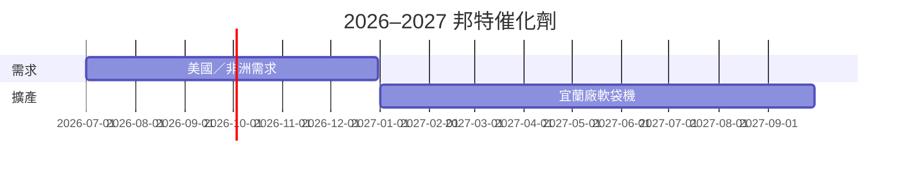

# 時程_2026醫療器材催化劑

## 日期表
| 日期 | 事件 | 相關公司 | 類型 | 重要性 | 備註 |
|---|---|---|---|---|---|
| 2026H2 | 美國補庫與非洲藥用軟袋需求 | [[4107_邦特（櫃）]] | 放量 | ⭐⭐ | 福邦整理 |
| 2027Q1–Q3 | 宜蘭廠新增軟袋機 | [[4107_邦特（櫃）]] | 擴產 | ⭐⭐⭐ | 券商 estimate |

## Gantt 時程圖

## 來源
- [[4107 邦特｜20260826 ｜福邦]]（福邦投顧，2026-08-26）
