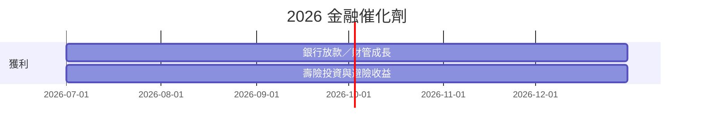

# 時程_2026金融與資產管理催化劑

## 日期表
| 日期 | 事件 | 相關公司 | 類型 | 重要性 | 備註 |
|---|---|---|---|---|---|
| 2026H2 | 銀行放款與財富管理成長 | [[2881_富邦金（市）]] | 業績 | ⭐⭐ | 元大 estimate |
| 2026H2 | 壽險投資、匯率避險與 IFRS 17 影響持續反映 | [[2881_富邦金（市）]] | 業績 | ⭐⭐⭐ | 受市場變數影響 |
| 2026H2 | 富邦金 TIS 約 140%、股利 payout 40–50% 目標驗證 | [[2881_富邦金（市）]] | 資本／股利 | ⭐⭐⭐ | Goldman Sachs 2026-06-16 轉述公司展望；仍受監理要求與資本生成影響 |
| 2026H2 | 國泰金銀行 NIM 1.63–1.65%、壽險 recurring yield 高於 3.5% | [[2882_國泰金（市）]] | 業績 | ⭐⭐⭐ | Goldman Sachs 2026-08-30 轉述管理層展望 |
| 2026H2 | 國泰金新契約 CSM 目標 NT$75.0bn、2H CSM margin 改善 | [[2882_國泰金（市）]] | 業績 | ⭐⭐ | Goldman Sachs 2026-08-30；需追蹤商品結構與投資收益 |

## Gantt 時程圖

## 來源
- [[2881 富邦金｜20260826｜元大]]（元大投顧，2026-08-26）
- [[報告_GoldmanSachs_富邦金_2881_20260915]]（Goldman Sachs，2026-06-16）
- [[報告_GoldmanSachs_國泰金_2882_20260915]]（Goldman Sachs，2026-08-30）

| 2026-11 | 永豐金現金增資完成 | [[2890_永豐金（市）]] | 資本 | ⭐⭐⭐ | 約 NT$200 億元；EPS 稀釋與證券注資效果屬券商 estimate |
| 2026H2 | 中租放款回溫與中國資產品質改善驗證 | [[5871_中租-KY（市）]] | 業績 | ⭐⭐⭐ | 信用成本與延滯率仍需追蹤 |

## 相關頁面

- [[2882_國泰金（市）]]
